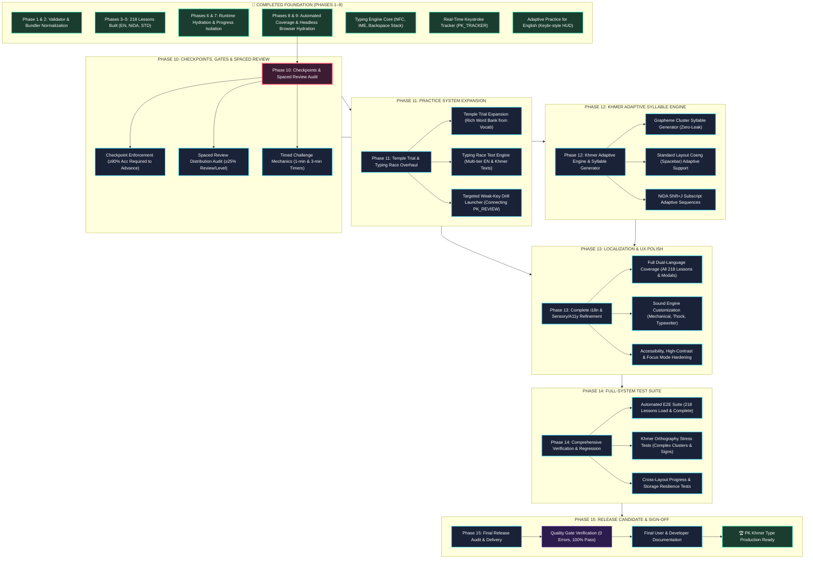
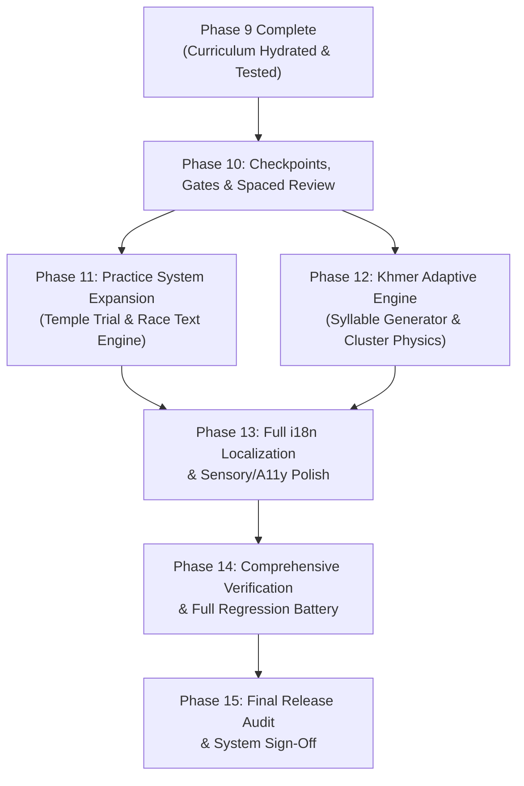

# PK KHMER TYPE — MASTER DEVELOPMENT ROADMAP & ARCHITECTURAL MAP
**Target Codebase:** PK Khmer Type (`idk`)  
**Document Status:** ACTIVE MASTER ROADMAP — SINGLE SOURCE OF TRUTH  
**Current Milestone:** PHASE 9 COMPLETED (Curriculum Hydration & Browser Verification Verified)  
**File Name:** `PK_KHMER_TYPE_MASTER_ROADMAP.md`  

---

## 1. PROJECT STATUS OVERVIEW

PK Khmer Type is an offline-first, high-precision Khmer and English touch-typing trainer. Following the completion of the 9-phase curriculum overhaul and baseline hydration, the core curriculum data and runtime loader are verified across all three supported keyboard layouts.

### Status Key:
- `[COMPLETED]`: Fully implemented, verified with tests, and active in the repository.
- `[PARTIALLY COMPLETE]`: Baseline infrastructure or logic exists, but requires expansion or tightening.
- `[NEXT]`: The immediate upcoming phase to be implemented.
- `[PLANNED]`: Designed and scheduled in the master roadmap.
- `[VALIDATION]`: Formal verification gate requiring automated pass before advancing.
- `[BLOCKED]`: Waiting on a prerequisite phase.

### Subsystem Health & Status Summary:
| Subsystem | Status | Current Baseline | What Remains |
| :--- | :---: | :--- | :--- |
| **Curriculum Data** | `[COMPLETED]` | 40 levels, 218 lessons, 664 exercises, 20,798 units across English, NiDA, Standard. Zero lessons below 80 units. | Checkpoint gating & review interleaving verification. |
| **Curriculum Bundler & Validator** | `[COMPLETED]` | `validate_curriculum.js` & `bundle_curricula.js` enforce 0 progression violations and 0 broken links. | Continuous execution in CI/validation gates. |
| **Runtime Lesson Engine** | `[COMPLETED]` | `js/lessons.js` hydrates all 3 layouts from `window.CURRICULUM_DATA` with offline fallback. | Checkpoint gate enforcement ($\ge 90\%$ accuracy). |
| **Typing Engine Core** | `[COMPLETED]` | Unicode NFC normalization, IME composition handling, multi-codepoint unit slicing, backspace stack. | Audio profile customization & sound latency tuning. |
| **Real-Time Keystroke Tracker** | `[COMPLETED]` | `js/tracker.js` (`PK_TRACKER`) zero-latency logging per key, finger, unit, layout, and active session. | Exporting aggregated telemetry for analytics dashboard. |
| **Review Engine Core** | `[COMPLETED]` | `js/review.js` (`PK_REVIEW`) character catalog, confusion matrix, staleness detection, candidate queue. | Connecting candidate queue to standalone targeted practice UI. |
| **Adaptive Practice (English)** | `[COMPLETED]` | Keybr-style letter progress bars, dynamic percentages (+2%/+3% correct, -1%..-4% wrong), 2,143 words. | Parity for Khmer NiDA & Standard. |
| **Adaptive Practice (Khmer)** | `[PARTIALLY COMPLETE]` | Basic syllable progression in `js/adaptive.js`, 384 Khmer words/syllables in `data/adaptive-vocab.js`. | Syllable-aware dynamic cluster generator, Coeng spacebar handling. |
| **Practice Modes (Trial & Race)** | `[PARTIALLY COMPLETE]` | `js/race.js` has live race track, local leaderboard, Temple Trial streak mechanics. | Word banks limited (9 Khmer, 20 English); race texts need multi-tier expansion. |
| **Progress & Account Persistence** | `[COMPLETED]` | `khmerProgressData_v2`, legacy migration, course isolation (`english`, `nida`, `standard`), backup export/import. | Granular historical attempt graphing. |
| **Localization & i18n** | `[PARTIALLY COMPLETE]` | `data/shared/i18n.json` exists; header and settings toggle English/Khmer. | 100% translation coverage for lesson cards, badges, and modals. |

---

## 2. THE MASTER ARCHITECTURE & DEVELOPMENT MAP

The following master map depicts the entire PK Khmer Type learning system from the completed Phase 9 baseline to total project completion:



---

## 3. MAJOR WORK AREAS & SUBSYSTEM DEEP DIVES

### A. Curriculum Subsystem
- **Current Baseline:** Complete 3-layout structure (English US, Khmer NiDA, Khmer Standard) totaling 218 lessons.
- **Physical Key Differentiation:**
  - *Standard Layout:* Spacebar base layer triggers Coeng (`្`), Shift+Space triggers word space, Semicolon triggers `ះ`.
  - *NiDA Layout:* `Shift + J` triggers Coeng (`្`), Base Space triggers ZWSP, Shift+Space triggers visible word space.
  - *English Layout:* Standard QWERTY home-row outward progression.
- **Planned Work:**
  - Enforce checkpoint accuracy gates ($\ge 90\%$) preventing unearned advancement.
  - Audit spaced review density to guarantee that at least $25\%$ of exercises in every level re-drill older keys.
  - Activate timed challenges (Level 12 / 13) with live countdown timers and WPM thresholds.

### B. Khmer NiDA & Standard Orthography Engine
- **Unicode Typing Order:** Strictly enforces **Consonant $\rightarrow$ Coeng $\rightarrow$ Subscript $\rightarrow$ Vowel**.
- **Compound Vowels:** Dedicated compound keys (`ាំ`, `ុំ`, `ុះ`, `េះ`, `ោះ`) taught as single atomic keystrokes.
- **Planned Work:**
  - Rare/Complex cluster validation (triple clusters like `ស្ទ្រី`, Sanskrit/Pali loans `សង្ឃ`, `សម្បត្តិ`, `កិត្តិយស`).
  - Intuitive visual correction hints when a user attempts to type left-side vowels (`េ`, `ែ`) before the consonant.

### C. Practice & Review Systems
- **Temple Trial (`trialPanel`):**
  - Current state: Hardcoded 9 Khmer words and 20 English words.
  - Planned expansion: Dynamically draw from `data/adaptive-vocab.js` and `data/typing-content.json` filtered by learner unlock level.
- **Typing Race (`racePanel`):**
  - Current state: Basic timer with local leaderboard.
  - Planned expansion: Multi-tier text bank (Easy, Medium, Hard, Expert) with culturally rich literature, proverbs, and historical passages.
- **Targeted Review (`js/review.js`):**
  - Current state: Generates confusion pairs, slow keys, and staleness rankings.
  - Planned expansion: Dedicated UI button to launch ad-hoc reinforcement sessions directly from `PK_REVIEW` candidate queue.

### D. Adaptive Practice System
- **Current State:** English is fully realized with dynamic letter progress bars (+2%/+3% correct, -1%..-4% mistakes), Keybr-style UI, and 2,143 dictionary words.
- **The Complete Adaptive Loop:**
  ```text
  Lesson Keystroke Telemetry (PK_TRACKER)
               │
               ▼
  Performance Evaluator (Accuracy, Error Clusters, Latency)
               │
               ▼
  Weak Area Detection (Error Rate >15% or Latency >2x Avg)
               │
               ▼
  Dynamic Word / Syllable Selector (65% Target Focus / 35% Maintenance)
               │
               ▼
  Target Word Stream Rendering (Interactive HUD)
               │
               ▼
  Before vs. After Delta Evaluation (Δ% Accuracy)
               │
               ▼
  Persistent State Update (pk_adaptive_state_v1)
  ```
- **Planned Work:** Extend dynamic cluster generator to Khmer NiDA and Standard layouts, ensuring zero locked-letter leakage while respecting Khmer phonotactics.

### E. Progress & Data Layer
- **Persistence:** LocalStorage key `khmerProgressData_v2` with layout isolation (`state.courses = { standard, nida, english }`).
- **Telemetry:** `PK_TRACKER` records attempts, errors, finger latency, and backspace counts.
- **Planned Work:**
  - Add structured historical attempt logging (date, lessonId, accuracy, WPM) for the Statistics dashboard.
  - Automated integrity check and fallback repair for corrupted storage states.

### F. Typing Engine & Sensory Feedback
- **Engine Core:** Multi-codepoint unit slicing (`splitIntoTypingUnits`), NFC normalization, IME awareness, Backspace history stack.
- **Sensory Systems:** Web Audio API key clicks, dynamic hands guide overlay, next-key glow, ember particle bursts.
- **Planned Work:**
  - Sound profile selector (Mechanical Blue, Linear Red, Deep Thock, Vintage Typewriter).
  - Keyboard-only navigation mode for 100% mouse-free operation.

### G. UI / UX & Localization
- **Design Foundation:** High-contrast dark theme with Temple, Moonlight, Jungle, Sunset, and Sepia variants.
- **Planned Work:**
  - Dual-language translation (`data/shared/i18n.json`) applied across all 218 lesson cards, badge tooltips, and modal descriptions.
  - Accessibility audit: Screen reader ARIA live-regions for error feedback, focus trap on open modals, and high-contrast color validation.

---

## 4. DETAILED SPECIFICATION OF FUTURE PHASES

```text
================================================================================
PHASE 10: CHECKPOINTS, GATEKEEPING & SPACED REVIEW AUDIT
================================================================================
Status:       [NEXT]
Dependencies: Phase 9 (Completed)
Files:        js/lessons.js, js/progress.js, data/curriculum/*

Goal:
Enforce true pedagogical gatekeeping across the 218 lessons and verify spaced
review distribution so learners do not advance without demonstrating accuracy.

Why It Exists:
Currently, lesson unlocking relies on a simple completion flag. Checkpoints and
timed challenges must act as genuine milestones requiring ≥90% accuracy.

Main Work:
1. Implement Checkpoint Gatekeeping:
   - Identify checkpoint lessons in each level (Stage 9).
   - In js/progress.js and js/lessons.js, require ≥90% accuracy on Checkpoints
     before unlocking the next level.
2. Timed Challenge Mechanics:
   - Wire 1-minute and 3-minute countdown timers into Level 12/13 speed lessons.
   - Calculate live net WPM and display celebratory pass criteria.
3. Spaced Review Audit:
   - Run audit verifying that ≥25% of exercises in every level systematically
     re-introduce characters from preceding levels.

Expected Result:
Learners cannot breeze through lessons with poor accuracy; checkpoints enforce
mastery, and timed drills function with active countdown timers.

Validation:
Automated test verifying checkpoint locks next level when accuracy <90%, and
unlocks when accuracy ≥90%. All 40 levels verified for review distribution.
```

```text
================================================================================
PHASE 11: PRACTICE SYSTEM EXPANSION (TEMPLE TRIAL & TYPING RACE)
================================================================================
Status:       [PLANNED]
Dependencies: Phase 10
Files:        js/race.js, data/typing-content.json, data/shared/race-config.json

Goal:
Transform Temple Trial and Typing Race from basic stubs into rich, layout-aware
practice modes with extensive vocabularies and authentic texts.

Why It Exists:
Temple Trial currently has only 9 Khmer words and 20 English words. Typing Race
lacks multi-tier literary content and layout-aware difficulty scaling.

Main Work:
1. Temple Trial Vocabulary Expansion:
   - Expand word pools to 500+ authentic Khmer words and 1,000+ English words
     drawn from adaptive vocabulary banks.
   - Filter words based on the learner's unlocked keys in the active layout.
2. Typing Race Text Engine:
   - Populate Easy, Medium, Hard, and Expert categories with authentic Khmer
     literature, proverbs, historical narratives, and English classic prose.
   - Integrate scoring formula from data/shared/race-config.json (netWPM * acc^2.2).
3. Targeted Review Drill Launcher:
   - Connect js/review.js candidate queue to a 1-click "Targeted Drill" button.

Expected Result:
Temple Trial provides endless varied practice; Typing Race features authentic,
challenging texts across 4 difficulties; targeted review is instantly accessible.

Validation:
Unit tests confirming zero locked-letter leakage in Temple Trial; live Chrome
test completing a 30s race and saving scores to local leaderboard.
```

```text
================================================================================
PHASE 12: KHMER ADAPTIVE SYLLABLE ENGINE & LAYOUT ISOLATION
================================================================================
Status:       [PLANNED]
Dependencies: Phase 10, Phase 11
Files:        js/adaptive.js, data/adaptive-vocab.js

Goal:
Bring full Khmer adaptive learning parity to match the English Keybr-style
trainer, supporting Khmer orthography and layout-specific mechanics.

Why It Exists:
English Adaptive Practice is fully mature, but Khmer requires syllable-aware
grapheme generation rather than arbitrary letter shuffling to form valid words.

Main Work:
1. Grapheme Cluster Syllable Generator:
   - Build dynamic Khmer syllable assembler respecting consonant-subscript-vowel
     phonotactics using strictly unlocked keys.
2. Standard Layout Spacebar Coeng Adaptation:
   - Ensure target word generation on Standard layout guides the user to use
     the thumb Spacebar for subscripts (`ក` + `Space` + `ក` = `ក្ក`).
3. NiDA Layout Shift+J Adaptation:
   - Ensure NiDA adaptive practice trains `Shift+J` for subscripts.
4. Granular Letter Progress UI for Khmer:
   - Render the horizontal progress strip for Khmer consonants and vowels.

Expected Result:
Learners can launch Adaptive Practice in Khmer NiDA and Khmer Standard, drilling
valid syllables with real-time weakness detection and Keybr-style progress.

Validation:
Automated test verifying 0 syntax errors in generated Khmer syllables, correct
subscript mapping per layout, and dynamic percentage updates.
```

```text
================================================================================
PHASE 13: FULL i18n LOCALIZATION & SENSORY/A11Y POLISH
================================================================================
Status:       [PLANNED]
Dependencies: Phase 11, Phase 12
Files:        data/shared/i18n.json, js/app.js, css/*.css, index.html

Goal:
Deliver complete dual-language (Khmer / English) localization and refine sensory
and accessibility features for all user tiers.

Why It Exists:
The app is founded in Cambodia for Khmer and international learners. Every UI
element, lesson card, and feedback message must be fluently available in both languages.

Main Work:
1. 100% i18n Translation Coverage:
   - Localize all 218 lesson titles, level titles, objectives, and exercise
     descriptions into both Khmer and English.
   - Ensure dynamic string replacement when toggling language (Alt+L).
2. Audio Profile Engine:
   - Implement audio synthesizers/samples for distinct key profiles: Mechanical
     Clicky (Blue), Smooth Linear (Red), Deep Thock, and Antique Typewriter.
3. Accessibility & Focus Mode:
   - Implement ARIA live regions announcing typing errors for screen readers.
   - Enforce modal focus traps and Esc-key dismissals.
   - Refine Focus Mode (Alt+F) to dim distractions with smooth transitions.

Expected Result:
Instantaneous, flawless switching between Khmer and English UI; satisfying,
customizable tactile audio; full accessibility compliance.

Validation:
Lighthouse accessibility score ≥95; automated check confirming 0 missing
translation keys in data/shared/i18n.json.
```

```text
================================================================================
PHASE 14: COMPREHENSIVE VERIFICATION & CROSS-BROWSER REGRESSION
================================================================================
Status:       [PLANNED]
Dependencies: Phases 10–13
Files:        scripts/validate_curriculum.js, scratch/test_*.js

Goal:
Execute an exhaustive automated test battery covering every lesson, subsystem,
and edge case across major browser runtimes.

Why It Exists:
Before declaring the system ready for production, machine-verifiable proof must
guarantee zero regressions, zero progression bugs, and rock-solid persistence.

Main Work:
1. 218-Lesson Automated Playthrough Suite:
   - Headless script that programmatically inputs correct keystrokes for all
     218 lessons across English, NiDA, and Standard.
   - Verify completion triggers, star assignments, and unlock cascades.
2. Khmer Orthography Stress Testing:
   - Verify complex clusters (e.g. `ស្ដេច`, `កញ្ជ្រោង`, `សម្បត្តិ`, `កិត្តិយស`).
   - Test Robat (`៌`), Bantoc (`់`), Coeng spacebar, and ZWSP handling.
3. Storage & State Resilience Tests:
   - Simulate storage quota limits, corrupted JSON recovery, and export/import.
4. Cross-Browser Verification:
   - Verify rendering and key capture across Chromium, Firefox, and WebKit.

Expected Result:
All test suites pass 100% with zero failures, confirming rock-solid stability.

Validation:
Master test script outputs: "ALL SUITES PASSED (218/218 Lessons, 0 Regressions)".
```

```text
================================================================================
PHASE 15: RELEASE CANDIDATE AUDIT & FINAL DELIVERY
================================================================================
Status:       [PLANNED]
Dependencies: Phase 14
Files:        README.md, manifest.json, service-worker.js

Goal:
Package the completed PK Khmer Type learning system for production release,
verifying offline PWA readiness and documenting the codebase.

Why It Exists:
Provides final validation against the Definition of Done, cleans up scratch
development artifacts, and guarantees flawless zero-latency offline operation.

Main Work:
1. PWA & Offline Packaging:
   - Audit service worker cache to ensure all assets (audio, fonts, curricula)
     cache for 100% offline functionality.
2. Code Cleanup:
   - Remove temporary scratch scripts and diagnostic logs.
3. Documentation Finalization:
   - Update README.md with complete curriculum details, shortcut reference,
     and technical architecture notes.
4. Final Sign-off Report:
   - Deliver comprehensive sign-off audit verifying all acceptance criteria.

Expected Result:
PK Khmer Type is completely packaged, documented, verified, and ready for release.

Validation:
Clean git working tree, verified offline PWA audit, 100% passing test matrix.
```

---

## 5. DEPENDENCY GRAPH & EXECUTION SEQUENCING



### Critical Path:
$$\text{Phase 9 (Done)} \longrightarrow \text{Phase 10 (Checkpoints)} \longrightarrow \text{Phase 12 (Khmer Adaptive)} \longrightarrow \text{Phase 13 (i18n & UX)} \longrightarrow \text{Phase 14 (Full Testing)} \longrightarrow \text{Phase 15 (Sign-Off)}$$

### Parallel Opportunities:
- **Phase 11 (Practice Expansion)** can be developed concurrently with **Phase 12 (Khmer Adaptive Engine)**, as Temple Trial/Race content is decoupled from the adaptive algorithm.
- **Audio profile customization (Phase 13)** can be implemented in parallel with **i18n text translation**.

---

## 6. CONNECTIONS TO EXISTING PLANNING DOCUMENTS

To preserve architectural continuity, this master roadmap incorporates and supersedes previous individual planning notes while maintaining links to existing project files:

| Existing Plan / Spec | File Location | How It Connects to Master Roadmap | Action |
| :--- | :--- | :--- | :--- |
| **Lesson Overhaul Master Plan** | `lesson_overhaul_plan.md` | Single source of truth for curriculum structure, 218 lesson specs, 10-stage pedagogy, and keyboard physics comparison. | **CONTINUE FROM EXISTING PLAN** (Phases 10–12 directly continue from here) |
| **Implementation Tasks Baseline** | `task.md` | Tracks foundational phases (Phases 2–7.9) including tracking (`PK_TRACKER`), review rules, and lesson strip fixes. | **ARCHIVED RECORD OF WORK** (Incorporated into Phase 1–9 baseline) |
| **Phase 7 Progress Spec** | `implementation_plan.md` | Architectural blueprint for character mastery classification (`locked` $\to$ `learning` $\to$ `proficient` $\to$ `mastered`). | **SUBSYSTEM SPEC** (Governs `js/review.js` candidate queues in Phase 11) |
| **Phase 8 Adaptive Practice Report** | `walkthrough.md` | Detailed report on adaptive practice architecture, dynamic percentage formula, Keybr-style UI, and word generator. | **SUBSYSTEM SPEC** (Governs Phase 12 Khmer adaptive expansion) |
| **Data Models & Characters** | `data/characters/*.json` | Character catalogs, key assignments, and unicode codepoint mappings. | **DATA ASSETS** (Referenced continuously) |
| **Curriculum Data Sources** | `data/curriculum/*/*.json` | Raw levels, lessons, and exercises partitioned by layout. | **DATA ASSETS** (Directly audited in Phase 10) |

---

## 7. DEFINITION OF A COMPLETED LEARNING SYSTEM

The learning system of PK Khmer Type is officially **COMPLETE** when all of the following conditions are met:

1. **Curriculum Coverage & Quality:**
   - 100% of required printable glyphs across English, Khmer NiDA, and Khmer Standard are taught.
   - Zero non-orientation lessons have fewer than 80 keystroke units.
   - Zero pre-introduction violations exist across all 218 lessons.
   - Checkpoint lessons enforce $\ge 90\%$ accuracy before advancing.
2. **Khmer Orthography Parity:**
   - Khmer NiDA correctly teaches Coeng at `Shift+J`, compound vowels as single keys, and `Shift+Space` word separation.
   - Khmer Standard correctly teaches Coeng on the base Spacebar layer, `ះ` on Semicolon, and unique Standard vowel/shift mappings.
   - Logical typing order (Consonant $\rightarrow$ Coeng $\rightarrow$ Subscript $\rightarrow$ Vowel) is enforced with helpful visual hints.
3. **Practice & Review Ecosystem:**
   - Temple Trial draws dynamically from a 500+ word bank filtered by learner unlocks.
   - Typing Race offers authentic Khmer and English texts across Easy, Medium, Hard, and Expert difficulties.
   - Targeted review automatically surfaces weak characters and confusion pairs.
4. **Adaptive Practice:**
   - English, Khmer NiDA, and Khmer Standard each have fully functioning adaptive trainers.
   - Adaptive engine operates with zero locked-letter leakage and Keybr-style visual mastery progress.
5. **Persistence & Data Integrity:**
   - All progress, stars, best scores, and streaks persist reliably across reloads and offline sessions.
   - Zero state collision between curriculum lessons and Adaptive Practice.
6. **Sensory & Accessibility Polish:**
   - Fluent, natural dual-language translation (English and Khmer) for all user-facing text.
   - Keyboard-only navigation support and accessible ARIA live-feedback.
   - High-performance, offline zero-latency operation without CORS blocks.
7. **Verification & Regression Proof:**
   - Automated test suite passes 100% across all 218 lessons.
   - Cross-browser headless validation passes with zero errors.

---

## 8. UNKNOWNS & OPEN QUESTIONS

The following architectural and design decisions require human preference or empirical validation prior to Phase 11/12 implementation:

1. **Typing Race Community Leaderboard:**
   - *Current State:* Race leaderboard is stored locally in `localStorage`.
   - *Question:* Should an optional, privacy-friendly online leaderboard (e.g. Firebase Firestore as referenced in `index.html` comments) be officially integrated, or should the app remain strictly 100% local-storage only?
   - *Recommendation:* Keep 100% local storage as the default offline mode; keep Firebase configuration purely optional for zero privacy friction.
2. **Audio Sample Packaging vs Web Audio Synth:**
   - *Current State:* Key click audio is generated procedurally via the Web Audio API (`AudioContext`).
   - *Question:* Should custom sound profiles (Thock, Typewriter) use synthesized audio nodes (100% zero-byte download) or tiny base64 audio sprites?
   - *Recommendation:* Synthesize via Web Audio API to maintain a lightweight, zero-dependency codebase without external asset loading.
3. **Khmer Syllable Structure Complexity Threshold in Adaptive Mode:**
   - *Current State:* Khmer words have complex grapheme clusters.
   - *Question:* In early adaptive stages (e.g. 5 consonants unlocked), should the generator produce isolated single syllables or only authentic dictionary words?
   - *Recommendation:* Use authentic syllables from `data/adaptive-vocab.js` to ensure the learner only types phonotactically natural Khmer combinations.

---
*End of Master Roadmap. This document is the primary reference for all subsequent development phases.*
