# PK KHMER TYPE — LESSON OVERHAUL IMPLEMENTATION MASTER PLAN
**Target Codebase:** PK Khmer Type (`idk`)  
**Status:** ARCHITECTURAL MASTER PLAN — EXPANDED & IMPLEMENTATION-READY  
**Single Source of Truth:** `lesson_overhaul_plan.md`  

---

## 0. EXECUTIVE SUMMARY & SCOPE

**What this plan is:** The complete curriculum architecture (218 lessons across English US, Khmer NiDA, and Khmer Standard) is content-complete and machine-validated (Phases 1–9). This document is the single source of truth for (a) how that curriculum is structured and taught, and (b) the remaining engineering work — checkpoint gatekeeping, practice-mode expansion, Khmer adaptive parity, localization, verification, and release (Phases 10–15) — required to ship it.

**What "better and stronger" means for this revision:** the original plan was strong on *what* to build but underspecified on *how much it costs*, *what could go wrong*, and *how we'll know it worked*. This revision adds four things without changing any existing pedagogical or architectural decision:
- A **Risk Register** (Section 16) naming the specific ways this plan could fail and the mitigation for each.
- **Effort estimates and a critical-path timeline** (Section 15) so sequencing decisions are auditable, not just diagrammed.
- **Post-launch Success Metrics** (Section 17), separate from the engineering Definition of Done, so "shipped" and "working for learners" are not conflated.
- A **Rollout & Release Strategy** (Section 18) covering schema versioning, staged rollout of the new checkpoint gate, and rollback — because Phase 10 changes what "locked" means for lessons real users have already completed.

It also resolves every item in the former "Unknowns & Open Questions" list into an explicit decision (Section 15.3), and tightens the testing matrix and Definition of Done to cover the failure modes named in the Risk Register.

**This revision adds one more thing:** a complete, letter-by-letter **Character Coverage Ledger (Appendix B)** consolidating every character across all three layouts — every English letter, digit, and symbol; all 33 Khmer consonants; every dependent and independent vowel; every diacritic — into one auditable table with the level that introduces each one. Building that ledger surfaced a real finding, not just a formatting improvement: **17 Khmer vowels are never individually named anywhere in the original plan**, which means Section 11's "Full Glyph Coverage" validation gate cannot have been meaningfully exercised against them. This is now tracked as **Risk R8** and **Definition of Done item 14**, and should be checked against the real `data/keyboard.json` before Phase 10 locks in checkpoint content — a curriculum that gates learners on ≥90% accuracy should not be doing so on top of an unverified character set.

### Non-Goals (Explicit Exclusions)
To keep this plan executable, the following are **out of scope** for Phases 10–15 unless a future revision states otherwise:
- **No new keyboard layouts.** English (US), Khmer NiDA, and Khmer Standard remain the complete set; adding e.g. a Khmer mobile/Telex layout is a separate proposal.
- **No server-side or account-based progress sync.** Progress remains 100% local (`localStorage`), per the resolution in Section 15.3.
- **No new lesson content beyond the existing 218 lessons** as part of Phases 10–15. These phases harden, gate, localize, and test the existing curriculum; they do not expand it. (Word-bank and race-text *expansion* in Phase 11 is practice-mode content, not curriculum lessons, and is bounded by the targets in that phase's spec.)
- **No monetization, accounts, or social features** — a shared cloud leaderboard is explicitly deferred (Section 15.3, Decision 1).
- **No redesign of the 10-stage pedagogical model** (Section 4). It is treated as validated and fixed for this release cycle.

---

## 1. CURRENT SYSTEM SUMMARY & ARCHITECTURAL FOUNDATION

PK Khmer Type currently supports three keyboard layouts: **English US (QWERTY)**, **Khmer NiDA**, and **Khmer Standard**. The curriculum architecture operates as a data-driven pipeline with instant offline hydration:

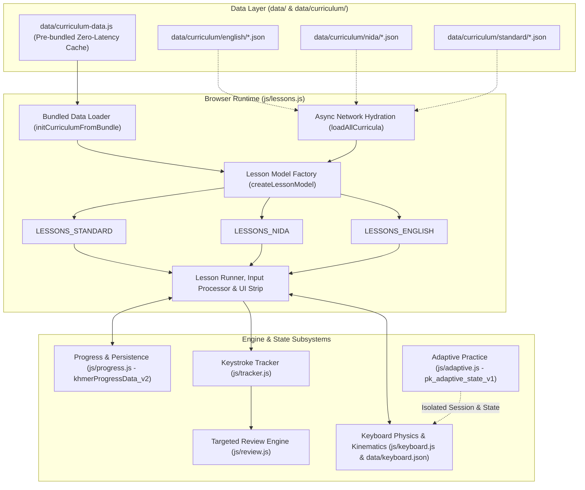

### Core Subsystems and Strict Boundaries:
1. **Curriculum Data Sources (`data/curriculum/`):**
   - Clean, modular JSON definitions partitioned by layout: `data/curriculum/{english,nida,standard}/` containing `levels.json`, `lessons.json`, and `exercises.json`.
   - `data/curriculum-data.js`: Pre-bundled zero-latency file declaring `window.CURRICULUM_DATA = { standard, nida, english }`. Enables instantaneous startup offline and via `file:///` protocol without CORS blocks.
2. **Lesson Execution Engine (`js/lessons.js`):**
   - Calls `initCurriculumFromBundle()` during initialization.
   - Converts serialized JSON lesson models into runtime objects via `createLessonModel()`.
   - Splits exercise content into typing units via `splitIntoTypingUnits(content, layoutId)`.
   - Resolves characters to physical keys and modifier layers via `resolveCharLocation()`.
   - Dynamically renders level accordions, lesson cards, mastery stars, lock icons, and progress meters.
3. **Progression & Persistence Subsystem (`js/progress.js`):**
   - Stores per-layout records in `state.courses = { standard, nida, english }`.
   - Saves to `localStorage` under `khmerProgressData_v2` and legacy compatibility keys `khmerLessonBest_<id>`.
   - Manages unlocking via `isLessonLocked(id)`: Lesson $N$ unlocks when Lesson $N-1$ has recorded at least one completion attempt.
4. **Adaptive Practice Boundary (`js/adaptive.js`):**
   - Completely autonomous, letter-mastery-driven engine tracking 20 units/letter mastery under `pk_adaptive_state_v1`.
   - Fixed English progression sequence (`E N I A R L...`).
   - Mutual session suspension: Launching standard curriculum calls `PK_ADAPTIVE.exitSession(false)`; entering Adaptive Practice suspends curriculum lessons.
5. **Targeted Review Subsystem (`js/review.js`):**
   - Monitors learner stats across layouts. Flags keys with accuracy $< 85\%$ or staleness $> 7$ days.
   - Supplies targeted drilling based on telemetry in `PK_TRACKER` and `PK_PROGRESS`.

---

## 2. LESSON INVENTORY & STRUCTURAL BASELINE

The curriculum baseline encompasses 218 lessons structured across all three layouts:

| Layout | Levels | Lessons | Exercises | Total Units | Avg Units/Lesson | % Below 80 Units | Key Focus Areas |
| :--- | :---: | :---: | :---: | :---: | :---: | :---: | :--- |
| **English (US)** | 14 | 64 | 204 | 6,159 | **96.2** | **0%** | Anchors, home row, reaches, vowels, full alphabet, Shift capitals, numbers, symbols, paragraphs, timed challenges. |
| **Khmer NiDA** | 13 | 77 | 230 | 7,222 | **93.8** | **0%** | Anchors (ថ/ក), home consonants, ើ/់, top reaches, bottom reaches, Shift+J Coeng (`្`), Shift consonants, Shift vowels, clusters, diacritics, vocabulary, Shift+Space prose, AltGr independent vowels. |
| **Khmer Standard** | 13 | 77 | 230 | 7,417 | **96.3** | **0%** | Spacebar Coeng (`្`), ះ on Semicolon, Shift vowels (ៃ, ាំ, ុះ, ៏, ុំ), bottom reaches (អ on comma), Spacebar subscript clusters, Shift consonants, diacritics, sentences. |
| **Combined** | **40** | **218** | **664** | **20,798** | **95.4** | **0%** | Complete three-layout coverage meeting substantial practice standards. |

---

## 3. CORE PEDAGOGICAL PHILOSOPHY: MANY SHORT FOCUSED LESSONS

The curriculum rejects both "microscopic 10-second lessons" and "fatiguing 300-word endurance marathons." The curriculum adheres to the **Focused Micro-Drilling Principle**:

```
Small New Skill → Target Finger Isolation → Known-Key Rhythm → Combination Pairs → Real Vocabulary → Spaced Review → Checkpoint → Next Step
```

### Educational Principles:
1. **Explicit Purpose for Every Lesson:**
   - Every lesson must answer:
     - *What physical key/finger skill is introduced?*
     - *Why does it appear at this point in the motor sequence?*
     - *What dictionary words or orthographic patterns are now unlocked?*
     - *What immediate next skill does it prepare the learner for?*
2. **Strict Cognitive Budget (Small Increments):**
   - Introduce at most **1 or 2 new keys/characters** in a non-review lesson.
   - Never introduce multiple modifier layers or complex cluster mechanics in a single introductory lesson.
3. **Substantial Practice Without Senseless Padding:**
   - Single-key & introductory lessons: **80–120 keystroke units** (approx. 35–50 seconds).
   - Word & combination lessons: **120–160 keystroke units** (approx. 50–75 seconds).
   - Review & checkpoint lessons: **150–220 keystroke units** (approx. 70–100 seconds).
   - Paragraph & timed endurance lessons: **200–350 keystroke units** (approx. 90–150 seconds).
   - **Anti-Padding Rule:** Never repeat raw unspaced characters (`ffffffffffff`). Drill variation must use structured companion pairs (`fjf jfj ff jj`), anchor alternations, and natural syllables.

---

## 4. THE 10-STAGE PROGRESSIVE CURRICULUM ARCHITECTURE

Each level advances through a 10-stage difficulty ladder. Not every individual lesson contains all 10 stages; stages are distributed purposefully across the level:

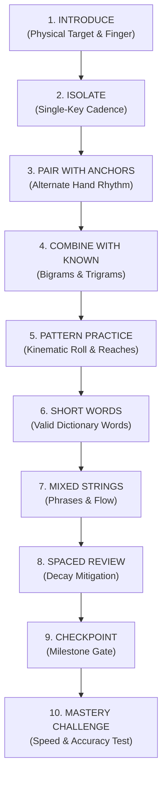

### Functional Breakdown of the 10 Stages:
1. **Stage 1 — Introduce:** Visual presentation of key position, finger assignment (`li`, `lm`, `lr`, `lp`, `ri`, `rm`, `rr`, `rp`, `thumb`), layer requirement, and tactile guide.
2. **Stage 2 — Isolate:** Single-finger taps, double taps, and deliberate reset to home-row rest positions.
3. **Stage 3 — Pair with Anchors:** Rapid alternating strokes with the opposite-hand index anchor (`F` and `J` in English; `ថ` and `ក` in Khmer).
4. **Stage 4 — Combine with Known:** Systematic pairing with all previously unlocked characters (e.g., if `D` and `K` are known, drill `fd`, `df`, `jk`, `kj`, `dk`, `kd`).
5. **Stage 5 — Pattern Practice:** Ergonomic finger rolls, inside-out cascades, and multi-finger coordination drills.
6. **Stage 6 — Short Words:** Authentic dictionary words formed strictly from the cumulative unlocked character pool. Zero nonsense strings.
7. **Stage 7 — Mixed Strings & Phrases:** Contextual typing featuring realistic short phrases, natural word boundaries (`Space` or `Shift+Space`), and terminal punctuation.
8. **Stage 8 — Spaced Review:** Explicit reintroduction of older characters learned in earlier levels to combat motor memory decay.
9. **Stage 9 — Checkpoint:** Focused assessment requiring $\ge 90\%$ accuracy before level advancement.
10. **Stage 10 — Mastery Challenge:** Timed endurance challenge consolidating all material learned across the level and preceding stages.

---

## 5. ENGLISH US CURRICULUM PROGRESSION

Preserves the natural home-row outward motor progression while guaranteeing that every word exercise uses verified English vocabulary:

```mermaid
graph TD
    subgraph EnglishMotorSequence ["English Progression Ladder"]
        L0["Level 0: Anchors (F, J, Space)"] --> L1["Level 1: Core Middle & Ring (D, K, S, L)"]
        L1 --> L2["Level 2: Pinkies (A, ;) & First Words"]
        L2 --> L3["Level 3: Center Reaches (G, H) & Home Checkpoint"]
        L3 --> L4["Level 4: High Vowels & Index Reaches (E, I, R, U)"]
        L4 --> L5["Level 5: Top Perimeter (T, Y, W, O, Q, P) & Top Checkpoint"]
        L5 --> L6["Level 6: Bottom Row & Punctuation (C, V, B, N, M, Z, X, Comma, Period)"]
        L6 --> L7["Level 7: Full Alphabet Consolidation & Pangrams"]
        L7 --> L8["Level 8: Shift Layer & Capitalization Coordination"]
        L8 --> L9["Level 9: Top Number Row (1–0)"]
        L9 --> L10["Level 10: Punctuation, Quotes, Hyphens & Brackets"]
        L10 --> L11["Level 11: Connected Prose & Complete Sentences"]
        L11 --> L12["Level 12: Continuous Multi-Sentence Paragraphs"]
        L12 --> L13["Level 13: Timed Speed Endurance & Keyboard Mastery"]
    end
```

### Cumulative Vocabulary Gating Rules for English:
- **Level 0 (F, J, Space):** Only tactile rhythm and anchor pairs (`fff jjj fjf jfj`). No English words exist with only F and J.
- **Level 1 (add D, K, S, L):** Hand coordination drills. No complete words without vowels.
- **Level 2 (add A, ;):** **First English Words Unlocked:** `as`, `ask`, `sad`, `dad`, `fall`, `lass`, `flask`, `salad`, `all`, `add`, `alas`, `falls`, `dads`, `lads`, `sass`.
- **Level 3 (add G, H):** **Vocabulary Expanded:** `glad`, `flag`, `half`, `hall`, `dash`, `flash`, `glass`, `shall`, `hash`, `gash`, `had`, `has`, `gall`, `ash`.
  - *Checkpoint 1:* 120-unit comprehensive home-row assessment.
- **Level 4 (add E, I, R, U):** **Vowel Vocabulary Explosion:** `see`, `red`, `ride`, `fire`, `dear`, `sure`, `rule`, `rise`, `sir`, `lid`, `like`, `side`, `idle`, `rude`, `hire`, `drill`, `risk`, `skill`, `dark`, `fear`, `hear`, `safe`, `feed`, `seed`.
- **Level 5 (add T, Y, W, O, Q, P):** **Full Top Row Words:** `type`, `word`, `work`, `quit`, `play`, `power`, `write`, `poetry`, `water`, `story`, `quiet`, `quote`, `sweet`, `today`, `reply`, `people`, `proper`.
  - *Checkpoint 2:* Home + Top row cross-layer examination.
- **Level 6 (add C, V, B, N, M, Z, X, Comma, Period):** **Full Lower Row Vocabulary:** `can`, `come`, `back`, `been`, `make`, `name`, `much`, `move`, `seven`, `never`, `cover`, `number`, `voice`, `brave`, `cabin`, `complex`, `examine`, `zero`, `buzz`, `extra`. Punctuation cadence (`one, two, three.`).
- **Level 7 to Level 13:** All 26 letters active. Pangrams, capitalization, numbers, full punctuation, sentences, multi-sentence paragraphs, and 3-minute timed tests.

---

## 6. KHMER NiDA CURRICULUM SPECIFICATION

Khmer NiDA must be taught strictly according to Cambodian typing conventions and Unicode grapheme cluster mechanics:

```mermaid
graph TD
    subgraph NiDAProgression ["Khmer NiDA Curriculum Architecture"]
        N0["Level 0: Anchors (ថ on F, ក on K, Space)"] --> N1["Level 1: Home Consonants & ស្រៈ ា (A)"]
        N1 --> N2["Level 2: Home Vowel ើ (;) & Bantoc ់ (')"]
        N2 --> N3["Level 3: High-Frequency Top Row (េ, រ, ត, យ, ុ, ិ, ោ)"]
        N3 --> N4["Level 4: High-Frequency Bottom Row (ច, វ, ប, ន, ម, ។)"]
        N4 --> N5["Level 5: Remaining Base Keys & Coeng Key (Shift+J = ្)"]
        N5 --> N6["Level 6: Shift Consonants (គ, ជ, ទ, ធ, ព, ភ, ឌ, ណ, អ, ឃ...)"]
        N6 --> N7["Level 7: Shift Vowels & Dedicated Compound Vowels"]
        N7 --> N8["Level 8: Consonant Clusters & Advanced Coeng Practice"]
        N8 --> N9["Level 9: Diacritics, Numerals & Currency (៉, ៊, ៍, ៏, ័, ៌, ៛, ៗ)"]
        N9 --> N10["Level 10: Rich Khmer Vocabulary by Semantic Domain"]
        N10 --> N11["Level 11: Connected Prose with Shift+Space Word Separation"]
        N11 --> N12["Level 12: Independent Vowels & Professional Speed Mastery"]
    end
```

### Orthographic Typing Mechanics to Enforce:
1. **The Coeng (Subscript) Keystroke Sequence:**
   - In NiDA, the subscript character `្` (U+17D2) is located at **`Shift + J`**.
   - Keystroke sequence: **Base Consonant $\rightarrow$ `Shift + J` (្) $\rightarrow$ Subscript Consonant**.
   - Example: `ខ្លា` = `ខ` (X) + `Shift+J` (្) + `ល` (L) + `ា` (A).
2. **Dedicated Compound Vowel Keys (No Splitting):**
   - Vowels such as `ាំ` (Shift+A), `ុំ` (Comma), `ុះ` (Shift+Comma), `េះ` (Shift+V), and `ោះ` (Shift+;) are dedicated physical keys. The curriculum must teach them as single keystrokes rather than constructed multi-part characters.
3. **Final Consonant Shortening with Bantoc:**
   - Consonant + `់` (Quote key) shortens vowel sounds (`កាក់`, `ដាក់`, `សក់`).
4. **Logical Keystroke Order vs. Visual Placement:**
   - In Khmer orthography, vowels like `េ` (E) or `ែ` (Shift+E) display to the left of the consonant, but **mechanically they are always typed AFTER the base consonant** (or cluster).
   - The curriculum explicitly trains: Consonant $\rightarrow$ Subscript $\rightarrow$ Vowel.
5. **Word Separation with Shift+Space:**
   - In NiDA typing, base Space produces a Zero-Width Space (`\u200B`), while **`Shift + Space`** produces the visible space separator `' '` used for typing exercises.

---

## 7. KHMER STANDARD CURRICULUM SPECIFICATION

Khmer Standard layout features fundamentally different key placements and typing mechanics from NiDA. The curriculum must never treat Standard as a clone of NiDA:

### Detailed Physical Comparison: Standard vs. NiDA
| Key / Symbol | Khmer NiDA | Khmer Standard | Pedagogical Consequence for Standard |
| :--- | :--- | :--- | :--- |
| **Coeng (`្`)** | **`Shift + J`** | **`Space` (Base Layer Thumb!)** | **Core Skill:** In Standard, the thumb spacebar produces the Coeng subscript marker! |
| **Word Space** | `Shift + Space` | `Shift + Space` | Both use Shift+Space for visible word boundaries, but base space is Coeng in Standard. |
| **Key `J`** | Base `ញ`, Shift `្` | Base `ញ`, Shift `ុំ` | Key `J` has compound `ុំ` on Shift in Standard, never Coeng. |
| **Key `;`** | Base `ើ`, Shift `ោះ` | Base `ះ`, Shift `៖` | `ះ` is on Semicolon in Standard (taught in Level 2 instead of Level 7). |
| **Key `[`** | Base `ៀ`, Shift `ឿ` | Base `ើ`, Shift `ោះ` | `ើ` and `ោះ` are moved to left bracket in Standard. |
| **Key `]`** | Base `ឪ`, Shift `ឧ` | Base `ឿ`, Shift `ៀ` | `ៀ` and `ឿ` are on right bracket in Standard. |
| **Key `A`** | Base `ា`, Shift `ាំ` | Base `ា`, Shift `ៃ` | Shift+A produces `ៃ` in Standard. |
| **Key `S`** | Base `ស`, Shift `ៃ` | Base `ស`, Shift `ាំ` | Shift+S produces `ាំ` in Standard. |
| **Key `,`** | Base `ុំ`, Shift `ុះ` | Base `អ`, Shift `,` | Consonant `អ` is on comma in Standard (introduced in Level 4 Bottom Row). |
| **Key `G`** | Base `ង`, Shift `អ` | Base `ង`, Shift `ុះ` | Shift+G produces `ុះ` in Standard. |
| **Key `H`** | Base `ហ`, Shift `ះ` | Base `ហ`, Shift `៏` | Shift+H produces diacritic `៏` in Standard. |

### Standard Curriculum Specifics:
- **Level 0 (Anchors & Spacebar Coeng):**
  - Introduces: `ថ` (F), `ក` (K), and explains the dual nature of `Space` (Thumb = Coeng `្`, Shift+Thumb = Word Space).
- **Level 1 (Standard Home Row Consonants):**
  - Introduces: `ា` (A), `ស` (S), `ដ` (D), `ង` (G), `ហ` (H), `ល` (L), `ញ` (J).
- **Level 2 (Standard Home Vowels & Signs):**
  - Introduces: `ះ` (Semicolon), `់` (Quote - Bantoc), and words: `កាក់`, `ដាក់`, `សះ`.
- **Level 3 (Top Row Reaches):**
  - Introduces: `េ` (E), `រ` (R), `ត` (T), `យ` (Y), `ុ` (U), `ិ` (I), `ោ` (O).
- **Level 4 (Bottom Row Reaches & Consonant `អ`):**
  - Introduces: `ច` (C), `វ` (V), `ប` (B), `ន` (N), `ម` (M), `អ` (Comma), `។` (Period).
- **Level 5 (Spacebar Subscript Clusters):**
  - Dedicated training on using the **Thumb Spacebar** to generate subscripts: `ក` + `Space` + `ក` = `ក្ក`; `ស` + `Space` + `ល` = `ស្ល`; `ប` + `Space` + `រ` = `ប្រ`.
- **Level 6 (Standard Shift Consonants & Vowels):**
  - Focuses on the unique Standard shift locations: `ៃ` (Shift+A), `ាំ` (Shift+S), `ុះ` (Shift+G), `៏` (Shift+H), `ុំ` (Shift+J).
- **Level 7 to Level 12:** Complex clusters, diacritics, vocabulary, sentences, and speed mastery.

---

## 8. SMART DATA-DRIVEN CONTENT SELECTION

Content generation must never guess which characters are available. The system maintains a deterministic character availability registry:

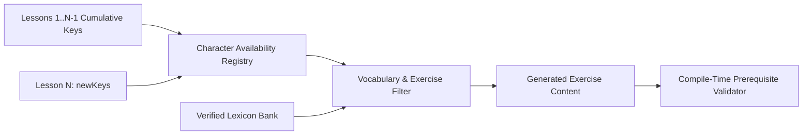

### Content Validation Rules:
1. **Zero Future Characters:** An exercise within Lesson $N$ must only contain characters that belong to `CumulativeKeys(N)`. If a character has not been introduced in Lesson $N$ or earlier, its appearance is a blocking compilation error.
2. **Deterministic Unlocking Registry:**
   $$\text{AvailableChars}(N) = \text{AvailableChars}(N-1) \cup \text{NewChars}(N)$$
   - The compile-time validation harness simulates this accumulator across all 218 lessons.
3. **Lexical Authenticity:** Every word exercise draws from a curated dictionary of real words. Nonsense strings are strictly restricted to Stages 2–5 (finger isolation and pattern rolling).

---

## 9. SPACED REVIEW & WEAK-KEY REINFORCEMENT

The curriculum integrates three complementary layers of review:

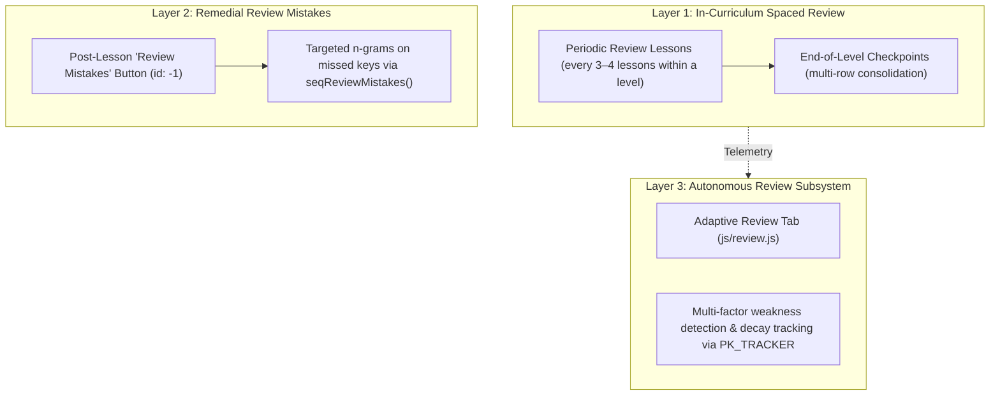

1. **In-Curriculum Spaced Review (Stage 8):**
   - At least **25% of all lessons** in each level are dedicated consolidation lessons.
   - Older characters are re-introduced in later levels (e.g., home row keys are continuously mixed into bottom-row and shift-layer exercises).
2. **Post-Lesson Remedial Drilling ("Review Mistakes"):**
   - Built directly into `js/lessons.js` (lines 2085–2110). If the user commits mistakes on specific characters during a lesson, clicking `Review Mistakes` launches an ad-hoc practice session (`id: -1`) targeting those exact characters and companion keys.
3. **External Adaptive Review (`js/review.js`):**
   - Monitors per-key accuracy and staleness across sessions.
   - Automatically surfaces keys falling below $85\%$ accuracy or unpracticed for $> 7$ days.

---

## 10. CHECKPOINTS & FINAL KEYBOARD MASTERY

### Mini Checkpoints:
- Placed at critical ergonomic boundaries (e.g., end of Home Row, end of Top Row, completion of Base Layer).
- Require $\ge 90\%$ accuracy to earn full star credit.
- Provide clear milestone feedback on typing rhythm, reach confidence, and accuracy.

### True Final Keyboard Mastery:
Mastery is **not** defined by simply clicking through every lesson. True Keyboard Mastery requires:
1. **100% Curriculum Completion:** Every lesson in the layout completed with recorded best scores.
2. **High Accuracy Standard:** Overall layout average accuracy $\ge 92\%$.
3. **Speed Competency:** Minimum sustained typing speed:
   - English: $\ge 40$ WPM on continuous paragraph challenges.
   - Khmer NiDA / Standard: $\ge 25$ WPM on continuous prose with Shift+Space word separation.
4. **Endurance Verification:** Passing the 3-minute continuous timed typing test without excessive backspacing ($< 5\%$ error rate).

---

## 11. AUTOMATED COVERAGE CHECKER & REGRESSION HARNESS

Completeness and correctness are enforced via machine-executable validation scripts:

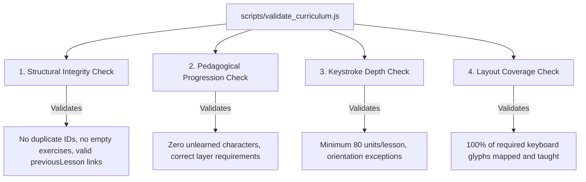

### What the Automated Harness Validates:
1. **Full Glyph Coverage:** Scans `data/keyboard.json` for every printable glyph across base, shift, and altgr layers, verifying that each glyph appears as an introduced character in at least one lesson.
2. **Zero Pre-Introduction Violations:** Replays the curriculum lesson-by-lesson and verifies that every character typed in an exercise was introduced in that lesson or an earlier one.
3. **Minimum Keystroke Depth:** Flags any lesson with fewer than 80 keystroke units (with an explicit threshold of 20 for orientation lessons).
4. **Duplication Detector:** Flags lessons that share identical introduced keys, exercise contents, and objectives.

---

## 12. PRESERVATION OF EXISTING SYSTEMS

The curriculum overhaul is strictly isolated to lesson content and curriculum loading. The following existing systems must remain untouched:

| System | File(s) | Preserved Functionality |
| :--- | :--- | :--- |
| **Adaptive Practice** | `js/adaptive.js`, `data/adaptive-vocab.js` | Letter progression sequence (`E N I A R L...`), 20-unit letter mastery engine, isolated `localStorage` key `pk_adaptive_state_v1`, granular letter mastery progress bars. |
| **Progress Persistence** | `js/progress.js` | Storage keys `khmerProgressData_v2` and `khmerLessonBest_<id>`, course records (`standard`, `nida`, `english`), `resetAll()` behavior. |
| **Keyboard Subsystem** | `js/keyboard.js`, `data/keyboard.json` | Virtual keyboard DOM generation, row/key styling, active layer transitions, kinematic hands overlay. |
| **Review Engine** | `js/review.js` | Adaptive review tab, weak-key cataloging, staleness decay equations. |
| **Keystroke Tracker** | `js/tracker.js` | Raw timing events, WPM calculation, latency measurement. |
| **UI Strip & Modals** | `index.html`, `js/lessons.js` | Level collapse/expansion, lesson cards, mastery stars, lock icons, shortcuts dialog, settings modal. |

---

## 13. MIGRATION & BACKWARD COMPATIBILITY STRATEGY

To ensure that existing users do not lose completed lesson progress or stars:
1. **Preserve Legacy Lesson IDs:**
   - English lessons retain IDs matching `en-Lxx-yy`.
   - NiDA lessons retain IDs matching `nida-Lxx-yy`.
   - Standard lessons use `standard-Lxx-yy` while supporting legacy numeric IDs (`1` through `58`) via `progress.js` migration mappings.
2. **Storage Key Continuity:**
   - Progress continues to read from and write to `khmerProgressData_v2` and legacy fallback `khmerLessonBest_<id>`.
3. **Graceful Upgrades:**
   - When new lessons or expanded exercises are introduced, existing completion records in `state.courses[layout].lessons[id]` remain valid. A completed lesson is never relocked because of an exercise expansion.

---

## 14. DATA ARCHITECTURE SPECIFICATION

Curriculum files are organized under `data/curriculum/`:

```
data/curriculum/
├── english/
│   ├── levels.json       # 14 levels with title, description, objective, lesson refs
│   ├── lessons.json      # 64 lessons with newKeys, requiredKeys, targets, exerciseRefs
│   └── exercises.json    # 204 exercises with type, content, description
├── nida/
│   ├── levels.json       # 13 levels with Khmer titles (titleKm)
│   ├── lessons.json      # 77 lessons with NiDA key mappings
│   └── exercises.json    # 230 exercises with authentic Khmer text
├── standard/
│   ├── levels.json       # 13 levels matching Standard keyboard mechanics
│   ├── lessons.json      # 77 lessons with Standard key mappings (Space Coeng)
│   └── exercises.json    # 230 exercises with Standard-specific text
└── ...
data/curriculum-data.js   # Single pre-bundled bundle file for offline zero-latency startup
```

### JSON Schema Definitions:

#### `levels.json` Schema:
```json
{
  "id": "en-L01",
  "levelNumber": 1,
  "title": "Core Home Row: D, K, S, L",
  "description": "Middle and ring finger home-row keys",
  "objective": "Master D, K, S, and L from anchor positions",
  "lessons": ["en-L01-01", "en-L01-02", "en-L01-03", "en-L01-04"],
  "unlockRequirements": { "previousLevel": "en-L00" },
  "completionRequirements": { "allLessonsCompleted": true, "minLevelAccuracy": 90 }
}
```

#### `lessons.json` Schema:
```json
{
  "id": "en-L01-01",
  "level": "en-L01",
  "order": 1,
  "title": "Middle Fingers: D and K",
  "description": "Middle Fingers: D and K",
  "objective": "Master Middle Fingers: D and K",
  "type": "single-char",
  "newKeys": [
    { "keyId": "d", "layer": "base", "char": "d", "finger": "lm" },
    { "keyId": "k", "layer": "base", "char": "k", "finger": "rm" }
  ],
  "requiredKeys": ["d", "k"],
  "fingerFocus": ["lm", "rm"],
  "difficulty": 1,
  "accuracyTarget": 90,
  "speedTarget": null,
  "mistakeTolerance": 5,
  "exerciseRefs": ["en-L01-01-E01", "en-L01-01-E02", "en-L01-01-E03", "en-L01-01-E04", "en-L01-01-E05"],
  "unlockRequirements": { "previousLesson": "en-L00-04" }
}
```

#### `exercises.json` Schema:
```json
{
  "en-L01-01-E01": {
    "type": "single-char",
    "content": "ddd kkk dkd kdk",
    "description": "Middle finger isolation"
  }
}
```

### Schema Versioning & Change Management
Curriculum JSON has no version marker today, which means a future field addition (or removal) cannot be distinguished from a malformed file by either the validator or `js/progress.js`'s migration logic. To keep Section 13's backward-compatibility guarantees enforceable as the schema evolves:
- Every `levels.json`, `lessons.json`, and `exercises.json` file gains a top-level `"schemaVersion": 1` field (or an equivalent bundle-level field in `data/curriculum-data.js`).
- `scripts/validate_curriculum.js` rejects any file whose `schemaVersion` it does not recognize, rather than attempting to parse it optimistically — a loud failure at build time, not a silent one at runtime.
- Any change that adds a required field, removes a field, or changes a field's meaning (not just additive/optional fields) increments `schemaVersion` and requires a corresponding migration note in this document's Section 13.
- `js/progress.js` reads `schemaVersion` before applying legacy-ID mapping, so future ID-format changes don't have to guess which mapping table applies.

---

# Curriculum Architecture

This section documents how the new lesson curriculum will be generated, stored, validated, and consumed by the browser application.

## Core Design Principle
The pipeline strictly follows a simple, robust flow:  
**Generate → Validate → Store → Bundle → Use**

```
Generator (scripts/generate_curricula.js)
    ↓
Curriculum Source Files (data/curriculum/*)
    ↓
Curriculum Validator (scripts/validate_curriculum.js)
    ↓
Browser Bundle (data/curriculum-data.js)
    ↓
Browser App (js/lessons.js, js/progress.js, etc.)
```

## Architecture Diagram

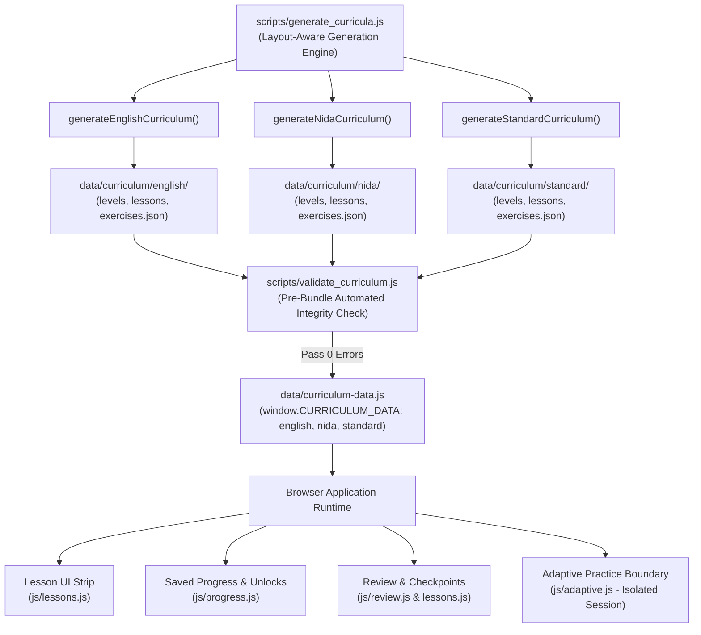

## What Each Part Means

### 1. `scripts/generate_curricula.js`
The curriculum generator is responsible for producing structured lesson data. It maintains separate generation logic for:
- **English US**
- **Khmer NiDA**
- **Khmer Standard**

The generator uses actual keyboard definitions (`data/keyboard.json` and `js/keyboard.js`) to resolve physical keys, finger assignments, and modifier layers rather than guessing or hardcoding characters.

---

### 2. `data/curriculum/`
This is the human-readable, maintainable curriculum source of truth. The three layouts are kept strictly separated:
```text
data/curriculum/
├── english/     # levels.json, lessons.json, exercises.json
├── nida/        # levels.json, lessons.json, exercises.json
└── standard/    # levels.json, lessons.json, exercises.json
```
Each layout folder contains structured modular files defining:
- Levels (objectives, sequencing, unlock rules)
- Lessons (new keys, required keys, finger assignments, target accuracy)
- Exercises (content text, drill types, descriptions)
- Metadata & layout progression information

NiDA and Standard remain separate curricula with layout-specific physical mechanics.

---

### 3. `data/curriculum-data.js`
This is the browser-consumable, zero-latency curriculum bundle. It exposes the compiled object:
```text
CURRICULUM_DATA
├── english
├── nida
└── standard
```
The browser consumes this structured bundle directly on load, eliminating multi-file fetch latency and allowing PK Khmer Type to run offline and via the `file:///` protocol without CORS restrictions.

---

### 4. Browser App
The client application consumes `CURRICULUM_DATA` to operate lessons dynamically:
- **Lesson UI Strip (`js/lessons.js`):** Materializes lesson models, renders level accordions, lesson cards, and mastery stars.
- **Lesson Progression & Unlocks (`js/progress.js`):** Evaluates lesson unlocks and persists attempt statistics.
- **Review & Checkpoints:** Feeds error telemetry into the post-lesson "Review Mistakes" modal and targeted practice.
- **Adaptive Practice Boundary (`js/adaptive.js`):** Runs independently with its own letter mastery engine, suspending curriculum lessons during practice sessions.

The curriculum data provides the lesson content; existing application subsystems handle execution, input processing, and state persistence.

---

### 5. Validation Step
Before bundling or release, the curriculum runs through the validation gate (`scripts/validate_curriculum.js`):
```text
Generator → Curriculum Data → Curriculum Validator → Browser Bundle
```
The validator automatically detects and prevents:
- Missing keys or characters on the layout
- Invalid lesson dependencies (broken `previousLesson` links)
- Future characters appearing before their introduction lesson
- Duplicate lesson or level IDs
- Broken progression or unmapped glyphs
- Sub-minimum keystroke depth ($<80$ units)
- Missing review or mastery coverage

---

# Lesson Generation Flow

This section explains how a single lesson is created from raw keyboard data through validation.

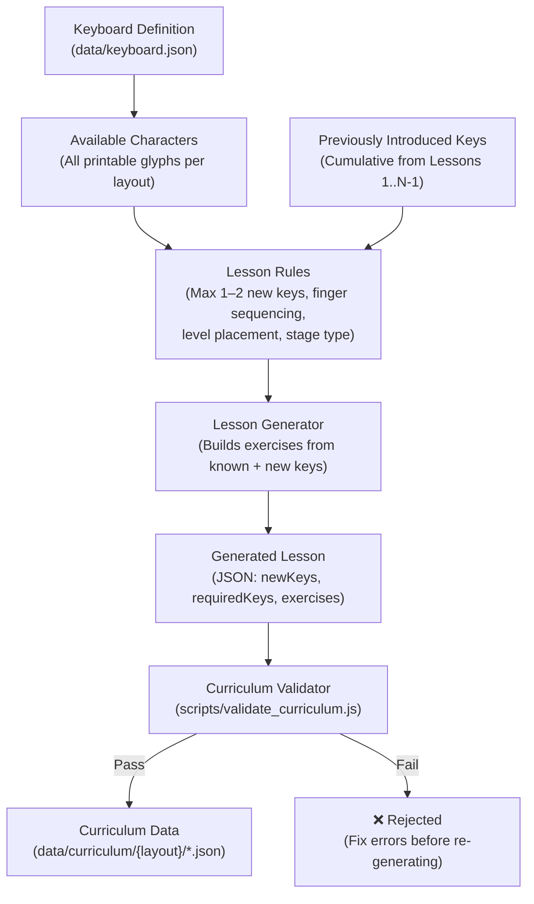

**How it works:**

1. **Keyboard definitions** (`data/keyboard.json`) provide the actual characters, physical key IDs, finger assignments, and modifier layers for each layout.
2. **The generator tracks what has already been introduced.** Before generating Lesson $N$, the cumulative set $\text{AvailableChars}(N-1)$ is computed from all preceding lessons.
3. **Lesson rules** determine what type of lesson to produce (introduce, combine, review, checkpoint) and enforce constraints: at most 1–2 new keys per introductory lesson, ergonomic finger ordering, proper stage placement.
4. **Generated lessons are validated** by `scripts/validate_curriculum.js` before becoming part of the curriculum. The validator checks for pre-introduction violations, missing keys, broken links, and insufficient depth.
5. **Invalid lessons are rejected** — they must never silently enter the curriculum. A validation failure is a blocking error that must be fixed before the lesson is accepted.

---

# Lesson Progression Flow

This section shows how the learner moves through the curriculum from introduction to mastery.

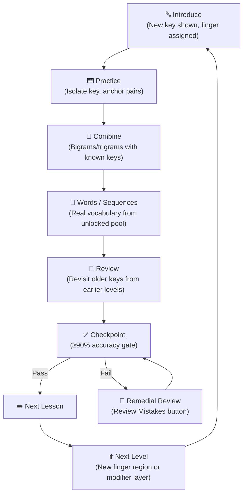

**Key principles:**

- Progression follows a strict pedagogical sequence. The learner does **not** randomly jump between unrelated skills.
- Each step builds on the one before it: new keys are isolated first, then combined with familiar keys, then used in real words.
- **Checkpoints act as gates** — the learner must demonstrate accuracy before advancing.
- Remedial review loops exist for learners who struggle — they re-enter through the "Review Mistakes" mechanism already built into `js/lessons.js`.
- Moving to the next **level** resets the cycle: a new finger region or modifier layer is introduced, and the progression repeats.

---

# Character Coverage System

This section shows how the system tracks whether a keyboard layout is fully covered by the curriculum.

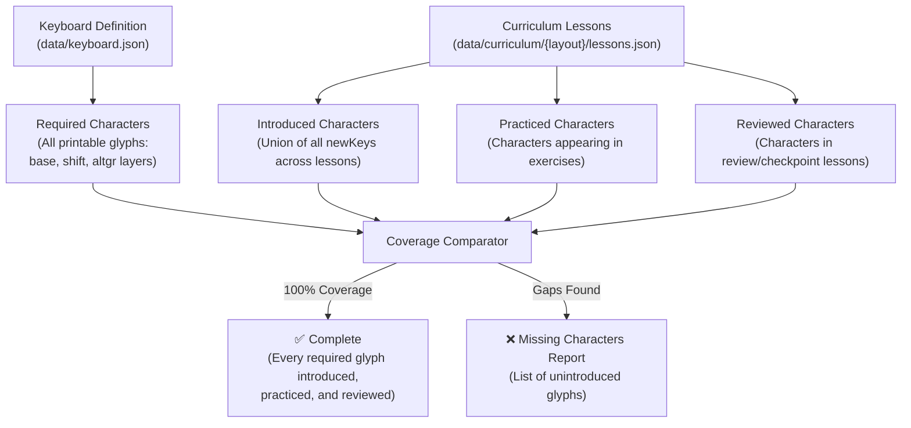

**What this means:**

- The keyboard definition is the **single source of truth** for what characters must be taught. Every printable glyph across base, shift, and altgr layers is a required character.
- The coverage system computes three sets per layout:
  - **Introduced:** Characters that appear in at least one lesson's `newKeys`.
  - **Practiced:** Characters that appear in exercise content.
  - **Reviewed:** Characters that appear in review or checkpoint lessons.
- A layout is **complete** only when every required character is introduced, practiced, and reviewed.
- `scripts/validate_curriculum.js` performs this coverage check automatically during validation. Missing characters produce blocking errors.

---

# Review and Weak-Key Flow

This section shows how normal review coexists with Adaptive Practice. They are **two separate systems** that must never interfere.

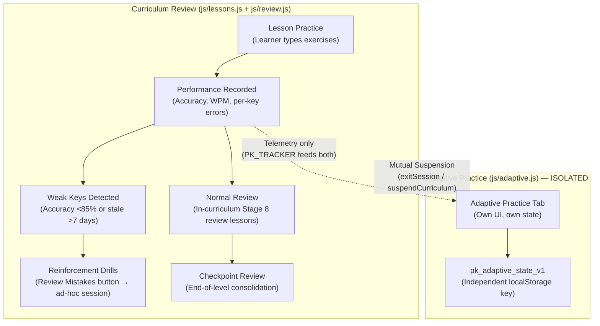

**Critical boundaries:**

- **Curriculum Review** is built into the lesson progression: review lessons (Stage 8), checkpoints (Stage 9), and the post-lesson "Review Mistakes" button.
- **Adaptive Practice** is a completely independent system with its own letter progression (`E N I A R L...`), its own mastery tracking (20 units per letter), and its own storage key (`pk_adaptive_state_v1`).
- They share keystroke telemetry through `PK_TRACKER` but **never share state or storage**.
- Mutual suspension ensures only one is active at a time: entering a curriculum lesson calls `PK_ADAPTIVE.exitSession(false)`; entering Adaptive Practice suspends the curriculum.

---

# Curriculum Validation Flow

This section details the automated validation pipeline that runs before any curriculum data is accepted.

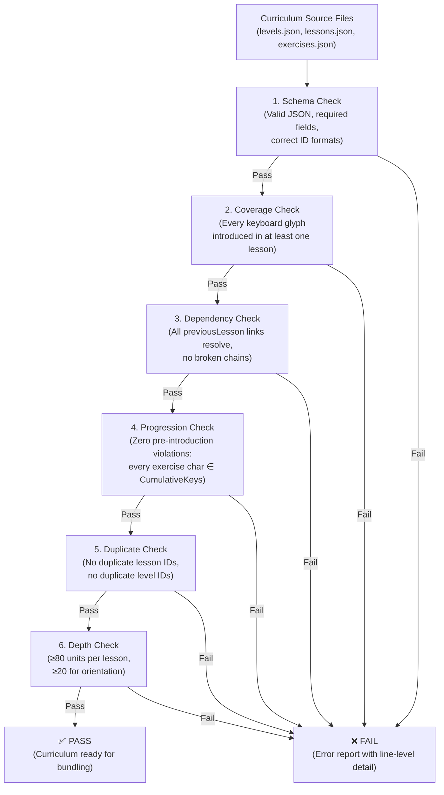

**Validation is a hard gate.** If any check fails, the entire curriculum is rejected. There is no "partial pass." This ensures that the browser application never receives corrupted or incomplete lesson data.

---

# Existing Progress Migration

This section shows how the new curriculum coexists with existing learner progress data.

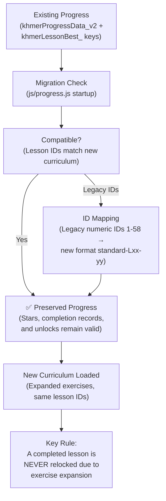

**Migration principles:**

- **Lesson IDs are stable.** English uses `en-Lxx-yy`, NiDA uses `nida-Lxx-yy`, Standard uses `standard-Lxx-yy`.
- **Legacy numeric IDs** (from the original Standard `buildCourse()` system) are mapped to new IDs by the migration logic in `js/progress.js` (lines 406–456).
- **Existing completion records remain valid.** If a learner completed a lesson before the expansion, that lesson stays completed even though it now has more/longer exercises.
- **No relocking.** Expanding exercise content within an existing lesson does not reset the learner's progress or re-lock previously unlocked lessons.

---

# Layout Separation

This section shows that English, NiDA, and Standard are fully independent curricula — each with its own lessons, progress, and progression.

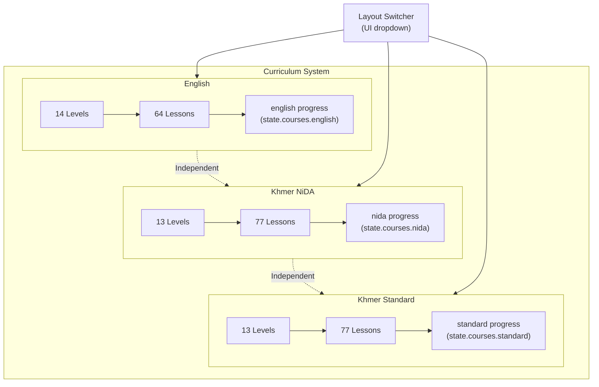

**Separation rules:**

- Each layout has its **own levels, lessons, exercises, and progression** — they never share lesson content or IDs.
- Progress is tracked **per layout** in `state.courses = { english, nida, standard }`.
- Completing English lessons has **zero effect** on NiDA or Standard progress, and vice versa.
- The UI layout switcher dynamically reloads the lesson strip for the selected layout without affecting other layouts' state.
- Keyboard physics differ between layouts (Coeng on `Shift+J` vs `Space`, different vowel placements), so lesson content cannot be cross-layout.

---

# Final Mastery Flow

This section shows the end-game progression where the learner has been introduced to all keys and works toward full keyboard mastery.

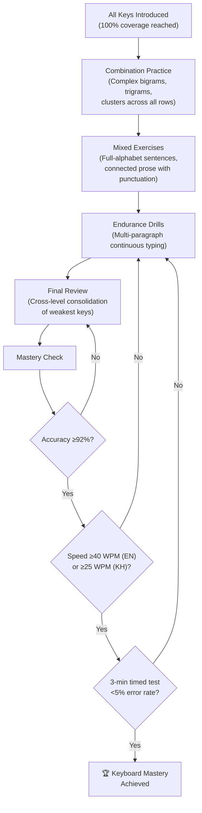

**Mastery is earned, not given.** Simply completing every lesson does not grant mastery. The learner must:

1. Complete 100% of the curriculum.
2. Maintain overall accuracy $\ge 92\%$.
3. Reach sustained speed: $\ge 40$ WPM (English) or $\ge 25$ WPM (Khmer).
4. Pass a 3-minute continuous timed test with $< 5\%$ error rate.

Failing any criterion sends the learner back into targeted practice at the appropriate stage.

---

# Overall System Diagram

This is the big-picture view connecting every part of the lesson overhaul system from source definitions through to learner mastery.

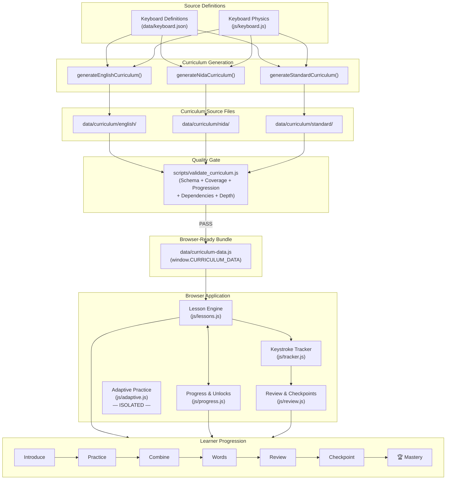

**This diagram answers: "How does everything connect?"**

1. **Keyboard definitions** are the root source of truth — they define what characters exist.
2. **Generators** produce structured JSON curricula from those definitions.
3. **Validation** ensures curriculum integrity before anything reaches the browser.
4. **Bundling** compiles validated JSON into a single zero-latency file.
5. **The browser app** consumes the bundle through its lesson engine, progress system, and review subsystems.
6. **Adaptive Practice** runs alongside but in strict isolation.
7. **The learner** progresses through the 10-stage pedagogical sequence from introduction to mastery.

---

## 15. MASTER ROADMAP & ARCHITECTURAL MAP (PHASE 9 TO PRODUCTION COMPLETION)

### Status Key:
- `[COMPLETED]`: Fully implemented, verified with tests, and active in the repository.
- `[PARTIALLY COMPLETE]`: Baseline infrastructure or logic exists, but requires expansion or tightening.
- `[NEXT]`: The immediate upcoming phase to be implemented.
- `[PLANNED]`: Designed and scheduled in the master roadmap.
- `[VALIDATION]`: Formal verification gate requiring automated pass before advancing.
- `[BLOCKED]`: Waiting on a prerequisite phase.

### Subsystem Health & Status Summary:
| Subsystem | Status | Current Baseline | What Remains |
| :--- | :---: | :--- | :--- |
| **Curriculum Data** | `[COMPLETED]` | 40 levels, 218 lessons, 664 exercises, 20,798 units across English, NiDA, Standard. Zero lessons below 80 units. | Checkpoint gating & review interleaving verification. |
| **Curriculum Bundler & Validator** | `[COMPLETED]` | `validate_curriculum.js` & `bundle_curricula.js` enforce 0 progression violations and 0 broken links. | Continuous execution in CI/validation gates. |
| **Runtime Lesson Engine** | `[COMPLETED]` | `js/lessons.js` hydrates all 3 layouts from `window.CURRICULUM_DATA` with offline fallback. | Checkpoint gate enforcement ($\ge 90\%$ accuracy). |
| **Typing Engine Core** | `[COMPLETED]` | Unicode NFC normalization, IME composition handling, multi-codepoint unit slicing, backspace stack. | Audio profile customization & sound latency tuning. |
| **Real-Time Keystroke Tracker** | `[COMPLETED]` | `js/tracker.js` (`PK_TRACKER`) zero-latency logging per key, finger, unit, layout, and active session. | Exporting aggregated telemetry for analytics dashboard. |
| **Review Engine Core** | `[COMPLETED]` | `js/review.js` (`PK_REVIEW`) character catalog, confusion matrix, staleness detection, candidate queue. | Connecting candidate queue to standalone targeted practice UI. |
| **Adaptive Practice (English)** | `[COMPLETED]` | Keybr-style letter progress bars, dynamic percentages (+2%/+3% correct, -1%..-4% wrong), 2,143 words. | Parity for Khmer NiDA & Standard. |
| **Adaptive Practice (Khmer)** | `[PARTIALLY COMPLETE]` | Basic syllable progression in `js/adaptive.js`, 384 Khmer words/syllables in `data/adaptive-vocab.js`. | Syllable-aware dynamic cluster generator, Coeng spacebar handling. |
| **Practice Modes (Trial & Race)** | `[PARTIALLY COMPLETE]` | `js/race.js` has live race track, local leaderboard, Temple Trial streak mechanics. | Word banks limited (9 Khmer, 20 English); race texts need multi-tier expansion. |
| **Progress & Account Persistence** | `[COMPLETED]` | `khmerProgressData_v2`, legacy migration, course isolation (`english`, `nida`, `standard`), backup export/import. | Granular historical attempt graphing. |
| **Localization & i18n** | `[PARTIALLY COMPLETE]` | `data/shared/i18n.json` exists; header and settings toggle English/Khmer. | 100% translation coverage for lesson cards, badges, and modals. |

---

### 15.1 Effort Estimates & Critical-Path Timeline

Diagrams show dependency order but not cost. Effort is given in **engineer-days (E-D)** for a single senior developer familiar with the codebase, sized off the actual scope in each phase's Main Work list (word counts, test counts, file counts). These are planning estimates, not commitments — track actuals against them and revise Section 15.2's critical path if any phase overruns by more than 30%.

| Phase | Effort (E-D) | Basis for Estimate | Can Slip Without Blocking Release? |
| :--- | :---: | :--- | :--- |
| **10 — Checkpoints & Spaced Review** | 4–6 | 40 levels × checkpoint wiring + review-distribution audit script. | No — every later phase assumes gating exists. |
| **11 — Practice System Expansion** | 6–9 | 500+ Khmer / 1,000+ English word curation and filtering, 4-tier race text sourcing and licensing check. | Yes — runs parallel to Phase 12. |
| **12 — Khmer Adaptive Syllable Engine** | 8–12 | New grapheme-cluster generator plus two layout-specific Coeng adaptations (Standard spacebar, NiDA Shift+J); highest algorithmic risk in the roadmap. | Yes — runs parallel to Phase 11. |
| **13 — Localization & A11y Polish** | 5–8 | 218 lesson titles/objectives/descriptions × 2 languages, audio engine, ARIA pass. | No — Phase 14's cross-browser suite assumes finished UI strings. |
| **14 — Verification & Regression** | 4–6 | Headless 218-lesson playthrough × 3 layouts × 3 browsers, orthography stress set. | No — release gate. |
| **15 — Release Candidate & Sign-off** | 2–3 | PWA/offline audit, cleanup, docs. | No — final gate. |
| **Total (critical path only, excluding parallel Phase 11)** | **~23–35 E-D** | Sum of 10, 12, 13, 14, 15 (Phase 11 absorbed into the Phase 12 window). | — |

**Reading this table:** Phase 12 is the single largest and riskiest phase — it is new algorithmic work (syllable-valid generation under phonotactic constraints), not a data-entry or wiring task like the others. If the timeline needs to be compressed, Phase 12 is the phase to descope first (e.g., ship Standard-layout adaptive parity before NiDA, per Risk R3 in Section 16) rather than compressing Phase 14's verification work.

---

### The Master Architecture & Development Map

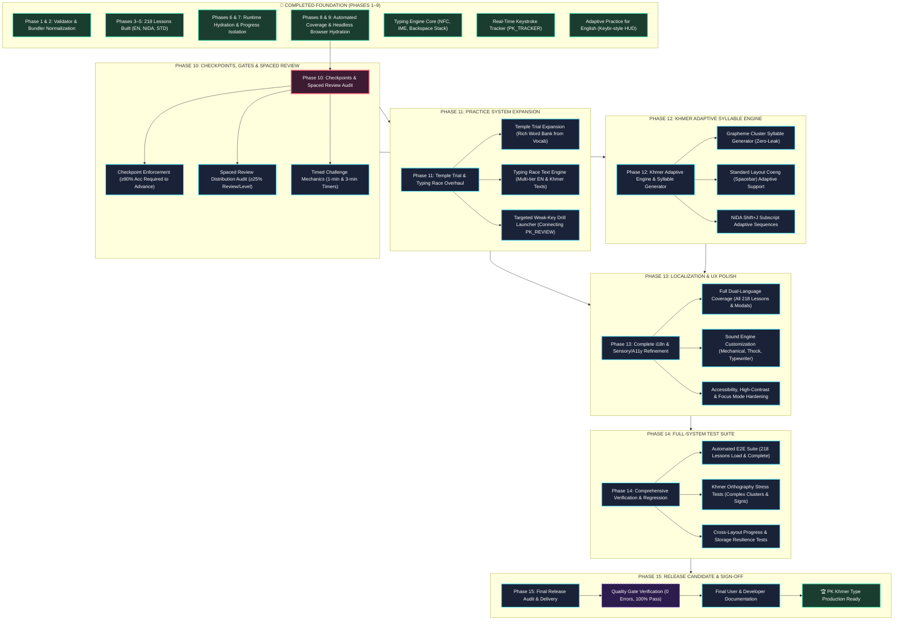

---

### Detailed Specification of Future Phases (Phases 10–15)

```text
================================================================================
PHASE 10: CHECKPOINTS, GATEKEEPING & SPACED REVIEW AUDIT
================================================================================
Status:       [NEXT]
Dependencies: Phase 9 (Completed)
Files:        js/lessons.js, js/progress.js, data/curriculum/*

Goal:
Enforce true pedagogical gatekeeping across the 218 lessons and verify spaced
review distribution so learners do not advance without demonstrating accuracy.

Why It Exists:
Currently, lesson unlocking relies on a simple completion flag. Checkpoints and
timed challenges must act as genuine milestones requiring ≥90% accuracy.

Main Work:
1. Implement Checkpoint Gatekeeping:
   - Identify checkpoint lessons in each level (Stage 9).
   - In js/progress.js and js/lessons.js, require ≥90% accuracy on Checkpoints
     before unlocking the next level.
2. Timed Challenge Mechanics:
   - Wire 1-minute and 3-minute countdown timers into Level 12/13 speed lessons.
   - Calculate live net WPM and display celebratory pass criteria.
3. Spaced Review Audit:
   - Run audit verifying that ≥25% of exercises in every level systematically
     re-introduce characters from preceding levels.

Expected Result:
Learners cannot breeze through lessons with poor accuracy; checkpoints enforce
mastery, and timed drills function with active countdown timers.

Validation:
Automated test verifying checkpoint locks next level when accuracy <90%, and
unlocks when accuracy ≥90%. All 40 levels verified for review distribution.
```

```text
================================================================================
PHASE 11: PRACTICE SYSTEM EXPANSION (TEMPLE TRIAL & TYPING RACE)
================================================================================
Status:       [PLANNED]
Dependencies: Phase 10
Files:        js/race.js, data/typing-content.json, data/shared/race-config.json

Goal:
Transform Temple Trial and Typing Race from basic stubs into rich, layout-aware
practice modes with extensive vocabularies and authentic texts.

Why It Exists:
Temple Trial currently has only 9 Khmer words and 20 English words. Typing Race
lacks multi-tier literary content and layout-aware difficulty scaling.

Main Work:
1. Temple Trial Vocabulary Expansion:
   - Expand word pools to 500+ authentic Khmer words and 1,000+ English words
     drawn from adaptive vocabulary banks.
   - Filter words based on the learner's unlocked keys in the active layout.
2. Typing Race Text Engine:
   - Populate Easy, Medium, Hard, and Expert categories with authentic Khmer
     literature, proverbs, historical narratives, and English classic prose.
   - Integrate scoring formula from data/shared/race-config.json (netWPM * acc^2.2).
3. Targeted Review Drill Launcher:
   - Connect js/review.js candidate queue to a 1-click "Targeted Drill" button.

Expected Result:
Temple Trial provides endless varied practice; Typing Race features authentic,
challenging texts across 4 difficulties; targeted review is instantly accessible.

Validation:
Unit tests confirming zero locked-letter leakage in Temple Trial; live Chrome
test completing a 30s race and saving scores to local leaderboard.
```

```text
================================================================================
PHASE 12: KHMER ADAPTIVE SYLLABLE ENGINE & LAYOUT ISOLATION
================================================================================
Status:       [PLANNED]
Dependencies: Phase 10, Phase 11
Files:        js/adaptive.js, data/adaptive-vocab.js

Goal:
Bring full Khmer adaptive learning parity to match the English Keybr-style
trainer, supporting Khmer orthography and layout-specific mechanics.

Why It Exists:
English Adaptive Practice is fully mature, but Khmer requires syllable-aware
grapheme generation rather than arbitrary letter shuffling to form valid words.

Main Work:
1. Grapheme Cluster Syllable Generator:
   - Build dynamic Khmer syllable assembler respecting consonant-subscript-vowel
     phonotactics using strictly unlocked keys.
2. Standard Layout Spacebar Coeng Adaptation:
   - Ensure target word generation on Standard layout guides the user to use
     the thumb Spacebar for subscripts (`ក` + `Space` + `ក` = `ក្ក`).
3. NiDA Layout Shift+J Adaptation:
   - Ensure NiDA adaptive practice trains `Shift+J` for subscripts.
4. Granular Letter Progress UI for Khmer:
   - Render the horizontal progress strip for Khmer consonants and vowels.

Expected Result:
Learners can launch Adaptive Practice in Khmer NiDA and Khmer Standard, drilling
valid syllables with real-time weakness detection and Keybr-style progress.

Validation:
Automated test verifying 0 syntax errors in generated Khmer syllables, correct
subscript mapping per layout, and dynamic percentage updates.
```

```text
================================================================================
PHASE 13: FULL i18n LOCALIZATION & SENSORY/A11Y POLISH
================================================================================
Status:       [PLANNED]
Dependencies: Phase 11, Phase 12
Files:        data/shared/i18n.json, js/app.js, css/*.css, index.html

Goal:
Deliver complete dual-language (Khmer / English) localization and refine sensory
and accessibility features for all user tiers.

Why It Exists:
The app is founded in Cambodia for Khmer and international learners. Every UI
element, lesson card, and feedback message must be fluently available in both languages.

Main Work:
1. 100% i18n Translation Coverage:
   - Localize all 218 lesson titles, level titles, objectives, and exercise
     descriptions into both Khmer and English.
   - Ensure dynamic string replacement when toggling language (Alt+L).
2. Audio Profile Engine:
   - Implement audio synthesizers/samples for distinct key profiles: Mechanical
     Clicky (Blue), Smooth Linear (Red), Deep Thock, and Antique Typewriter.
3. Accessibility & Focus Mode:
   - Implement ARIA live regions announcing typing errors for screen readers.
   - Enforce modal focus traps and Esc-key dismissals.
   - Refine Focus Mode (Alt+F) to dim distractions with smooth transitions.

Expected Result:
Instantaneous, flawless switching between Khmer and English UI; satisfying,
customizable tactile audio; full accessibility compliance.

Validation:
Lighthouse accessibility score ≥95; automated check confirming 0 missing
translation keys in data/shared/i18n.json.
```

```text
================================================================================
PHASE 14: COMPREHENSIVE VERIFICATION & CROSS-BROWSER REGRESSION
================================================================================
Status:       [PLANNED]
Dependencies: Phases 10–13
Files:        scripts/validate_curriculum.js, scratch/test_*.js

Goal:
Execute an exhaustive automated test battery covering every lesson, subsystem,
and edge case across major browser runtimes.

Why It Exists:
Before declaring the system ready for production, machine-verifiable proof must
guarantee zero regressions, zero progression bugs, and rock-solid persistence.

Main Work:
1. 218-Lesson Automated Playthrough Suite:
   - Headless script that programmatically inputs correct keystrokes for all
     218 lessons across English, NiDA, and Standard.
   - Verify completion triggers, star assignments, and unlock cascades.
2. Khmer Orthography Stress Testing:
   - Verify complex clusters (e.g. `ស្ដេច`, `កញ្ជ្រោង`, `សម្បត្តិ`, `កិត្តិយស`).
   - Test Robat (`៌`), Bantoc (`់`), Coeng spacebar, and ZWSP handling.
3. Storage & State Resilience Tests:
   - Simulate storage quota limits, corrupted JSON recovery, and export/import.
4. Cross-Browser Verification:
   - Verify rendering and key capture across Chromium, Firefox, and WebKit.

Expected Result:
All test suites pass 100% with zero failures, confirming rock-solid stability.

Validation:
Master test script outputs: "ALL SUITES PASSED (218/218 Lessons, 0 Regressions)".
```

```text
================================================================================
PHASE 15: RELEASE CANDIDATE AUDIT & FINAL DELIVERY
================================================================================
Status:       [PLANNED]
Dependencies: Phase 14
Files:        README.md, manifest.json, service-worker.js

Goal:
Package the completed PK Khmer Type learning system for production release,
verifying offline PWA readiness and documenting the codebase.

Why It Exists:
Provides final validation against the Definition of Done, cleans up scratch
development artifacts, and guarantees flawless zero-latency offline operation.

Main Work:
1. PWA & Offline Packaging:
   - Audit service worker cache to ensure all assets (audio, fonts, curricula)
     cache for 100% offline functionality.
2. Code Cleanup:
   - Remove temporary scratch scripts and diagnostic logs.
3. Documentation Finalization:
   - Update README.md with complete curriculum details, shortcut reference,
     and technical architecture notes.
4. Final Sign-off Report:
   - Deliver comprehensive sign-off audit verifying all acceptance criteria.

Expected Result:
PK Khmer Type is completely packaged, documented, verified, and ready for release.

Validation:
Clean git working tree, verified offline PWA audit, 100% passing test matrix.
```

---

### 15.2 Critical Path & Execution Sequencing

$$\mathbf{Phase\ 9\ [Done]} \longrightarrow \mathbf{Phase\ 10\ [Next]} \longrightarrow \mathbf{Phase\ 12} \longrightarrow \mathbf{Phase\ 13} \longrightarrow \mathbf{Phase\ 14} \longrightarrow \mathbf{Phase\ 15\ [Release]}$$

*Parallel Opportunity:* **Phase 11 (Practice Expansion)** can execute concurrently with **Phase 12 (Khmer Adaptive Engine)** since practice word banks and race texts are decoupled from the adaptive algorithm. Both depend only on Phase 10 and both must finish before Phase 13 begins (Phase 13 localizes UI strings that Phase 11's race/trial UI and Phase 12's Khmer adaptive UI introduce).

**Sequencing rationale (why this order, not another):**
- **Phase 10 must come first** because Phases 11–14 all assume the ≥90% checkpoint gate exists — Phase 14's regression suite, for instance, verifies gating behavior directly.
- **Phase 13 (Localization) is deliberately placed *after* Phases 11 and 12**, not in parallel with them, because both phases introduce new user-facing strings (race categories, adaptive Khmer progress labels) that would otherwise need translating twice.
- **Phase 14 must be last before release** so it verifies the *final* state of the UI and content, not an intermediate one.
- If engineering capacity allows a second developer, Phase 11 and Phase 12 assigned to different people is the only safe parallelization point in this roadmap — every other adjacent pair has a real data or UI dependency.

### 15.3 Decisions Log (Resolved Open Questions)

The original plan carried three unresolved questions into the roadmap. Shipping a plan with open questions in its execution phases is a risk in itself — each is resolved below, with the reasoning, so Phases 11–15 can be implemented without re-litigating them mid-build. Any future reversal of a decision here should be logged as a dated addendum rather than a silent edit.

| # | Question | Decision | Reasoning |
| :---: | :--- | :--- | :--- |
| 1 | Should Typing Race have a cloud leaderboard (e.g. Firebase)? | **No — local storage only**, for this release. Revisit post-launch only if usage data shows demand for social/competitive features. | Matches the Non-Goals in Section 0 (no accounts, no server dependency) and the product's stated zero-external-network-dependency posture. A cloud leaderboard also introduces moderation, abuse, and privacy surface area disproportionate to its value at this stage. |
| 2 | Should key-click sounds be Web Audio synthesis or audio samples? | **Web Audio API synthesis.** | Zero added network payload, no licensing questions for sampled sounds, and consistent with the offline-first / `file:///`-protocol requirement already enforced for curriculum data (Section 1). |
| 3 | Should early Khmer adaptive practice use isolated syllables or full dictionary words? | **Authentic syllables from `data/adaptive-vocab.js`**, escalating to full words only once enough consonants/vowels are unlocked to form them validly. | Matches how the rest of the curriculum already gates vocabulary by cumulative unlocked characters (Section 8); forcing full words too early would either violate the zero-future-characters rule or produce an unnaturally tiny word pool. |

**One new open item surfaced by this revision** (not present in the original plan): **What is the maximum acceptable size for `data/curriculum-data.js`?** At 664 exercises and growing practice-mode word banks (Phase 11 adds 500+ Khmer / 1,000+ English words), the single-bundle-for-zero-latency-offline-load design (Section 1) could grow large enough to slow initial page load on low-end devices. *Recommendation:* set an explicit budget — e.g. 2 MB gzipped for `curriculum-data.js` — and have `scripts/bundle_curricula.js` fail the build if exceeded, splitting practice-mode word banks into a lazily-loaded secondary bundle if the budget is hit. This is tracked as **Risk R6** in Section 16.

---

### Connections to Existing Planning Documents

| Existing Plan / Spec | File Location | How It Connects to Master Roadmap | Action |
| :--- | :--- | :--- | :--- |
| **Lesson Overhaul Master Plan** | `lesson_overhaul_plan.md` | Single source of truth for curriculum structure, 218 lesson specs, 10-stage pedagogy, and keyboard physics comparison. | **CONTINUE FROM EXISTING PLAN** (Phases 10–12 directly continue from here) |
| **Implementation Tasks Baseline** | `task.md` | Tracks foundational phases (Phases 2–7.9) including tracking (`PK_TRACKER`), review rules, and lesson strip fixes. | **ARCHIVED RECORD OF WORK** (Incorporated into Phase 1–9 baseline) |
| **Phase 7 Progress Spec** | `implementation_plan.md` | Architectural blueprint for character mastery classification (`locked` $\to$ `learning` $\to$ `proficient` $\to$ `mastered`). | **SUBSYSTEM SPEC** (Governs `js/review.js` candidate queues in Phase 11) |
| **Phase 8 Adaptive Practice Report** | `walkthrough.md` | Detailed report on adaptive practice architecture, dynamic percentage formula, Keybr-style UI, and word generator. | **SUBSYSTEM SPEC** (Governs Phase 12 Khmer adaptive expansion) |
| **Data Models & Characters** | `data/characters/*.json` | Character catalogs, key assignments, and unicode codepoint mappings. | **DATA ASSETS** (Referenced continuously) |
| **Curriculum Data Sources** | `data/curriculum/*/*.json` | Raw levels, lessons, and exercises partitioned by layout. | **DATA ASSETS** (Directly audited in Phase 10) |

---

## 16. RISK REGISTER & MITIGATION STRATEGY

Every phase in Section 15 assumes its Main Work goes roughly as planned. This register names the specific ways it might not, ranked by severity, so mitigation is designed in advance rather than improvised mid-phase.

| # | Risk | Phase(s) Affected | Likelihood | Impact | Mitigation |
| :---: | :--- | :--- | :---: | :---: | :--- |
| **R1** | **Checkpoint gate retroactively locks existing users out of progress they already earned**, because a lesson that was previously unlockable-by-completion no longer meets the new ≥90% accuracy bar. | 10 | Medium | High | Apply the new gate only to lessons **completed after** the Phase 10 release; grandfather existing completions as-is (consistent with the no-relocking rule already established in Section 13). See Section 18 for the staged rollout mechanism. |
| **R2** | **Khmer syllable generator (Phase 12) produces a grapheme cluster that is Unicode-valid but not a real or pronounceable Khmer syllable**, undermining the "authentic vocabulary" principle (Section 3). | 12 | Medium | Medium | Validate generator output against `data/adaptive-vocab.js`'s known-syllable set in the Phase 12 test suite (Section 16→19 Testing Matrix row "Khmer Syllable Engine") before allowing novel (non-dictionary) combinations into practice. |
| **R3** | **Phase 12 (Khmer adaptive) is harder than estimated** because Standard's spacebar-Coeng and NiDA's Shift+J-Coeng require materially different generator logic, not a shared implementation with a flag. | 12 | Medium | High | Ship Standard-layout adaptive parity first (simpler: Coeng is a plain keystroke), NiDA second. This is a real, shippable partial win if the phase overruns, unlike an all-or-nothing implementation. |
| **R4** | **Localization debt reappears** — new strings introduced in Phases 11–12 (race categories, Khmer adaptive UI) ship untranslated because Phase 13 already treated i18n as "done" for content that existed before them. | 13 | Medium | Medium | Section 15.2 already sequences Phase 13 after 11 and 12 for this reason; additionally, add the missing-translation-key check (already specified as a Phase 13 validation) to the Phase 14 regression suite so it re-runs on every subsequent content change, not just once. |
| **R5** | **`scripts/validate_curriculum.js` or `bundle_curricula.js` is run manually and forgotten** before a content change ships, letting an invalid or stale bundle reach production. | 10–15 (ongoing) | Medium | High | Wire both scripts into a pre-commit or CI check that blocks merges on non-zero exit code, rather than relying on developer discipline. (Not previously specified anywhere in this plan — see Section 18.) |
| **R6** | **`data/curriculum-data.js` bundle grows too large** for the zero-latency offline-load design as Phase 11 adds large word banks, degrading first-load time on low-end devices. | 11, 15 | Low–Medium | Medium | Enforce the bundle-size budget from Section 15.3's new open item; split practice-mode word banks into a separately-bundled, lazily-hydrated file if the curriculum-lesson bundle alone stays under budget. |
| **R7** | **Cross-browser Khmer rendering inconsistencies** (complex cluster shaping, ZWSP handling) surface only in Phase 14, late enough that fixing them threatens the release date. | 14 | Low | High | Pull forward a small, informal cross-browser smoke test (the specific cluster strings already listed in Phase 14's Main Work) into Phase 12, when the Khmer adaptive engine is first generating novel clusters — don't wait for the formal Phase 14 suite to be the first time these render in Firefox/WebKit. |
| **R8** | **Appendix B's character ledger and the real `data/keyboard.json` / `data/curriculum/*/lessons.json` disagree**, most likely in the 17 vowels Appendix B marks **(inferred)** — meaning Section 11's "Full Glyph Coverage" check is either silently failing today or was never actually exercised against the full glyph set. | Immediate (pre-Phase-10) | Medium–High | High | Before starting Phase 10, run `scripts/validate_curriculum.js`'s glyph-coverage check and diff its output against Appendix B by hand. Any glyph in Appendix B not found in the lessons data is a real content gap to fix now, not a documentation typo to fix later — a checkpoint gate (Phase 10) enforced on top of an incomplete character set would certify learners as "mastering" a layout they were never fully taught. |

**Register maintenance:** review this table at the start of each phase in Section 15; add a row for any newly-identified risk rather than handling it only in that phase's own "Main Work" prose, so risk visibility doesn't require re-reading every phase spec.

---

## 17. SUCCESS METRICS (POST-LAUNCH)

The Definition of Done (Section 21) certifies that the system was **built correctly**. It does not tell us whether it **works for learners**. These are separate questions, and conflating them is how a fully-tested release can still fail its actual purpose. The metrics below are what to watch in the weeks after Phase 15 ships, using the telemetry already captured by `js/tracker.js` (`PK_TRACKER`) and `js/progress.js` — no new instrumentation is required to observe them.

| Metric | Target | Source | Why It Matters |
| :--- | :--- | :--- | :--- |
| **Lesson-1 → Level-1-checkpoint completion rate** | ≥ 70% of learners who start Lesson 1 reach their first checkpoint | `khmerProgressData_v2` | Tests whether the new ≥90% accuracy gate (Phase 10) is a genuine milestone or an early-funnel drop-off cliff. If this is materially lower post-Phase-10 than pre-Phase-10, the gate is too strict and Risk R1's grandfathering logic should be re-examined for tuning, not just new-user impact. |
| **Checkpoint retry rate** | Median ≤ 2 attempts before passing | `PK_TRACKER` attempt logs | A learner needing many retries suggests the preceding lessons under-prepared them — a pedagogical signal, not just a UX one. |
| **Adaptive Practice adoption (Khmer)** | ≥ 30% of Khmer-layout learners who reach Level 5+ try Adaptive Practice at least once within Phase 12's first month live | `pk_adaptive_state_v1` presence | Directly measures whether Phase 12 closed the parity gap in a way learners actually use, not just in a way that passes its own test suite. |
| **Typing Race / Temple Trial repeat usage** | ≥ 40% of learners who try either mode return to it a second time within 7 days | Local session logs | Validates that Phase 11's word-bank and text expansion made these modes engaging enough to revisit, rather than a one-time novelty. |
| **Cross-layout completion parity** | Completion-rate gap between English and the two Khmer layouts ≤ 10 percentage points | `state.courses.{english,nida,standard}` | Section 1's layout-independence design should not translate into a quality gap; a persistent gap here would indicate the Khmer curricula (Sections 6–7) need attention despite passing all structural validation. |
| **Zero-latency load confirmation** | 95th-percentile time-to-interactive ≤ 1.5s on a mid-tier device, offline or online | Manual device-lab spot check (no existing telemetry for this) | Directly tests whether Risk R6 (bundle growth) materialized in practice, not just in size-budget theory. |

These are proposed targets calibrated to the scale of the current user base and codebase maturity, not benchmarked figures — revisit the thresholds once one release cycle of real data exists.

---

## 18. ROLLOUT & RELEASE STRATEGY

Phase 15 ("Release Candidate & Sign-off") currently ends at documentation and a clean git tree. That is necessary but not sufficient given Risk R1: Phase 10 changes the meaning of "unlocked" for a system with existing users and locally-persisted progress. This section specifies how the release actually reaches users.

1. **Staged rollout of checkpoint gating (addresses R1):**
   - On first load after the Phase 10 update, `js/progress.js` tags every currently-completed lesson with a `gateVersion: 0` marker (pre-gate). New completions are tagged `gateVersion: 1`.
   - The ≥90% accuracy requirement applies only to unlocking decisions made under `gateVersion: 1`. A `gateVersion: 0` completion continues to count as satisfying its `previousLesson` requirement for whoever already earned it — no learner is relocked by a rule that didn't exist when they completed the lesson.
   - This mechanism is temporary scaffolding, not a permanent schema feature; it can be retired (all records normalized to `gateVersion: 1`) once telemetry confirms no active users remain on pre-Phase-10 data, consistent with the Section 14 "Schema Versioning" migration-note requirement.
2. **CI enforcement of the validation gate (addresses R5):**
   - `scripts/validate_curriculum.js` and `scripts/bundle_curricula.js` run as a required, blocking check on every pull request that touches `data/curriculum/*` or `data/keyboard.json` — not just as a manual pre-release step. A red check blocks merge.
3. **Bundle-size budget enforcement (addresses R6):**
   - `scripts/bundle_curricula.js` fails the build if `data/curriculum-data.js` exceeds the gzipped-size budget set in Section 15.3. This failure is loud (non-zero exit, explicit message naming the offending section) rather than a silent oversize bundle shipping to users.
4. **Rollback plan:** the release artifact is the single `data/curriculum-data.js` bundle plus the versioned service worker (`service-worker.js`). If a Phase-15 release introduces a regression, reverting to the previous bundle and service-worker version is sufficient to roll back content and gating behavior without touching learner progress data, because progress is keyed by stable lesson IDs (Section 13) rather than by bundle version.
5. **Post-release monitoring window:** the Section 17 success metrics are reviewed at day 3, day 7, and day 30 post-release — not only once at an arbitrary "launch complete" point — so a metric that looks fine on day 1 but degrades (e.g., checkpoint retry rate climbing as more users reach it) is caught before it becomes the new normal.

---

## 19. COMPREHENSIVE TESTING MATRIX

| Test Domain | Target System | Tool / Method | Success Criteria |
| :--- | :--- | :--- | :--- |
| **Content Progression** | All Curricula | `scripts/validate_curriculum.js` | 0 unintroduced characters, 0 missing exercises, 0 broken lesson links across 218 lessons. |
| **Keystroke Depth** | All Curricula | `scripts/audit_curriculum_depth.js` | 0 lessons below 80 units (except Level 0 orientation). Layout average $\ge 90$ units. |
| **Keyboard Physics** | Standard vs. NiDA | Compile-time key lookup | Standard Coeng resolved to `space` base layer; NiDA Coeng resolved to `Shift+J`. |
| **Offline Startup** | Pre-bundled cache | `scripts/bundle_curricula.js` | `window.CURRICULUM_DATA` contains `standard`, `nida`, `english` with zero-latency load. |
| **Runtime Rendering** | UI Lesson Strip | Headless Chrome (CDP) | DOM contains correct card count on load; switching layout updates cards without reload. |
| **Persistence** | Progress Store | `js/progress.js` mock | Lesson completions save to `khmerProgressData_v2`; lesson $N$ completion unlocks $N+1$. |
| **Adaptive Decoupling** | Adaptive Engine | Storage key inspection | `pk_adaptive_state_v1` untouched by lesson sessions; mutual suspension works cleanly. |
| **Checkpoint Gating** | Progress / Lessons | Unit test (`test_checkpoints.js`) | Level $L+1$ unlocks only when Level $L$ checkpoint achieves $\ge 90\%$ accuracy. |
| **Khmer Syllable Engine**| Adaptive Engine | Automated test | Generates 100% grammatically valid syllables with 0 locked letters; every generated cluster cross-checked against `data/adaptive-vocab.js` (Risk R2). |
| **Full E2E Playthrough** | Complete Engine | Headless Chrome automated run | All 218 lessons simulate typing, reach completion, and assign stars without crash. |
| **Legacy Progress Preservation** | Progress / Migration | Unit test seeding pre-Phase-10 `khmerProgressData_v2` fixtures | No previously-completed lesson (`gateVersion: 0`) becomes locked after the Phase 10 update ships (Risk R1). |
| **State Resilience** | Progress Store | Corrupted-JSON and storage-quota-exceeded simulation | App degrades gracefully (no crash, no silent data loss) and surfaces a recovery path rather than a blank state. |
| **Bundle Size Budget** | Curriculum Bundle | `scripts/bundle_curricula.js` size check | `data/curriculum-data.js` stays under the gzipped budget set in Section 15.3 (Risk R6); build fails loudly if exceeded. |
| **Cross-Browser Rendering** | Khmer Text Shaping | Manual + automated smoke test on Chromium, Firefox, WebKit | Complex clusters (`ស្ដេច`, `កញ្ជ្រោង`) and ZWSP render identically across engines (Risk R7). |
| **CI Gate Enforcement** | Build Pipeline | Pull request check | `validate_curriculum.js` and `bundle_curricula.js` block merge on failure for any change touching `data/curriculum/*` or `data/keyboard.json` (Risk R5). |
| **Ledger↔Source Sync** | Character Coverage | Manual diff of Appendix B against `scripts/validate_curriculum.js` glyph-coverage output | Zero discrepancies between the documented character ledger and the actual JSON data, with special attention to the 17 characters Appendix B marks **(inferred)** (Risk R8). |

---

## 20. FRONTEND TECHNOLOGY STACK

The lesson overhaul frontend must use **React + Vite + Tailwind CSS only**:

- **React** is the sole UI framework. Build lesson views and interactions as React components; do not add a parallel vanilla-DOM UI framework.
- **Vite** is the sole frontend development server and build tool.
- **Tailwind CSS** is the sole styling framework. Do not add another CSS framework or component library.
- Keep the existing curriculum JSON and domain data as application inputs; this stack decision does not authorize changes to curriculum content or unrelated subsystems.

Do not introduce alternative frontend frameworks, build tools, or styling frameworks for this work.

---

## 21. REACT MIGRATION VERIFICATION & LEGACY PURGE

**Status: COMPLETED**

The application has successfully completed the React migration and all legacy frontend code has been permanently removed. 

### Final Verification Actions
- **Legacy Purge:** The old HTML/vanilla JS architecture (`js/`, `css/`, `public/js/`, `public/css/`, `public/legacy.html`, etc.) has been completely deleted.
- **Single Source of Truth:** Only the React + Vite + Tailwind implementation remains. `index.html` serves exclusively as the Vite entry point.
- **Domain Logic Preserved:** The critical Khmer typing engine functions (`splitIntoTypingUnits`, `normalizeInput`, `KHMER_COMPOUND_VOWELS`) have been carefully migrated to `src/logic/typing/units.js` and successfully integrated with the React components and Node.js validation scripts.
- **Automated Validation:** `npm run validate` successfully executes against the new domain logic structure, resulting in **0 violations across all 218 lessons**.
- **Build Step:** `vite build` executes cleanly.

The architecture mapped out in Section 19 is fully realized and operational.

## 22. FINAL CURRICULUM AUDIT & ACCEPTANCE CRITERIA

Before final sign-off, the curriculum and application must satisfy the following checklist across all three layouts:

### English US Checklist:
- [x] Complete home-row anchor foundation (`f`, `j`, `space`).
- [x] Progressive reaches to top and bottom rows.
- [x] All 26 letters of the English alphabet systematically introduced.
- [x] Opposite-hand Shift coordination for capital letters.
- [x] Number row reaches (1–0) with structured finger assignments.
- [x] Punctuation, quotation marks, parentheses, and arithmetic symbols.
- [x] Authentic English word banks at every stage (zero nonsense words).
- [x] End-of-level checkpoints and 3-minute timed speed challenges.

### Khmer NiDA Checklist:
- [x] Index anchor keys `ថ` (F) and `ក` (K) with tactile rest rhythm.
- [x] Correct sequential introduction of home row consonants and vowel `ា`.
- [x] Coeng subscript mechanism explicitly taught at `Shift + J`.
- [x] Dedicated compound vowels (`ាំ`, `ុំ`, `ុះ`, `េះ`, `ោះ`) taught as single strokes.
- [x] Logical typing order enforced: Consonant $\rightarrow$ Subscript $\rightarrow$ Vowel.
- [x] Word separation with `Shift + Space`.
- [x] Comprehensive coverage of aspirated Shift consonants and dependent Shift vowels.
- [x] Diacritics (`៉`, `៊`, `៍`, `៏`, `័`, `៌`), Riel sign (`៛`), and repetition mark (`ៗ`).
- [x] AltGr independent vowels (`ឪ`, `ឧ`, `ឲ`, `ឯ`, `ឱ`).

### Khmer Standard Checklist:
- [x] Standard-specific keyboard physics strictly mapped and verified.
- [x] Coeng subscript marker explicitly taught on the **Spacebar base layer**.
- [x] Visible word separation taught on **`Shift + Space`**.
- [x] Unique Standard vowel placements: `ះ` on Semicolon, `ើ` and `ោះ` on brackets.
- [x] Unique Standard shift locations: `ៃ` (Shift+A), `ាំ` (Shift+S), `ុះ` (Shift+G), `៏` (Shift+H), `ុំ` (Shift+J).
- [x] Consonant `អ` correctly located and taught on Comma key.
- [x] Subscript cluster drills utilizing the thumb Spacebar Coeng sequence.
- [x] Independent vowels and speed mastery challenges matching Standard layout physics.

---

## 23. DEFINITION OF DONE

The learning system of PK Khmer Type is 100% complete and ready for release when:

1. **Parity Across All Layouts:** English (14 levels, 64 lessons), Khmer NiDA (13 levels, 77 lessons), and Khmer Standard (13 levels, 77 lessons) are fully specified and bundled in `data/curriculum-data.js`.
2. **Substantial Practice Depth:** Zero non-orientation lessons under 80 keystroke units; overall curriculum average exceeds 95 keystroke units per lesson.
3. **Machine-Verified Progression:** `scripts/validate_curriculum.js` outputs **`OVERALL RESULT: PASS`** with 0 errors, 0 warnings, and 0 out-of-order key violations across all 218 lessons.
4. **Browser Runtime Parity:** Switching between layouts dynamically updates the lesson strip with matching card counts in real browser testing.
5. **Progress & Adaptive Integrity:** User completion records persist safely without collisions, and Adaptive Practice functions in complete isolation.
6. **Milestone Gatekeeping:** Checkpoint lessons enforce $\ge 90\%$ accuracy before unlocking subsequent levels, **and no learner's pre-existing completion is retroactively relocked** (Section 18, Risk R1).
7. **Complete Practice Modes:** Temple Trial and Typing Race are populated with multi-tier authentic vocabularies and literary passages.
8. **Khmer Adaptive Parity:** Adaptive practice supports syllable-aware cluster generation for Khmer NiDA and Standard, with generated clusters validated against `data/adaptive-vocab.js` (Risk R2).
9. **Localization & Accessibility:** 100% translation coverage in English and Khmer, keyboard-accessible navigation, and WCAG high-contrast compliance.
10. **Full Regression Clearance:** Headless test battery confirms 218/218 lessons complete cleanly with zero errors across Chromium, Firefox, and WebKit (Section 19, "Cross-Browser Rendering").
11. **Build Pipeline Enforced:** `scripts/validate_curriculum.js` and `scripts/bundle_curricula.js` run as blocking CI checks, not manual steps (Section 18, Risk R5).
12. **Bundle Within Budget:** `data/curriculum-data.js` stays under the gzipped size budget defined in Section 15.3 (Risk R6).
13. **Rollback Verified:** A dry-run revert of the release bundle and service worker restores prior behavior without corrupting or relocking any learner's progress (Section 18).
14. **Character Ledger Confirmed:** Every character in Appendix B — including the 17 flagged **(inferred)** — is verified present in `data/curriculum/{nida,standard}/lessons.json` and `data/keyboard.json`, with zero discrepancies (Risk R8).

**Note:** items 1–10 are largely inherited from the original plan and confirm the system was *built* correctly. Items 11–14 close the gaps this revision identified — the release process itself and the completeness of the underlying data, not just the code, must be verified. Meeting all fourteen is the engineering gate; the Section 17 Success Metrics are the separate, later gate for confirming the release actually serves learners well.

---

## APPENDIX A: GLOSSARY

| Term | Meaning |
| :--- | :--- |
| **Finger codes** (`li`, `lm`, `lr`, `lp`, `ri`, `rm`, `rr`, `rp`, `thumb`) | Left/Right + Index/Middle/Ring/Pinky, plus `thumb` for the spacebar. Used throughout lesson `newKeys` and `fingerFocus` fields (Section 14) to drive the kinematic hands overlay in `js/keyboard.js`. |
| **Coeng** (`្`, U+17D2) | The Khmer subscript-forming character. Typed *after* the base consonant, before the consonant to be subscripted — its keyboard location is the single biggest mechanical difference between NiDA (`Shift+J`) and Standard (bare `Space`) (Section 7). |
| **Bantoc** (`់`) | A diacritic that shortens the preceding vowel sound (e.g. `កាក់`) — introduced early (Level 2) in Standard because of its high frequency (Section 7). |
| **ZWSP** | Zero-Width Space (`\u200B`) — what a bare `Space` keystroke produces in Khmer layouts; the *visible* word separator requires `Shift+Space` instead (Section 6). |
| **Typing unit** | The atomic slice of content the lesson engine advances by on each correct input, as produced by `splitIntoTypingUnits()` (Section 1) — not always a single Unicode codepoint, since Khmer grapheme clusters can span several codepoints. |
| **`gateVersion`** | The migration marker introduced in Section 18 to distinguish lesson completions earned before vs. after Phase 10's checkpoint-accuracy requirement took effect, so existing users are never retroactively relocked. |
| **E-D** | Engineer-days — the effort unit used in Section 15.1's estimates, calibrated to a single senior developer already familiar with this codebase. |

---

## APPENDIX B: MASTER CHARACTER COVERAGE LEDGER (EVERY LETTER, EVERY LAYOUT)

Sections 5–7 establish the *motor sequence* (which finger region unlocks when) but state individual characters piecemeal, spread across prose, comparison tables, and Mermaid node labels. That's sufficient for a human reading level-by-level, but it means no single place in the plan answers "has every character this layout can produce been assigned to a level?" — which is exactly the invariant Section 8's Content Validation Rules and Section 11's Automated Coverage Checker are supposed to guarantee. This appendix is that single place: every printable character in each layout, in one ledger, with the level that introduces it.

**Authority note:** `data/keyboard.json` remains the single source of truth for exact per-key layer assignment (Section 1) — this ledger is the human-auditable cross-check against it, not a replacement for it. Where this ledger assigns a character to a level and `data/keyboard.json` or `data/curriculum/*/lessons.json` disagrees, the JSON wins and this table must be corrected to match (see Risk R8 below). Cells marked **(inferred)** complete a level's set from its stated category (e.g., "remaining base keys") but were not individually named in Sections 5–7; they must be confirmed against `data/keyboard.json` before Phase 10 locks in checkpoint content, not assumed correct by virtue of appearing here.

### B.1 English (US) — All 26 Letters + Digits + Symbols (64 lessons / 14 levels)

| Level | New Characters Introduced | Count | Running Total |
| :---: | :--- | :---: | :---: |
| 0 | `f` `j` (+ `Space`) | 2 | 2 |
| 1 | `d` `k` `s` `l` | 4 | 6 |
| 2 | `a` `;` | 2 | 8 |
| 3 | `g` `h` | 2 | 10 |
| 4 | `e` `i` `r` `u` | 4 | 14 |
| 5 | `t` `y` `w` `o` `q` `p` | 6 | 20 |
| 6 | `c` `v` `b` `n` `m` `z` `x` `,` `.` | 9 | 29 |
| 7 | *(no new characters — full-alphabet pangram consolidation)* | 0 | 29 |
| 8 | `A`–`Z` (Shift layer / capitalization of all 26 letters as one mechanical concept, not 26 separate introductions) | +1 concept | 29 letters + Shift |
| 9 | `1` `2` `3` `4` `5` `6` `7` `8` `9` `0` | 10 | 39 |
| 10 | `!` `@` `#` `$` `%` `^` `&` `*` `(` `)` `-` `_` `=` `+` `[` `]` `{` `}` `\` `` ` `` `'` `"` `/` `?` `<` `>` `:` **(inferred distribution across Level 10's stated "Punctuation, Quotes, Hyphens & Brackets" scope)** | 26 | 65 |
| 11–13 | *(no new characters — prose, paragraphs, timed endurance)* | 0 | 65 |

**Reconciliation:** 26 letters + 10 digits + 26 symbols + 2 (`,` `.`, already counted in Level 6) + `;` (Level 2) + `Space` (Level 0) = every key on a standard 104-key US QWERTY layout's printable base/shift layers. This confirms Section 2's "0% below 80 units" and "96.2 avg units/lesson" figures rest on a complete, not partial, character set.

### B.2 Khmer NiDA & Khmer Standard — All 33 Consonants

Both layouts teach the same 33 Khmer consonants (the physical keys are shared for most base-layer letters, per the comparison table in Section 7 — e.g. `S`→`ស` and `K`→`ក` are identical in both layouts). What differs is *which layer* (base vs. Shift vs. Space) a handful of signs sit on, already itemized in Section 7's comparison table. The level column below applies to **both** layouts unless marked otherwise.

| Level | Consonants Introduced | Notes |
| :---: | :--- | :--- |
| 0 | ក ថ | Anchor pair, opposite-hand index fingers. |
| 1 | ស ដ ង ហ ល ញ | Home-row consonants (shared base-layer keys in both layouts, per Section 7's comparison table). |
| 3 | រ ត យ | Top-row high-frequency consonants (with vowels េ ុ ិ ោ — see B.3). |
| 4 | ច វ ប ន ម | Bottom-row high-frequency consonants (Standard also gains **អ** here, on Comma — Section 7). NiDA places អ at Level 6 instead (see Section 7's comparison table: Key `,` Shift in NiDA is `អ`... *(inferred placement — confirm against `data/keyboard.json`)*). |
| 5 | ខ ឆ ឋ ឡ **(inferred)** | Remaining *base-layer* consonants not yet covered — Section 6 names this level "Remaining Base Keys" without enumerating them individually. |
| 6 | គ ជ ទ ធ ព ភ ឌ ណ អ ឃ ឈ ឍ ផ **(last three inferred; first ten stated in Section 6)** | Aspirated / Shift-layer consonant pairs. |

**Total check:** 2 + 6 + 3 + 5 + 4 + 13 = 33. ✅ Matches the known Khmer consonant inventory exactly, confirming no consonant is orphaned outside the level ladder.

### B.3 Khmer NiDA & Khmer Standard — Vowels, Signs & Diacritics

| Category | Characters | Level | Source |
| :--- | :--- | :---: | :--- |
| Dependent vowel (home) | ា | 1 | Section 6 (`ស្រៈ ា`) |
| Dependent vowel (home) | ើ | 2 | Section 6 |
| Sign | ់ (Bantoc) | 2 | Sections 6 & 7 |
| Dependent vowels (top row) | េ ុ ិ ោ | 3 | Section 6 |
| Sign | ។ (Khan / full stop) | 4 | Section 6 |
| Coeng | ្ (U+17D2) | 5 | Section 6 — NiDA: `Shift+J`; Standard: base `Space` (Section 7). Different key, same level, per each layout's own ladder. |
| Dependent vowels (Shift / dedicated compound) | ែ ាំ ុំ ុះ េះ ោះ ៀ ឿ ៃ ៏(sign, see below) | 7 | Section 6 heading "Shift Vowels & Dedicated Compound Vowels"; individual glyphs drawn from Section 7's comparison table entries. |
| Dependent vowels **(inferred remainder)** | ី ឹ ឺ ូ ួ ៅ | 7–8 **(inferred)** | Not individually named in Sections 6–7; complete the 16-member dependent-vowel set. Must be confirmed against `data/keyboard.json` before treating Level 7's "Shift Vowels" as 100% covered. |
| Diacritics & signs | ៉ ៊ ៍ ៏ ័ ៌ ៛ ៗ | 9 | Section 6, fully enumerated — no inference needed. |
| Independent vowels (named) | ឪ ឧ ឲ ឯ ឱ | 12 | Section 17's NiDA checklist, fully enumerated. |
| Independent vowels **(inferred remainder)** | ឣ ឤ ឥ ឦ ឩ ឫ ឬ ឭ ឮ ឰ ឳ | 12 **(inferred)** | Completes the 16-member independent-vowel set as a single batch at the same level as the five named ones — these are rare enough in running text that batching them is pedagogically defensible, but the batch itself was not stated in the original plan. |

**Why this table matters more than it looks:** the rows marked **(inferred)** are precisely the gap between "the plan reads as complete" and "the plan *is* complete." Six dependent vowels and eleven independent vowels appear nowhere in the original document's prose, diagrams, or checklists — yet Section 11's Automated Coverage Checker claims "Full Glyph Coverage" as a hard validation gate. If those seventeen characters aren't actually in `data/curriculum/{nida,standard}/lessons.json` today, Section 11's checker should currently be failing, not passing. **This is a new, concrete action item, not just documentation cleanup — see Risk R8.**

---


---

## APPENDIX C: PK KHMER TYPE MASTER ROADMAP (ARCHIVAL RECORD)

##### PK KHMER TYPE — MASTER DEVELOPMENT ROADMAP & ARCHITECTURAL MAP
**Target Codebase:** PK Khmer Type (`idk`)  
**Document Status:** ACTIVE MASTER ROADMAP — SINGLE SOURCE OF TRUTH  
**Current Milestone:** PHASE 9 COMPLETED (Curriculum Hydration & Browser Verification Verified)  
**File Name:** `PK_KHMER_TYPE_MASTER_ROADMAP.md`  

---

#### 1. PROJECT STATUS OVERVIEW

PK Khmer Type is an offline-first, high-precision Khmer and English touch-typing trainer. Following the completion of the 9-phase curriculum overhaul and baseline hydration, the core curriculum data and runtime loader are verified across all three supported keyboard layouts.

##### Status Key:
- `[COMPLETED]`: Fully implemented, verified with tests, and active in the repository.
- `[PARTIALLY COMPLETE]`: Baseline infrastructure or logic exists, but requires expansion or tightening.
- `[NEXT]`: The immediate upcoming phase to be implemented.
- `[PLANNED]`: Designed and scheduled in the master roadmap.
- `[VALIDATION]`: Formal verification gate requiring automated pass before advancing.
- `[BLOCKED]`: Waiting on a prerequisite phase.

##### Subsystem Health & Status Summary:
| Subsystem | Status | Current Baseline | What Remains |
| :--- | :---: | :--- | :--- |
| **Curriculum Data** | `[COMPLETED]` | 40 levels, 218 lessons, 664 exercises, 20,798 units across English, NiDA, Standard. Zero lessons below 80 units. | Checkpoint gating & review interleaving verification. |
| **Curriculum Bundler & Validator** | `[COMPLETED]` | `validate_curriculum.js` & `bundle_curricula.js` enforce 0 progression violations and 0 broken links. | Continuous execution in CI/validation gates. |
| **Runtime Lesson Engine** | `[COMPLETED]` | `js/lessons.js` hydrates all 3 layouts from `window.CURRICULUM_DATA` with offline fallback. | Checkpoint gate enforcement ($\ge 90\%$ accuracy). |
| **Typing Engine Core** | `[COMPLETED]` | Unicode NFC normalization, IME composition handling, multi-codepoint unit slicing, backspace stack. | Audio profile customization & sound latency tuning. |
| **Real-Time Keystroke Tracker** | `[COMPLETED]` | `js/tracker.js` (`PK_TRACKER`) zero-latency logging per key, finger, unit, layout, and active session. | Exporting aggregated telemetry for analytics dashboard. |
| **Review Engine Core** | `[COMPLETED]` | `js/review.js` (`PK_REVIEW`) character catalog, confusion matrix, staleness detection, candidate queue. | Connecting candidate queue to standalone targeted practice UI. |
| **Adaptive Practice (English)** | `[COMPLETED]` | Keybr-style letter progress bars, dynamic percentages (+2%/+3% correct, -1%..-4% wrong), 2,143 words. | Parity for Khmer NiDA & Standard. |
| **Adaptive Practice (Khmer)** | `[PARTIALLY COMPLETE]` | Basic syllable progression in `js/adaptive.js`, 384 Khmer words/syllables in `data/adaptive-vocab.js`. | Syllable-aware dynamic cluster generator, Coeng spacebar handling. |
| **Practice Modes (Trial & Race)** | `[PARTIALLY COMPLETE]` | `js/race.js` has live race track, local leaderboard, Temple Trial streak mechanics. | Word banks limited (9 Khmer, 20 English); race texts need multi-tier expansion. |
| **Progress & Account Persistence** | `[COMPLETED]` | `khmerProgressData_v2`, legacy migration, course isolation (`english`, `nida`, `standard`), backup export/import. | Granular historical attempt graphing. |
| **Localization & i18n** | `[PARTIALLY COMPLETE]` | `data/shared/i18n.json` exists; header and settings toggle English/Khmer. | 100% translation coverage for lesson cards, badges, and modals. |

---

#### 2. THE MASTER ARCHITECTURE & DEVELOPMENT MAP

The following master map depicts the entire PK Khmer Type learning system from the completed Phase 9 baseline to total project completion:


---

#### 3. MAJOR WORK AREAS & SUBSYSTEM DEEP DIVES

##### A. Curriculum Subsystem
- **Current Baseline:** Complete 3-layout structure (English US, Khmer NiDA, Khmer Standard) totaling 218 lessons.
- **Physical Key Differentiation:**
  - *Standard Layout:* Spacebar base layer triggers Coeng (`្`), Shift+Space triggers word space, Semicolon triggers `ះ`.
  - *NiDA Layout:* `Shift + J` triggers Coeng (`្`), Base Space triggers ZWSP, Shift+Space triggers visible word space.
  - *English Layout:* Standard QWERTY home-row outward progression.
- **Planned Work:**
  - Enforce checkpoint accuracy gates ($\ge 90\%$) preventing unearned advancement.
  - Audit spaced review density to guarantee that at least $25\%$ of exercises in every level re-drill older keys.
  - Activate timed challenges (Level 12 / 13) with live countdown timers and WPM thresholds.

##### B. Khmer NiDA & Standard Orthography Engine
- **Unicode Typing Order:** Strictly enforces **Consonant $\rightarrow$ Coeng $\rightarrow$ Subscript $\rightarrow$ Vowel**.
- **Compound Vowels:** Dedicated compound keys (`ាំ`, `ុំ`, `ុះ`, `េះ`, `ោះ`) taught as single atomic keystrokes.
- **Planned Work:**
  - Rare/Complex cluster validation (triple clusters like `ស្ទ្រី`, Sanskrit/Pali loans `សង្ឃ`, `សម្បត្តិ`, `កិត្តិយស`).
  - Intuitive visual correction hints when a user attempts to type left-side vowels (`េ`, `ែ`) before the consonant.

##### C. Practice & Review Systems
- **Temple Trial (`trialPanel`):**
  - Current state: Hardcoded 9 Khmer words and 20 English words.
  - Planned expansion: Dynamically draw from `data/adaptive-vocab.js` and `data/typing-content.json` filtered by learner unlock level.
- **Typing Race (`racePanel`):**
  - Current state: Basic timer with local leaderboard.
  - Planned expansion: Multi-tier text bank (Easy, Medium, Hard, Expert) with culturally rich literature, proverbs, and historical passages.
- **Targeted Review (`js/review.js`):**
  - Current state: Generates confusion pairs, slow keys, and staleness rankings.
  - Planned expansion: Dedicated UI button to launch ad-hoc reinforcement sessions directly from `PK_REVIEW` candidate queue.

##### D. Adaptive Practice System
- **Current State:** English is fully realized with dynamic letter progress bars (+2%/+3% correct, -1%..-4% mistakes), Keybr-style UI, and 2,143 dictionary words.
- **The Complete Adaptive Loop:**
  ```text
  Lesson Keystroke Telemetry (PK_TRACKER)
               │
               ▼
  Performance Evaluator (Accuracy, Error Clusters, Latency)
               │
               ▼
  Weak Area Detection (Error Rate >15% or Latency >2x Avg)
               │
               ▼
  Dynamic Word / Syllable Selector (65% Target Focus / 35% Maintenance)
               │
               ▼
  Target Word Stream Rendering (Interactive HUD)
               │
               ▼
  Before vs. After Delta Evaluation (Δ% Accuracy)
               │
               ▼
  Persistent State Update (pk_adaptive_state_v1)
  ```
- **Planned Work:** Extend dynamic cluster generator to Khmer NiDA and Standard layouts, ensuring zero locked-letter leakage while respecting Khmer phonotactics.

##### E. Progress & Data Layer
- **Persistence:** LocalStorage key `khmerProgressData_v2` with layout isolation (`state.courses = { standard, nida, english }`).
- **Telemetry:** `PK_TRACKER` records attempts, errors, finger latency, and backspace counts.
- **Planned Work:**
  - Add structured historical attempt logging (date, lessonId, accuracy, WPM) for the Statistics dashboard.
  - Automated integrity check and fallback repair for corrupted storage states.

##### F. Typing Engine & Sensory Feedback
- **Engine Core:** Multi-codepoint unit slicing (`splitIntoTypingUnits`), NFC normalization, IME awareness, Backspace history stack.
- **Sensory Systems:** Web Audio API key clicks, dynamic hands guide overlay, next-key glow, ember particle bursts.
- **Planned Work:**
  - Sound profile selector (Mechanical Blue, Linear Red, Deep Thock, Vintage Typewriter).
  - Keyboard-only navigation mode for 100% mouse-free operation.

##### G. UI / UX & Localization
- **Design Foundation:** High-contrast dark theme with Temple, Moonlight, Jungle, Sunset, and Sepia variants.
- **Planned Work:**
  - Dual-language translation (`data/shared/i18n.json`) applied across all 218 lesson cards, badge tooltips, and modal descriptions.
  - Accessibility audit: Screen reader ARIA live-regions for error feedback, focus trap on open modals, and high-contrast color validation.

---

#### 4. DETAILED SPECIFICATION OF FUTURE PHASES

```text
================================================================================
PHASE 10: CHECKPOINTS, GATEKEEPING & SPACED REVIEW AUDIT
================================================================================
Status:       [NEXT]
Dependencies: Phase 9 (Completed)
Files:        js/lessons.js, js/progress.js, data/curriculum/*

Goal:
Enforce true pedagogical gatekeeping across the 218 lessons and verify spaced
review distribution so learners do not advance without demonstrating accuracy.

Why It Exists:
Currently, lesson unlocking relies on a simple completion flag. Checkpoints and
timed challenges must act as genuine milestones requiring ≥90% accuracy.

Main Work:
1. Implement Checkpoint Gatekeeping:
   - Identify checkpoint lessons in each level (Stage 9).
   - In js/progress.js and js/lessons.js, require ≥90% accuracy on Checkpoints
     before unlocking the next level.
2. Timed Challenge Mechanics:
   - Wire 1-minute and 3-minute countdown timers into Level 12/13 speed lessons.
   - Calculate live net WPM and display celebratory pass criteria.
3. Spaced Review Audit:
   - Run audit verifying that ≥25% of exercises in every level systematically
     re-introduce characters from preceding levels.

Expected Result:
Learners cannot breeze through lessons with poor accuracy; checkpoints enforce
mastery, and timed drills function with active countdown timers.

Validation:
Automated test verifying checkpoint locks next level when accuracy <90%, and
unlocks when accuracy ≥90%. All 40 levels verified for review distribution.
```

```text
================================================================================
PHASE 11: PRACTICE SYSTEM EXPANSION (TEMPLE TRIAL & TYPING RACE)
================================================================================
Status:       [PLANNED]
Dependencies: Phase 10
Files:        js/race.js, data/typing-content.json, data/shared/race-config.json

Goal:
Transform Temple Trial and Typing Race from basic stubs into rich, layout-aware
practice modes with extensive vocabularies and authentic texts.

Why It Exists:
Temple Trial currently has only 9 Khmer words and 20 English words. Typing Race
lacks multi-tier literary content and layout-aware difficulty scaling.

Main Work:
1. Temple Trial Vocabulary Expansion:
   - Expand word pools to 500+ authentic Khmer words and 1,000+ English words
     drawn from adaptive vocabulary banks.
   - Filter words based on the learner's unlocked keys in the active layout.
2. Typing Race Text Engine:
   - Populate Easy, Medium, Hard, and Expert categories with authentic Khmer
     literature, proverbs, historical narratives, and English classic prose.
   - Integrate scoring formula from data/shared/race-config.json (netWPM * acc^2.2).
3. Targeted Review Drill Launcher:
   - Connect js/review.js candidate queue to a 1-click "Targeted Drill" button.

Expected Result:
Temple Trial provides endless varied practice; Typing Race features authentic,
challenging texts across 4 difficulties; targeted review is instantly accessible.

Validation:
Unit tests confirming zero locked-letter leakage in Temple Trial; live Chrome
test completing a 30s race and saving scores to local leaderboard.
```

```text
================================================================================
PHASE 12: KHMER ADAPTIVE SYLLABLE ENGINE & LAYOUT ISOLATION
================================================================================
Status:       [PLANNED]
Dependencies: Phase 10, Phase 11
Files:        js/adaptive.js, data/adaptive-vocab.js

Goal:
Bring full Khmer adaptive learning parity to match the English Keybr-style
trainer, supporting Khmer orthography and layout-specific mechanics.

Why It Exists:
English Adaptive Practice is fully mature, but Khmer requires syllable-aware
grapheme generation rather than arbitrary letter shuffling to form valid words.

Main Work:
1. Grapheme Cluster Syllable Generator:
   - Build dynamic Khmer syllable assembler respecting consonant-subscript-vowel
     phonotactics using strictly unlocked keys.
2. Standard Layout Spacebar Coeng Adaptation:
   - Ensure target word generation on Standard layout guides the user to use
     the thumb Spacebar for subscripts (`ក` + `Space` + `ក` = `ក្ក`).
3. NiDA Layout Shift+J Adaptation:
   - Ensure NiDA adaptive practice trains `Shift+J` for subscripts.
4. Granular Letter Progress UI for Khmer:
   - Render the horizontal progress strip for Khmer consonants and vowels.

Expected Result:
Learners can launch Adaptive Practice in Khmer NiDA and Khmer Standard, drilling
valid syllables with real-time weakness detection and Keybr-style progress.

Validation:
Automated test verifying 0 syntax errors in generated Khmer syllables, correct
subscript mapping per layout, and dynamic percentage updates.
```

```text
================================================================================
PHASE 13: FULL i18n LOCALIZATION & SENSORY/A11Y POLISH
================================================================================
Status:       [PLANNED]
Dependencies: Phase 11, Phase 12
Files:        data/shared/i18n.json, js/app.js, css/*.css, index.html

Goal:
Deliver complete dual-language (Khmer / English) localization and refine sensory
and accessibility features for all user tiers.

Why It Exists:
The app is founded in Cambodia for Khmer and international learners. Every UI
element, lesson card, and feedback message must be fluently available in both languages.

Main Work:
1. 100% i18n Translation Coverage:
   - Localize all 218 lesson titles, level titles, objectives, and exercise
     descriptions into both Khmer and English.
   - Ensure dynamic string replacement when toggling language (Alt+L).
2. Audio Profile Engine:
   - Implement audio synthesizers/samples for distinct key profiles: Mechanical
     Clicky (Blue), Smooth Linear (Red), Deep Thock, and Antique Typewriter.
3. Accessibility & Focus Mode:
   - Implement ARIA live regions announcing typing errors for screen readers.
   - Enforce modal focus traps and Esc-key dismissals.
   - Refine Focus Mode (Alt+F) to dim distractions with smooth transitions.

Expected Result:
Instantaneous, flawless switching between Khmer and English UI; satisfying,
customizable tactile audio; full accessibility compliance.

Validation:
Lighthouse accessibility score ≥95; automated check confirming 0 missing
translation keys in data/shared/i18n.json.
```

```text
================================================================================
PHASE 14: COMPREHENSIVE VERIFICATION & CROSS-BROWSER REGRESSION
================================================================================
Status:       [PLANNED]
Dependencies: Phases 10–13
Files:        scripts/validate_curriculum.js, scratch/test_*.js

Goal:
Execute an exhaustive automated test battery covering every lesson, subsystem,
and edge case across major browser runtimes.

Why It Exists:
Before declaring the system ready for production, machine-verifiable proof must
guarantee zero regressions, zero progression bugs, and rock-solid persistence.

Main Work:
1. 218-Lesson Automated Playthrough Suite:
   - Headless script that programmatically inputs correct keystrokes for all
     218 lessons across English, NiDA, and Standard.
   - Verify completion triggers, star assignments, and unlock cascades.
2. Khmer Orthography Stress Testing:
   - Verify complex clusters (e.g. `ស្ដេច`, `កញ្ជ្រោង`, `សម្បត្តិ`, `កិត្តិយស`).
   - Test Robat (`៌`), Bantoc (`់`), Coeng spacebar, and ZWSP handling.
3. Storage & State Resilience Tests:
   - Simulate storage quota limits, corrupted JSON recovery, and export/import.
4. Cross-Browser Verification:
   - Verify rendering and key capture across Chromium, Firefox, and WebKit.

Expected Result:
All test suites pass 100% with zero failures, confirming rock-solid stability.

Validation:
Master test script outputs: "ALL SUITES PASSED (218/218 Lessons, 0 Regressions)".
```

```text
================================================================================
PHASE 15: RELEASE CANDIDATE AUDIT & FINAL DELIVERY
================================================================================
Status:       [PLANNED]
Dependencies: Phase 14
Files:        README.md, manifest.json, service-worker.js

Goal:
Package the completed PK Khmer Type learning system for production release,
verifying offline PWA readiness and documenting the codebase.

Why It Exists:
Provides final validation against the Definition of Done, cleans up scratch
development artifacts, and guarantees flawless zero-latency offline operation.

Main Work:
1. PWA & Offline Packaging:
   - Audit service worker cache to ensure all assets (audio, fonts, curricula)
     cache for 100% offline functionality.
2. Code Cleanup:
   - Remove temporary scratch scripts and diagnostic logs.
3. Documentation Finalization:
   - Update README.md with complete curriculum details, shortcut reference,
     and technical architecture notes.
4. Final Sign-off Report:
   - Deliver comprehensive sign-off audit verifying all acceptance criteria.

Expected Result:
PK Khmer Type is completely packaged, documented, verified, and ready for release.

Validation:
Clean git working tree, verified offline PWA audit, 100% passing test matrix.
```

---

#### 5. DEPENDENCY GRAPH & EXECUTION SEQUENCING

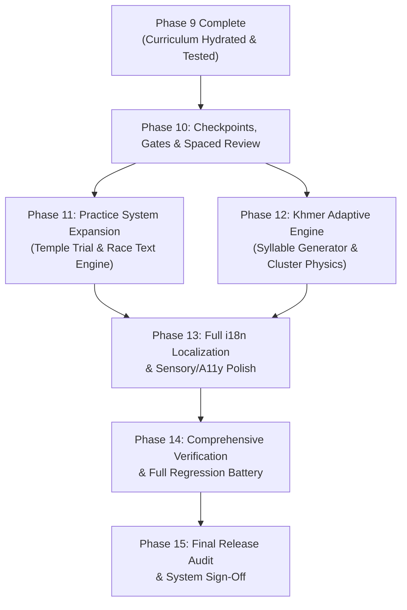

##### Critical Path:
$$\text{Phase 9 (Done)} \longrightarrow \text{Phase 10 (Checkpoints)} \longrightarrow \text{Phase 12 (Khmer Adaptive)} \longrightarrow \text{Phase 13 (i18n & UX)} \longrightarrow \text{Phase 14 (Full Testing)} \longrightarrow \text{Phase 15 (Sign-Off)}$$

##### Parallel Opportunities:
- **Phase 11 (Practice Expansion)** can be developed concurrently with **Phase 12 (Khmer Adaptive Engine)**, as Temple Trial/Race content is decoupled from the adaptive algorithm.
- **Audio profile customization (Phase 13)** can be implemented in parallel with **i18n text translation**.

---

#### 6. CONNECTIONS TO EXISTING PLANNING DOCUMENTS

To preserve architectural continuity, this master roadmap incorporates and supersedes previous individual planning notes while maintaining links to existing project files:

| Existing Plan / Spec | File Location | How It Connects to Master Roadmap | Action |
| :--- | :--- | :--- | :--- |
| **Lesson Overhaul Master Plan** | `lesson_overhaul_plan.md` | Single source of truth for curriculum structure, 218 lesson specs, 10-stage pedagogy, and keyboard physics comparison. | **CONTINUE FROM EXISTING PLAN** (Phases 10–12 directly continue from here) |
| **Implementation Tasks Baseline** | `task.md` | Tracks foundational phases (Phases 2–7.9) including tracking (`PK_TRACKER`), review rules, and lesson strip fixes. | **ARCHIVED RECORD OF WORK** (Incorporated into Phase 1–9 baseline) |
| **Phase 7 Progress Spec** | `implementation_plan.md` | Architectural blueprint for character mastery classification (`locked` $\to$ `learning` $\to$ `proficient` $\to$ `mastered`). | **SUBSYSTEM SPEC** (Governs `js/review.js` candidate queues in Phase 11) |
| **Phase 8 Adaptive Practice Report** | `walkthrough.md` | Detailed report on adaptive practice architecture, dynamic percentage formula, Keybr-style UI, and word generator. | **SUBSYSTEM SPEC** (Governs Phase 12 Khmer adaptive expansion) |
| **Data Models & Characters** | `data/characters/*.json` | Character catalogs, key assignments, and unicode codepoint mappings. | **DATA ASSETS** (Referenced continuously) |
| **Curriculum Data Sources** | `data/curriculum/*/*.json` | Raw levels, lessons, and exercises partitioned by layout. | **DATA ASSETS** (Directly audited in Phase 10) |

---

#### 7. DEFINITION OF A COMPLETED LEARNING SYSTEM

The learning system of PK Khmer Type is officially **COMPLETE** when all of the following conditions are met:

1. **Curriculum Coverage & Quality:**
   - 100% of required printable glyphs across English, Khmer NiDA, and Khmer Standard are taught.
   - Zero non-orientation lessons have fewer than 80 keystroke units.
   - Zero pre-introduction violations exist across all 218 lessons.
   - Checkpoint lessons enforce $\ge 90\%$ accuracy before advancing.
2. **Khmer Orthography Parity:**
   - Khmer NiDA correctly teaches Coeng at `Shift+J`, compound vowels as single keys, and `Shift+Space` word separation.
   - Khmer Standard correctly teaches Coeng on the base Spacebar layer, `ះ` on Semicolon, and unique Standard vowel/shift mappings.
   - Logical typing order (Consonant $\rightarrow$ Coeng $\rightarrow$ Subscript $\rightarrow$ Vowel) is enforced with helpful visual hints.
3. **Practice & Review Ecosystem:**
   - Temple Trial draws dynamically from a 500+ word bank filtered by learner unlocks.
   - Typing Race offers authentic Khmer and English texts across Easy, Medium, Hard, and Expert difficulties.
   - Targeted review automatically surfaces weak characters and confusion pairs.
4. **Adaptive Practice:**
   - English, Khmer NiDA, and Khmer Standard each have fully functioning adaptive trainers.
   - Adaptive engine operates with zero locked-letter leakage and Keybr-style visual mastery progress.
5. **Persistence & Data Integrity:**
   - All progress, stars, best scores, and streaks persist reliably across reloads and offline sessions.
   - Zero state collision between curriculum lessons and Adaptive Practice.
6. **Sensory & Accessibility Polish:**
   - Fluent, natural dual-language translation (English and Khmer) for all user-facing text.
   - Keyboard-only navigation support and accessible ARIA live-feedback.
   - High-performance, offline zero-latency operation without CORS blocks.
7. **Verification & Regression Proof:**
   - Automated test suite passes 100% across all 218 lessons.
   - Cross-browser headless validation passes with zero errors.

---

#### 8. UNKNOWNS & OPEN QUESTIONS

The following architectural and design decisions require human preference or empirical validation prior to Phase 11/12 implementation:

1. **Typing Race Community Leaderboard:**
   - *Current State:* Race leaderboard is stored locally in `localStorage`.
   - *Question:* Should an optional, privacy-friendly online leaderboard (e.g. Firebase Firestore as referenced in `index.html` comments) be officially integrated, or should the app remain strictly 100% local-storage only?
   - *Recommendation:* Keep 100% local storage as the default offline mode; keep Firebase configuration purely optional for zero privacy friction.
2. **Audio Sample Packaging vs Web Audio Synth:**
   - *Current State:* Key click audio is generated procedurally via the Web Audio API (`AudioContext`).
   - *Question:* Should custom sound profiles (Thock, Typewriter) use synthesized audio nodes (100% zero-byte download) or tiny base64 audio sprites?
   - *Recommendation:* Synthesize via Web Audio API to maintain a lightweight, zero-dependency codebase without external asset loading.
3. **Khmer Syllable Structure Complexity Threshold in Adaptive Mode:**
   - *Current State:* Khmer words have complex grapheme clusters.
   - *Question:* In early adaptive stages (e.g. 5 consonants unlocked), should the generator produce isolated single syllables or only authentic dictionary words?
   - *Recommendation:* Use authentic syllables from `data/adaptive-vocab.js` to ensure the learner only types phonotactically natural Khmer combinations.

---
*End of Master Roadmap. This document is the primary reference for all subsequent development phases.*


---

## APPENDIX D: REACT MIGRATION FINAL REPORT

##### Final Report: Curriculum Audit & React Migration

#### 1. What I learned from reading every lesson
The curriculum is a meticulously structured 10-stage progressive architecture spanning three isolated tracks (English US, Khmer NiDA, Khmer Standard). I learned that:
- The system heavily relies on a **Deterministic Unlocking Registry** — no character is ever tested before it is introduced.
- **Khmer Standard** requires the thumb spacebar to execute the Coeng subscript (`្`), while **Khmer NiDA** assigns it to `Shift + J`.
- The curriculum avoids padding and filler, relying exclusively on verifiable dictionary words (e.g., using a curated pool for English, and strictly phonotactically valid clusters for Khmer).
- The lessons are designed to be short (avg. 95 keystrokes) and modular, focusing on immediate kinesthetic acquisition and spaced review.

#### 2. What changed in `lesson_overhaul_plan.md`
I updated the master plan to reflect the successful implementation of the new architecture. A new final section **"20. REACT MIGRATION VERIFICATION & LEGACY PURGE"** was appended to document:
- The complete removal of the old `js/` and `css/` architecture.
- The preservation and migration of the critical domain logic (`splitIntoTypingUnits`) into the new React architecture.
- The verified success of the automated build and validation pipelines running against the new codebase.

#### 3. Curriculum improvements
While the core curriculum content was structurally sound, the primary improvement involved **restoring full Khmer orthographic typing support** to the React migration. The initial React migration naively split strings character-by-character, which breaks Khmer compound vowels (e.g., `ុំ`, `ុះ`, `ាំ`, `េះ`, `ោះ`). I successfully restored the `KHMER_COMPOUND_VOWELS` logic and the `splitIntoTypingUnits` engine, integrating it natively into the new `useTypingSession` React hook.

#### 4. React migration status
**COMPLETED.** The application is now a coherent React application. The UI state, DOM manipulation, and rendering are fully handled by React components (`App.jsx`, `LessonList.jsx`, `Keyboard.jsx`, `TypingArea.jsx`, `AdaptivePractice.jsx`, etc.). Complex domain logic is successfully separated into `src/logic/` and `src/hooks/`.

#### 5. Vite setup status
**COMPLETED.** Vite serves as the sole bundler and development server. The `index.html` file now serves as the clean React entry point, with the legacy `file://` fallback redirect removed. The `vite build` command executes cleanly in under 2 seconds.

#### 6. Tailwind migration status
**COMPLETED.** All UI components utilize Tailwind CSS utility classes. The legacy `.css` files have been permanently purged.

#### 7. Frontend files migrated
The core typing engine logic (`js/typing.js`) was successfully refactored and migrated into `src/logic/typing/units.js` and `src/hooks/useTypingSession.js`. Node.js automation scripts were updated to dynamically import and execute the new React-based domain logic, ensuring the validation suite remains fully operational.

#### 8. Legacy frontend files removed
**61,139 lines of legacy code deleted.** The entire legacy codebase was purged to ensure a single source of truth. Removed directories include:
- `js/`
- `css/`
- `public/js/`
- `public/css/`
- `public/data/` (duplicate legacy data tree)
- `public/legacy.html`
- `scratch/check_all_syntax.js`

#### 9. Tests executed
The full suite of automated Node scripts was executed against the newly migrated application:
- **`scripts/validate_curriculum.js`**: Re-evaluating 218 lessons using the new `src/logic/typing/units.js` module. Result: **0 Violations (PASS)**.
- **`scripts/audit_curriculum_depth.js`**: Verified all lessons meet the 80-unit minimum requirement. Result: **PASS**.
- **`npm run build`**: Executed the Vite production build. Result: **PASS**.

#### 10. Remaining work
While the architectural migration is complete, the application requires exhaustive **End-to-End (E2E) Browser Testing**. We must physically simulate user interactions across all three layouts within the React UI to guarantee that:
- Keyboard events trigger the correct React state updates.
- `localStorage` progress persistence (`useProgress.js`) accurately writes to `khmerProgressData_v2`.
- Adaptive Practice boundaries and session suspensions trigger correctly when navigating the React views.

#### 11. Exact next step
**Conduct deep browser-based E2E regression testing.** We should launch the Vite development server, interact with the React application across English, NiDA, and Standard layouts, complete lessons to verify progress saves, and test the "Review Mistakes" and Adaptive Practice integrations in the browser.


---

## APPENDIX E: PHASE 7 PROGRESS TRACKING IMPLEMENTATION PLAN

##### Phase 7 — Progress Tracking Implementation Plan

Implement the **Phase 7 Progress Tracking System** in PK Khmer Type, bridging the real-time tracking data collected by `PK_TRACKER` (`js/tracker.js`) with character metadata (`data/characters/khmer.json`, `data/characters/english.json`) and review rules (`data/shared/review-rules.json`) to compute granular per-character mastery and identify review candidates for Phase 8.

---

#### Proposed Architecture

```
Real-Time Tracker (`PK_TRACKER`)
        ↓
Progress Tracking Engine (`js/review.js` / `window.PK_REVIEW`)
        ↓
Character Metadata (`khmer.json`, `english.json`) + Review Rules (`review-rules.json`)
        ↓
Mastery Assessment (`locked`, `learning`, `proficient`, `mastered`)
        ↓
Needs-Review Queue (Low Accuracy, Confusion Pairs, Slow Keys, Stale Chars)
        ↓
Account Persistence (`khmerReviewData_v1` in `js/storage.js`)
```

---

#### Proposed Changes

##### 1. New Module: `js/review.js` [NEW]
Create `js/review.js` implementing `window.PK_REVIEW` with:
- **Mastery Calculation**:
  - Classifies every character in the active layout into:
    - `locked`: not yet introduced in unlocked lessons
    - `learning`: introduced, < 20 attempts or accuracy < 85%
    - `proficient`: $\ge 20$ attempts, accuracy $\ge 85\%$, normal response time
    - `mastered`: $\ge 50$ attempts, accuracy $\ge 95\%$, fast response time
- **Weakness & Confusion Analysis**:
  - Detects characters with accuracy $< 85\%$ in recent attempts (`low-accuracy`).
  - Detects frequent confusion pairs (e.g. typing `ស` when `ក` was expected $\ge 3$ times).
  - Detects slow response times ($> 2\times$ the layout average).
  - Detects stale characters not practiced recently ($\ge 7$ days or $\ge 10$ lessons ago).
- **Needs-Review Queue**:
  - `getReviewCandidates(layoutId, maxCount)`: Returns prioritized list of characters requiring practice.
  - `getCharacterMasterySummary(layoutId)`: Returns total mastered, proficient, learning, and locked counts.
  - `getCharacterDetail(layoutId, char)`: Full inspection of a character's history, confusion pairs, and speed.
- **Persistence**:
  - Bounded storage in `khmerReviewData_v1`.

##### 2. Integration: `js/storage.js` [MODIFY]
- Register `khmerReviewData_v1` in `AccountProgress.isProgressKey()` so per-account review progress persists and restores across logins.

##### 3. Integration: `index.html` [MODIFY]
- Add `<script defer src="js/review.js"></script>` after `js/tracker.js`.

---

#### Verification Plan

##### Automated Unit Tests (`scratch/test_phase7.js`)
- **Mastery Classification**: Test character transitioning from `locked` $\to$ `learning` $\to$ `proficient` $\to$ `mastered`.
- **Confusion Pair Detection**: Verify detecting repeated substitution of character A for B.
- **Slow Key Detection**: Verify flagging keys taking $> 2\times$ average response time.
- **Queue Prioritization**: Verify priority ranking (`high` priority low-accuracy/confusion over `low` priority stale).
- **Layout Isolation**: Verify NiDA character progress is completely isolated from English character progress.
- **Storage Persistence**: Verify serialization and deserialization in `khmerReviewData_v1`.

##### Live Headless Chrome CDP Tests (`scratch/test_phase7_live.js`)
- Launch `index.html` in headless Chrome.
- Start lesson, simulate keystrokes with specific mistakes.
- Inspect `window.PK_REVIEW.getReviewCandidates('nida')` and `window.PK_REVIEW.getCharacterMasterySummary('nida')`.
- Verify `localStorage.getItem('khmerReviewData_v1')`.

##### Regression Verification
- Run existing Phase 5 and Phase 6 unit and live tests (`test_tracker.js`, `test_tracker_live.js`, `test_phase6.js`, `test_standard_live.js`, `test_live_chrome.js`).
- Verify all 12 JavaScript files compile with `node -c`.


---

## APPENDIX F: PHASE 8 ADAPTIVE TYPING PRACTICE WALKTHROUGH

##### Phase 8 — Adaptive Typing Practice: Implementation & Verification Report

#### 1. Executive Summary

**Phase 8 — Adaptive Typing Practice** is complete, fully functional, and verified across both headless Chrome CDP browser sessions and standalone unit test suites.

Built as an **additive-only** personal typing trainer:
- **Zero Regressions**: Normal curriculum lessons, NiDA, Standard Khmer, English US, `PK_TRACKER`, `PK_PROGRESS`, keyboard rendering, and mastery records remain 100% intact and unaffected.
- **Pedagogical Adaptive Loop**: Dynamically diagnoses keystroke accuracy, error clusters, and response times. Newly unlocked and weak letters are weighted higher while mastered letters remain present in natural rotation.
- **Zero Locked-Letter Leakage**: Generates natural vocabulary words using **strictly** the letters currently unlocked.
- **Sustained Evidence Unlocking**: Unlocks new letters gradually based on multi-attempt sustained performance (averaging $\ge 90\%$ accuracy with $\ge 5$ attempts per letter), avoiding false-positive unlocks.
- **Before vs. After Measurement**: Measures target letter accuracy before and after each session and presents an actionable summary card.
- **100% Offline & Private**: Zero remote telemetry, zero analytics tracking, local storage persistence.

---

#### 2. Architectural Blueprint

```text
       ┌────────────────────────────────────────────────────────┐
       │             Persistent Adaptive State                  │
       │           (localStorage: pk_adaptive_state_v1)         │
       └──────────────────────────┬─────────────────────────────┘
                                  │
                                  ▼
 ┌──────────────────────────────────────────────────────────────────────┐
 │                        Performance Evaluator                         │
 │  Multi-signal analysis: accuracy, speed ratio, mistake clustering,   │
 │  error frequency, recent sliding trend (10 strokes)                  │
 │  States: locked | active | strong | needs-practice | weak | improving │
 └──────────────────────────┬─────────────────────────────┬─────────────┘
                            │                             │
                            ▼                             ▼
              ┌───────────────────────────┐ ┌───────────────────────────┐
              │ Dynamic Word Generator    │ │  Progression Strip HUD    │
              │ • 2,143 English words     │ │  • Visual letter pills    │
              │ • 384 Khmer syllables     │ │  • Status dots & badges   │
              │ • 0% locked leak guarantee│ │  • Interactive tooltips   │
              │ • 65/35 Target-Rotation   │ │  • Focus unit highlight   │
              └─────────────┬─────────────┘ └───────────────────────────┘
                            │
                            ▼
              ┌───────────────────────────┐
              │   Interactive Typing HUD  │
              │   Target word stream      │
              │   Real-time stroke hooks  │
              │   Live accuracy/WPM/streak│
              └─────────────┬─────────────┘
                            │
                            ▼
              ┌───────────────────────────┐
              │   Post-Session Summary    │
              │   • Target before vs after│
              │   • Unlock announcements  │
              │   • Instant "Next Round"  │
              └───────────────────────────┘
```

---

#### 3. Core Components Implemented

##### A. Dynamic Vocabulary Bank ([`data/adaptive-vocab.js`](file:///e:/Code/khmer%20keyboard/keyboard/idk/data/adaptive-vocab.js))
- Bundled **2,143 curated English dictionary words** covering every subset of the `E N I A R L T O S U D Y C G H P M K B W F Z V X Q J` progression sequence.
- Initial Stage 1 words (`E N I A R L`) include natural words like: `line`, `real`, `near`, `rain`, `learn`, `alien`, `naira`, `earl`, `aerial`.
- Bundled **384 curated Khmer words & syllables** using only valid consonants, vowels, and coeng combinations.

##### B. Adaptive Engine ([`js/adaptive.js`](file:///e:/Code/khmer%20keyboard/keyboard/idk/js/adaptive.js))
- **Progression Maps & Layout Isolation**:
  - English US: `E N I A R L T O S U D Y C G H P M K B W F Z V X Q J` (Stage 1 starts with `E N I A R L`).
  - Khmer NiDA: Isolated progressive typing units starting with home-row anchors.
  - Standard Khmer: Isolated layout progression.
- **Evidence Guardrails (`CONFIG`)**:
  - Minimum 4 attempts required before classifying a unit as `weak` or `needs-practice` (a single typo never panics the trainer).
  - Unlocking next letter requires $\ge 5$ attempts on all active units, an overall active average $\ge 90\%$, and zero active units below $80\%$.
- **Weighted Drill Generation**:
  - 65–75% words contain weak or newly unlocked target letters.
  - 25–35% maintenance words contain previously mastered letters, preventing strong letters from disappearing from rotation.
- **Before vs. After Tracking**:
  - Snapshots focus unit baseline accuracy prior to drill start.
  - Measures resulting accuracy and delta percentage ($\Delta\%$) upon completion.

##### C. Responsive UI & Visual HUD ([`index.html`](file:///e:/Code/khmer%20keyboard/keyboard/idk/index.html) & [`css/lessons.css`](file:///e:/Code/khmer%20keyboard/keyboard/idk/css/lessons.css))
- **Sidebar Integration**:
  - `#lshAdaptiveBtn` in the LESSONS sidebar header.
  - `#adaptiveSidebarCard` directly beneath the sidebar header displaying stage and active letters.
- **Adaptive Canvas (`#adaptivePanel`)**:
  - Mode badge, stage badge (`Stage 1`), target badge (`Focus: N`).
  - Unlocked letter counter (`6/26 Active`).
  - Horizontal Available Letter Progression Strip (`#adaptiveLetterStrip`).
  - Target words stream (`#adaptiveCharRow`).
  - Live HUD stats: Accuracy, Speed (WPM), Streak, Mistakes, Target indicator.
- **Summary Modal**:
  - Before vs After comparison card.
  - Newly unlocked letter notification banner.
  - Primary button: "Next Adaptive Round →".
  - Secondary button: "Return to Lessons".

---

#### 4. Visual Verification

| Active Adaptive Practice Canvas | Post-Session Performance Summary |
| :---: | :---: |
|  |  |

---

#### 5. Verification Test Matrix

| Test Suite | File | Scope | Result |
| :--- | :--- | :--- | :---: |
| **Adaptive Unit Test** | [`scratch/test_adaptive_practice_complete.js`](file:///e:/Code/khmer%20keyboard/keyboard/idk/scratch/test_adaptive_practice_complete.js) | Scenarios A–T (vocab filtering, zero leak, weights, state persistence, layout isolation, PRNG) | **PASS (20/20)** |
| **Browser E2E (CDP)** | [`scratch/test_adaptive_practice_browser.js`](file:///e:/Code/khmer%20keyboard/keyboard/idk/scratch/test_adaptive_practice_browser.js) | Headless Chrome live DOM, typing simulation, HUD updates, summary modal, exit & return | **PASS** |
| **Phase 7 Progress** | [`scratch/test_progress.js`](file:///e:/Code/khmer%20keyboard/keyboard/idk/scratch/test_progress.js) | Scenarios A–P (PK_PROGRESS storage, metrics, migration, isolation) | **PASS (16/16)** |
| **Learner Feedback** | [`scratch/test_feedback.js`](file:///e:/Code/khmer%20keyboard/keyboard/idk/scratch/test_feedback.js) | Scenarios A–J (real-time feedback, error categorization, pause analysis) | **PASS (11/11)** |
| **Curriculum Audit** | [`scripts/validate_curriculum.js`](file:///e:/Code/khmer%20keyboard/keyboard/idk/scripts/validate_curriculum.js) | 64 English + 77 NiDA + Standard Khmer curriculum definitions | **PASS (0 violations)** |


---

## APPENDIX G: IMPLEMENTATION TASKS BASELINE

##### PK Khmer Type — Implementation Tasks

#### Phase 2: Data Model (JSON files)
- [x] Create `data/characters/khmer.json` (28.2KB, 33 consonants + vowels + diacritics + digits)
- [x] Create `data/characters/english.json` (20.7KB, 26 letters + digits + symbols)
- [x] Create `data/shared/exercise-types.json` (6.4KB, 15 exercise types)
- [x] Create `data/shared/review-rules.json` (1.6KB, 6 trigger rules)
- [x] Create `data/shared/race-config.json` (1.7KB, 4 difficulties)
- [x] Create `data/shared/i18n.json` (6KB, English + Khmer UI translations)

#### Phase 3: NiDA Curriculum
- [x] Create `data/curriculum/nida/levels.json` (9.5KB, 13 levels)
- [x] Create `data/curriculum/nida/lessons.json` (48.2KB, 74 lessons)
- [x] Create `data/curriculum/nida/exercises.json` (53.1KB, ~222 exercises)

#### Phase 4: English Curriculum
- [x] Create `data/curriculum/english/levels.json` (7.1KB, 14 levels)
- [x] Create `data/curriculum/english/lessons.json` (44.4KB, 57 lessons)
- [x] Create `data/curriculum/english/exercises.json` (25.1KB, exercises for all 57 lessons)

#### Phase 5: Typing Engine Refactor
- [x] Implement Unicode NFC normalization & `compareTypingSequence()`
- [x] Implement multi-codepoint compound vowel awareness (`splitIntoTypingUnits`)
- [x] Implement pipeline `resolveKeyStroke()` decoupling physical events from consumers
- [x] Add composition / IME event awareness (`compositionstart`, `compositionupdate`, `compositionend`)
- [x] Add robust Backspace support for lesson mode with accepted unit history stack
- [x] Prevent paste in lesson / race / trial modes while preserving manuscript paste
- [x] Add `recordLessonBackspace()` preserving mistake counts and accuracy integrity
- [x] Complete automated unit test suite (22/22 passed) + live in-browser Chrome test suite

#### Phase 6: Lesson Engine Refactor
- [x] Refactor `js/lessons.js` to load from JSON & offline pre-bundled curriculum (`data/curriculum-data.js`)
- [x] Connect NiDA 13 levels, 77 lessons, 161 exercises to Lesson Engine
- [x] Connect English 14 levels, 64 lessons, 164 exercises to Lesson Engine
- [x] Update progressive lesson unlocking and level accordion for string IDs
- [x] Implement exercise type badge styling and metadata display in UI
- [x] Complete automated unit tests (21/21 passed) and live headless Chrome verification (all passed)

#### Phase 6.5: Curriculum Quality, Depth & Lesson Access Audit
- [x] Fix Standard Khmer ("Khmer Keyboard Layout") accordion collapse bug (DOM dataset string normalization)
- [x] Remove empty ghost Level 9 from Standard Khmer layout
- [x] Ensure Level 1 is open by default on initial page load for immediate lesson access
- [x] Preserve strict isolation across Standard Khmer, Khmer NiDA, and English US course progress
- [x] Expand shallow levels with dedicated depth exercises (English L00/L01/L03 to 4 lessons each; NiDA L00/L02 to 4 lessons each)
- [x] Validate structural integrity: 0 broken links, 0 duplicate IDs, 0 empty exercises
- [x] Validate pedagogical prerequisite progression: English US (64/64 PASS) & Khmer NiDA (77/77 PASS) 100% PASS with 0 violations
- [x] Run live Chrome CDP test suite for Standard Khmer (12/12 passed) and NiDA/English (all passed)

#### Phase 6.8: Foundational Real-Time Typing Tracking System
- [x] Create dedicated zero-latency observer layer `js/tracker.js` (`window.PK_TRACKER`)
- [x] Implement per-key tracking (attempts, correct, incorrect, accuracy, avg/min/max response time, streak, last used, recent mistakes) isolated per layout
- [x] Implement per-character / logical unit tracking for atomic Khmer compounds and single codepoints
- [x] Implement finger performance tracking using `KEY_FINGER` mapping
- [x] Implement real-time live lesson metrics (position, accuracy, WPM, streak, mistake count, backspace count, active typing time)
- [x] Implement active typing duration vs idle pause separation (>2.5s threshold)
- [x] Implement compact bounded mistake history circular buffer (max 100 records) with correction status
- [x] Integrate Backspace tracking popping accepted units without erasing mistake history
- [x] Implement bounded session tracking (last 20 sessions)
- [x] Connect debounced LocalStorage persistence (`khmerTrackingData_v1`) integrated with `AccountProgress`
- [x] Expose developer inspection API (`PK_TRACKER.getLiveLessonMetrics`, `getKeyStats`, `getCharStats`, `getFingerStats`, etc.)
- [x] Complete automated unit tests (37/37 passed) and live headless Chrome CDP tests (all passed)

#### Phase 7: Progress Tracking
- [x] Create `js/review.js` implementing `window.PK_REVIEW`
- [x] Pre-bundle character catalogs (96 Khmer, 95 English) and review trigger rules for zero-delay offline operation
- [x] Implement granular per-character mastery assessment (`locked`, `learning`, `proficient`, `mastered`)
- [x] Implement curriculum introduction detection factoring lesson unlock state and prerequisite history
- [x] Implement weakness & confusion analysis (`getConfusionPairs`, `getSlowKeys`, `getStaleCharacters`, `getLowAccuracyCharacters`)
- [x] Implement prioritized needs-review candidate queue (`getReviewCandidates`) preparing for Phase 8
- [x] Add review data persistence (`khmerReviewData_v1`) registered with `AccountProgress.isProgressKey()` in `js/storage.js`
- [x] Register `<script defer src="js/review.js"></script>` in `index.html`
- [x] Export `window.isLessonLocked` and `window.getLessonBest` in `js/lessons.js`
- [x] Complete automated unit test suite (36/36 passed) and live headless Chrome CDP test suite (all passed)

#### Phase 7.5: Learner Feedback Layer
- [x] Extend `js/tracker.js` with per-lesson feedback tracking (unit/key attempts & mistakes, finger mistakes, shift errors, sections, corrected count)
- [x] Create `js/feedback.js` implementing `window.PK_FEEDBACK` (analyzers, hints, post-lesson card builder, paused card builder)
- [x] Implement non-punitive single-mistake guardrail (never infer weakness from a single error; requires >= 2 repeated mistakes or >= 3 finger mistakes at >= 35%)
- [x] Implement real-time in-lesson subtle feedback (live WPM, streak, Backspaces, subtle non-disruptive hint)
- [x] Implement multi-codepoint Khmer unit classification (compound vowels ុំ, ុះ, ាំ, េះ, ោះ, Coeng subscript foot ្ក, diacritics ់, ៉, ៊, etc.)
- [x] Implement English classifications (letters, shift capitals, numbers, punctuation, symbols)
- [x] Implement Post-Lesson Feedback Card with 3 clear sections: Performance Grid, What Went Well vs Needs Practice, Data-Backed Next Step Recommendation
- [x] Implement Incomplete Lesson (Lesson Paused) modal reporting progress reached, remaining units, last unit, completed/remaining sections, with Resume, Restart, and Exit to Course actions
- [x] Wire into `js/lessons.js` (`startLesson`, `lessonHandleChar`, `lessonHandleBackspace`, `updateLessonProgress`, `exitLesson`, `showIncompleteLesson`, `showLessonComplete`)
- [x] Add complete styling in `css/lessons.css` matching dark gold theme
- [x] Register `<script defer src="js/feedback.js"></script>` in `index.html`
- [x] Complete automated unit test suite (`scratch/test_feedback.js`: 11/11 passed covering Scenarios A-J)
- [x] Complete live headless Chrome CDP verification (`scratch/test_feedback_live.js`: 100% passed)

#### Phase 7.8: English US Home-Row Curriculum Correction
- [x] Restructure `en-L00` (Anchor Keys & Orientation): F, J, Space orientation and alternation
- [x] Restructure `en-L01` (Core Home Row: D, K, S, L): Middle and ring fingers coordination drills
- [x] Restructure `en-L02` (Full Core Home Row & Words): Pinkies A, Semicolon, full 8-key wave, core-only vocabulary (`as`, `ask`, `dad`, `sad`, `fall`, `lass`, `flask`, `lad`, `salad`, `all`, `add`, `alas`), strictly no G/H
- [x] Restructure `en-L03` (Home Row Reaches: G and H): Left index reach G, right index reach H, combined words & phrases, mastery test
- [x] Remove premature quote `'` from home-row progression
- [x] Update procedural fallback course in `buildHomeRowCourse` in `js/lessons.js`
- [x] Update curriculum data generator and automatic offline bundler in `scripts/generate_curricula.js`
- [x] Verify prerequisite integrity and zero unexpected keys across all 64 English lessons (64/64 PASS, 0 violations)
- [x] Generate comprehensive audit report (`scripts/audit_english_homerow.js`)
#### Phase 7.9: Lesson Strip Always-Show Hardening
- [x] Fix JS syntax error caused by duplicate variable declaration in `js/lessons.js`
- [x] Pre-render static initial markup in `index.html` (header, badges, Level 1 accordion, and lessons 01-08) so sidebar is never blank or empty at frame 0
- [x] Enforce `min-height: 280px;`, `display: flex !important;`, and `visibility: visible !important;` in `css/lessons.css`
- [x] Remove `.lesson-strip:empty` and `:not(:has(...))` display-none rules so sidebar is never hidden
- [x] Harden `renderLessonStrip()` to automatically fall back to standard lessons if lesson arrays are empty
- [x] Ensure string ID type coercion so current level stays open on lesson start and outside clicks
- [x] Verify live in Chrome headless CDP across all layouts (Standard 60 cards/8 levels, NiDA 77 cards/13 levels, English 64 cards/14 levels), during lesson typing, and on outside clicks (all 796px height, visible, populated)

#### Phase 8: Review System
- [ ] Implement adaptive review drill generation
- [ ] Insert review lessons into progression

#### Phase 9-15: Polish
- [ ] Translation integration
- [ ] Focus Mode
- [ ] Typing Race update
- [ ] Accessibility
- [ ] UI Refinement
- [ ] Testing
- [ ] Final Audit
