# PK KHMER TYPE — LESSON OVERHAUL IMPLEMENTATION MASTER PLAN
**Target Codebase:** PK Khmer Type (`idk`)  
**Status:** ARCHITECTURAL MASTER PLAN — EXPANDED & IMPLEMENTATION-READY  
**Single Source of Truth:** `lesson_overhaul_plan.md`  

---

## 1. CURRENT SYSTEM SUMMARY & ARCHITECTURAL FOUNDATION

PK Khmer Type currently supports three keyboard layouts: **English US (QWERTY)**, **Khmer NiDA**, and **Khmer Standard**. The curriculum architecture operates as a data-driven pipeline with instant offline hydration:

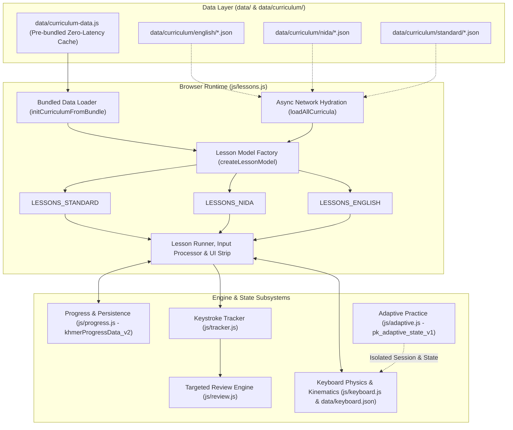

### Core Subsystems and Strict Boundaries:
1. **Curriculum Data Sources (`data/curriculum/`):**
   - Clean, modular JSON definitions partitioned by layout: `data/curriculum/{english,nida,standard}/` containing `levels.json`, `lessons.json`, and `exercises.json`.
   - `data/curriculum-data.js`: Pre-bundled zero-latency file declaring `window.CURRICULUM_DATA = { standard, nida, english }`. Enables instantaneous startup offline and via `file:///` protocol without CORS blocks.
2. **Lesson Execution Engine (`js/lessons.js`):**
   - Calls `initCurriculumFromBundle()` during initialization.
   - Converts serialized JSON lesson models into runtime objects via `createLessonModel()`.
   - Splits exercise content into typing units via `splitIntoTypingUnits(content, layoutId)`.
   - Resolves characters to physical keys and modifier layers via `resolveCharLocation()`.
   - Dynamically renders level accordions, lesson cards, mastery stars, lock icons, and progress meters.
3. **Progression & Persistence Subsystem (`js/progress.js`):**
   - Stores per-layout records in `state.courses = { standard, nida, english }`.
   - Saves to `localStorage` under `khmerProgressData_v2` and legacy compatibility keys `khmerLessonBest_<id>`.
   - Manages unlocking via `isLessonLocked(id)`: Lesson $N$ unlocks when Lesson $N-1$ has recorded at least one completion attempt.
4. **Adaptive Practice Boundary (`js/adaptive.js`):**
   - Completely autonomous, letter-mastery-driven engine tracking 20 units/letter mastery under `pk_adaptive_state_v1`.
   - Fixed English progression sequence (`E N I A R L...`).
   - Mutual session suspension: Launching standard curriculum calls `PK_ADAPTIVE.exitSession(false)`; entering Adaptive Practice suspends curriculum lessons.
5. **Targeted Review Subsystem (`js/review.js`):**
   - Monitors learner stats across layouts. Flags keys with accuracy $< 85\%$ or staleness $> 7$ days.
   - Supplies targeted drilling based on telemetry in `PK_TRACKER` and `PK_PROGRESS`.

---

## 2. LESSON INVENTORY & STRUCTURAL BASELINE

The curriculum baseline encompasses 218 lessons structured across all three layouts:

| Layout | Levels | Lessons | Exercises | Total Units | Avg Units/Lesson | % Below 80 Units | Key Focus Areas |
| :--- | :---: | :---: | :---: | :---: | :---: | :---: | :--- |
| **English (US)** | 14 | 64 | 204 | 6,159 | **96.2** | **0%** | Anchors, home row, reaches, vowels, full alphabet, Shift capitals, numbers, symbols, paragraphs, timed challenges. |
| **Khmer NiDA** | 13 | 77 | 230 | 7,222 | **93.8** | **0%** | Anchors (ថ/ក), home consonants, ើ/់, top reaches, bottom reaches, Shift+J Coeng (`្`), Shift consonants, Shift vowels, clusters, diacritics, vocabulary, Shift+Space prose, AltGr independent vowels. |
| **Khmer Standard** | 13 | 77 | 230 | 7,417 | **96.3** | **0%** | Spacebar Coeng (`្`), ះ on Semicolon, Shift vowels (ៃ, ាំ, ុះ, ៏, ុំ), bottom reaches (អ on comma), Spacebar subscript clusters, Shift consonants, diacritics, sentences. |
| **Combined** | **40** | **218** | **664** | **20,798** | **95.4** | **0%** | Complete three-layout coverage meeting substantial practice standards. |

---

## 3. CORE PEDAGOGICAL PHILOSOPHY: MANY SHORT FOCUSED LESSONS

The curriculum rejects both "microscopic 10-second lessons" and "fatiguing 300-word endurance marathons." The curriculum adheres to the **Focused Micro-Drilling Principle**:

```
Small New Skill → Target Finger Isolation → Known-Key Rhythm → Combination Pairs → Real Vocabulary → Spaced Review → Checkpoint → Next Step
```

### Educational Principles:
1. **Explicit Purpose for Every Lesson:**
   - Every lesson must answer:
     - *What physical key/finger skill is introduced?*
     - *Why does it appear at this point in the motor sequence?*
     - *What dictionary words or orthographic patterns are now unlocked?*
     - *What immediate next skill does it prepare the learner for?*
2. **Strict Cognitive Budget (Small Increments):**
   - Introduce at most **1 or 2 new keys/characters** in a non-review lesson.
   - Never introduce multiple modifier layers or complex cluster mechanics in a single introductory lesson.
3. **Substantial Practice Without Senseless Padding:**
   - Single-key & introductory lessons: **80–120 keystroke units** (approx. 35–50 seconds).
   - Word & combination lessons: **120–160 keystroke units** (approx. 50–75 seconds).
   - Review & checkpoint lessons: **150–220 keystroke units** (approx. 70–100 seconds).
   - Paragraph & timed endurance lessons: **200–350 keystroke units** (approx. 90–150 seconds).
   - **Anti-Padding Rule:** Never repeat raw unspaced characters (`ffffffffffff`). Drill variation must use structured companion pairs (`fjf jfj ff jj`), anchor alternations, and natural syllables.

---

## 4. THE 10-STAGE PROGRESSIVE CURRICULUM ARCHITECTURE

Each level advances through a 10-stage difficulty ladder. Not every individual lesson contains all 10 stages; stages are distributed purposefully across the level:

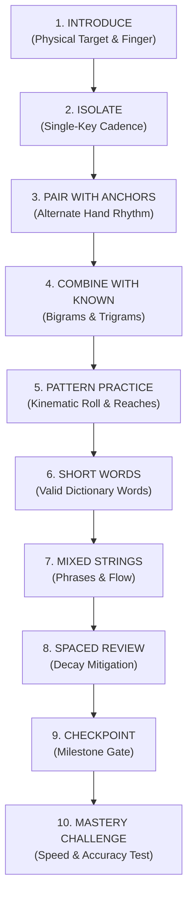

### Functional Breakdown of the 10 Stages:
1. **Stage 1 — Introduce:** Visual presentation of key position, finger assignment (`li`, `lm`, `lr`, `lp`, `ri`, `rm`, `rr`, `rp`, `thumb`), layer requirement, and tactile guide.
2. **Stage 2 — Isolate:** Single-finger taps, double taps, and deliberate reset to home-row rest positions.
3. **Stage 3 — Pair with Anchors:** Rapid alternating strokes with the opposite-hand index anchor (`F` and `J` in English; `ថ` and `ក` in Khmer).
4. **Stage 4 — Combine with Known:** Systematic pairing with all previously unlocked characters (e.g., if `D` and `K` are known, drill `fd`, `df`, `jk`, `kj`, `dk`, `kd`).
5. **Stage 5 — Pattern Practice:** Ergonomic finger rolls, inside-out cascades, and multi-finger coordination drills.
6. **Stage 6 — Short Words:** Authentic dictionary words formed strictly from the cumulative unlocked character pool. Zero nonsense strings.
7. **Stage 7 — Mixed Strings & Phrases:** Contextual typing featuring realistic short phrases, natural word boundaries (`Space` or `Shift+Space`), and terminal punctuation.
8. **Stage 8 — Spaced Review:** Explicit reintroduction of older characters learned in earlier levels to combat motor memory decay.
9. **Stage 9 — Checkpoint:** Focused assessment requiring $\ge 90\%$ accuracy before level advancement.
10. **Stage 10 — Mastery Challenge:** Timed endurance challenge consolidating all material learned across the level and preceding stages.

---

## 5. ENGLISH US CURRICULUM PROGRESSION

Preserves the natural home-row outward motor progression while guaranteeing that every word exercise uses verified English vocabulary:

```mermaid
graph TD
    subgraph EnglishMotorSequence ["English Progression Ladder"]
        L0["Level 0: Anchors (F, J, Space)"] --> L1["Level 1: Core Middle & Ring (D, K, S, L)"]
        L1 --> L2["Level 2: Pinkies (A, ;) & First Words"]
        L2 --> L3["Level 3: Center Reaches (G, H) & Home Checkpoint"]
        L3 --> L4["Level 4: High Vowels & Index Reaches (E, I, R, U)"]
        L4 --> L5["Level 5: Top Perimeter (T, Y, W, O, Q, P) & Top Checkpoint"]
        L5 --> L6["Level 6: Bottom Row & Punctuation (C, V, B, N, M, Z, X, Comma, Period)"]
        L6 --> L7["Level 7: Full Alphabet Consolidation & Pangrams"]
        L7 --> L8["Level 8: Shift Layer & Capitalization Coordination"]
        L8 --> L9["Level 9: Top Number Row (1–0)"]
        L9 --> L10["Level 10: Punctuation, Quotes, Hyphens & Brackets"]
        L10 --> L11["Level 11: Connected Prose & Complete Sentences"]
        L11 --> L12["Level 12: Continuous Multi-Sentence Paragraphs"]
        L12 --> L13["Level 13: Timed Speed Endurance & Keyboard Mastery"]
    end
```

### Cumulative Vocabulary Gating Rules for English:
- **Level 0 (F, J, Space):** Only tactile rhythm and anchor pairs (`fff jjj fjf jfj`). No English words exist with only F and J.
- **Level 1 (add D, K, S, L):** Hand coordination drills. No complete words without vowels.
- **Level 2 (add A, ;):** **First English Words Unlocked:** `as`, `ask`, `sad`, `dad`, `fall`, `lass`, `flask`, `salad`, `all`, `add`, `alas`, `falls`, `dads`, `lads`, `sass`.
- **Level 3 (add G, H):** **Vocabulary Expanded:** `glad`, `flag`, `half`, `hall`, `dash`, `flash`, `glass`, `shall`, `hash`, `gash`, `had`, `has`, `gall`, `ash`.
  - *Checkpoint 1:* 120-unit comprehensive home-row assessment.
- **Level 4 (add E, I, R, U):** **Vowel Vocabulary Explosion:** `see`, `red`, `ride`, `fire`, `dear`, `sure`, `rule`, `rise`, `sir`, `lid`, `like`, `side`, `idle`, `rude`, `hire`, `drill`, `risk`, `skill`, `dark`, `fear`, `hear`, `safe`, `feed`, `seed`.
- **Level 5 (add T, Y, W, O, Q, P):** **Full Top Row Words:** `type`, `word`, `work`, `quit`, `play`, `power`, `write`, `poetry`, `water`, `story`, `quiet`, `quote`, `sweet`, `today`, `reply`, `people`, `proper`.
  - *Checkpoint 2:* Home + Top row cross-layer examination.
- **Level 6 (add C, V, B, N, M, Z, X, Comma, Period):** **Full Lower Row Vocabulary:** `can`, `come`, `back`, `been`, `make`, `name`, `much`, `move`, `seven`, `never`, `cover`, `number`, `voice`, `brave`, `cabin`, `complex`, `examine`, `zero`, `buzz`, `extra`. Punctuation cadence (`one, two, three.`).
- **Level 7 to Level 13:** All 26 letters active. Pangrams, capitalization, numbers, full punctuation, sentences, multi-sentence paragraphs, and 3-minute timed tests.

---

## 6. KHMER NiDA CURRICULUM SPECIFICATION

Khmer NiDA must be taught strictly according to Cambodian typing conventions and Unicode grapheme cluster mechanics:

```mermaid
graph TD
    subgraph NiDAProgression ["Khmer NiDA Curriculum Architecture"]
        N0["Level 0: Anchors (ថ on F, ក on K, Space)"] --> N1["Level 1: Home Consonants & ស្រៈ ា (A)"]
        N1 --> N2["Level 2: Home Vowel ើ (;) & Bantoc ់ (')"]
        N2 --> N3["Level 3: High-Frequency Top Row (េ, រ, ត, យ, ុ, ិ, ោ)"]
        N3 --> N4["Level 4: High-Frequency Bottom Row (ច, វ, ប, ន, ម, ។)"]
        N4 --> N5["Level 5: Remaining Base Keys & Coeng Key (Shift+J = ្)"]
        N5 --> N6["Level 6: Shift Consonants (គ, ជ, ទ, ធ, ព, ភ, ឌ, ណ, អ, ឃ...)"]
        N6 --> N7["Level 7: Shift Vowels & Dedicated Compound Vowels"]
        N7 --> N8["Level 8: Consonant Clusters & Advanced Coeng Practice"]
        N8 --> N9["Level 9: Diacritics, Numerals & Currency (៉, ៊, ៍, ៏, ័, ៌, ៛, ៗ)"]
        N9 --> N10["Level 10: Rich Khmer Vocabulary by Semantic Domain"]
        N10 --> N11["Level 11: Connected Prose with Shift+Space Word Separation"]
        N11 --> N12["Level 12: Independent Vowels & Professional Speed Mastery"]
    end
```

### Orthographic Typing Mechanics to Enforce:
1. **The Coeng (Subscript) Keystroke Sequence:**
   - In NiDA, the subscript character `្` (U+17D2) is located at **`Shift + J`**.
   - Keystroke sequence: **Base Consonant $\rightarrow$ `Shift + J` (្) $\rightarrow$ Subscript Consonant**.
   - Example: `ខ្លា` = `ខ` (X) + `Shift+J` (្) + `ល` (L) + `ា` (A).
2. **Dedicated Compound Vowel Keys (No Splitting):**
   - Vowels such as `ាំ` (Shift+A), `ុំ` (Comma), `ុះ` (Shift+Comma), `េះ` (Shift+V), and `ោះ` (Shift+;) are dedicated physical keys. The curriculum must teach them as single keystrokes rather than constructed multi-part characters.
3. **Final Consonant Shortening with Bantoc:**
   - Consonant + `់` (Quote key) shortens vowel sounds (`កាក់`, `ដាក់`, `សក់`).
4. **Logical Keystroke Order vs. Visual Placement:**
   - In Khmer orthography, vowels like `េ` (E) or `ែ` (Shift+E) display to the left of the consonant, but **mechanically they are always typed AFTER the base consonant** (or cluster).
   - The curriculum explicitly trains: Consonant $\rightarrow$ Subscript $\rightarrow$ Vowel.
5. **Word Separation with Shift+Space:**
   - In NiDA typing, base Space produces a Zero-Width Space (`\u200B`), while **`Shift + Space`** produces the visible space separator `' '` used for typing exercises.

---

## 7. KHMER STANDARD CURRICULUM SPECIFICATION

Khmer Standard layout features fundamentally different key placements and typing mechanics from NiDA. The curriculum must never treat Standard as a clone of NiDA:

### Detailed Physical Comparison: Standard vs. NiDA
| Key / Symbol | Khmer NiDA | Khmer Standard | Pedagogical Consequence for Standard |
| :--- | :--- | :--- | :--- |
| **Coeng (`្`)** | **`Shift + J`** | **`Space` (Base Layer Thumb!)** | **Core Skill:** In Standard, the thumb spacebar produces the Coeng subscript marker! |
| **Word Space** | `Shift + Space` | `Shift + Space` | Both use Shift+Space for visible word boundaries, but base space is Coeng in Standard. |
| **Key `J`** | Base `ញ`, Shift `្` | Base `ញ`, Shift `ុំ` | Key `J` has compound `ុំ` on Shift in Standard, never Coeng. |
| **Key `;`** | Base `ើ`, Shift `ោះ` | Base `ះ`, Shift `៖` | `ះ` is on Semicolon in Standard (taught in Level 2 instead of Level 7). |
| **Key `[`** | Base `ៀ`, Shift `ឿ` | Base `ើ`, Shift `ោះ` | `ើ` and `ោះ` are moved to left bracket in Standard. |
| **Key `]`** | Base `ឪ`, Shift `ឧ` | Base `ឿ`, Shift `ៀ` | `ៀ` and `ឿ` are on right bracket in Standard. |
| **Key `A`** | Base `ា`, Shift `ាំ` | Base `ា`, Shift `ៃ` | Shift+A produces `ៃ` in Standard. |
| **Key `S`** | Base `ស`, Shift `ៃ` | Base `ស`, Shift `ាំ` | Shift+S produces `ាំ` in Standard. |
| **Key `,`** | Base `ុំ`, Shift `ុះ` | Base `អ`, Shift `,` | Consonant `អ` is on comma in Standard (introduced in Level 4 Bottom Row). |
| **Key `G`** | Base `ង`, Shift `អ` | Base `ង`, Shift `ុះ` | Shift+G produces `ុះ` in Standard. |
| **Key `H`** | Base `ហ`, Shift `ះ` | Base `ហ`, Shift `៏` | Shift+H produces diacritic `៏` in Standard. |

### Standard Curriculum Specifics:
- **Level 0 (Anchors & Spacebar Coeng):**
  - Introduces: `ថ` (F), `ក` (K), and explains the dual nature of `Space` (Thumb = Coeng `្`, Shift+Thumb = Word Space).
- **Level 1 (Standard Home Row Consonants):**
  - Introduces: `ា` (A), `ស` (S), `ដ` (D), `ង` (G), `ហ` (H), `ល` (L), `ញ` (J).
- **Level 2 (Standard Home Vowels & Signs):**
  - Introduces: `ះ` (Semicolon), `់` (Quote - Bantoc), and words: `កាក់`, `ដាក់`, `សះ`.
- **Level 3 (Top Row Reaches):**
  - Introduces: `េ` (E), `រ` (R), `ត` (T), `យ` (Y), `ុ` (U), `ិ` (I), `ោ` (O).
- **Level 4 (Bottom Row Reaches & Consonant `អ`):**
  - Introduces: `ច` (C), `វ` (V), `ប` (B), `ន` (N), `ម` (M), `អ` (Comma), `។` (Period).
- **Level 5 (Spacebar Subscript Clusters):**
  - Dedicated training on using the **Thumb Spacebar** to generate subscripts: `ក` + `Space` + `ក` = `ក្ក`; `ស` + `Space` + `ល` = `ស្ល`; `ប` + `Space` + `រ` = `ប្រ`.
- **Level 6 (Standard Shift Consonants & Vowels):**
  - Focuses on the unique Standard shift locations: `ៃ` (Shift+A), `ាំ` (Shift+S), `ុះ` (Shift+G), `៏` (Shift+H), `ុំ` (Shift+J).
- **Level 7 to Level 12:** Complex clusters, diacritics, vocabulary, sentences, and speed mastery.

---

## 8. SMART DATA-DRIVEN CONTENT SELECTION

Content generation must never guess which characters are available. The system maintains a deterministic character availability registry:

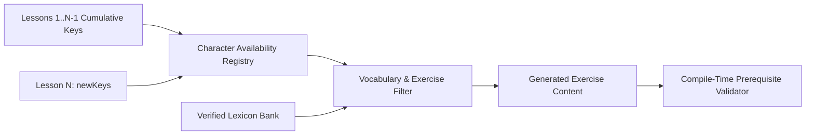

### Content Validation Rules:
1. **Zero Future Characters:** An exercise within Lesson $N$ must only contain characters that belong to `CumulativeKeys(N)`. If a character has not been introduced in Lesson $N$ or earlier, its appearance is a blocking compilation error.
2. **Deterministic Unlocking Registry:**
   $$\text{AvailableChars}(N) = \text{AvailableChars}(N-1) \cup \text{NewChars}(N)$$
   - The compile-time validation harness simulates this accumulator across all 218 lessons.
3. **Lexical Authenticity:** Every word exercise draws from a curated dictionary of real words. Nonsense strings are strictly restricted to Stages 2–5 (finger isolation and pattern rolling).

---

## 9. SPACED REVIEW & WEAK-KEY REINFORCEMENT

The curriculum integrates three complementary layers of review:

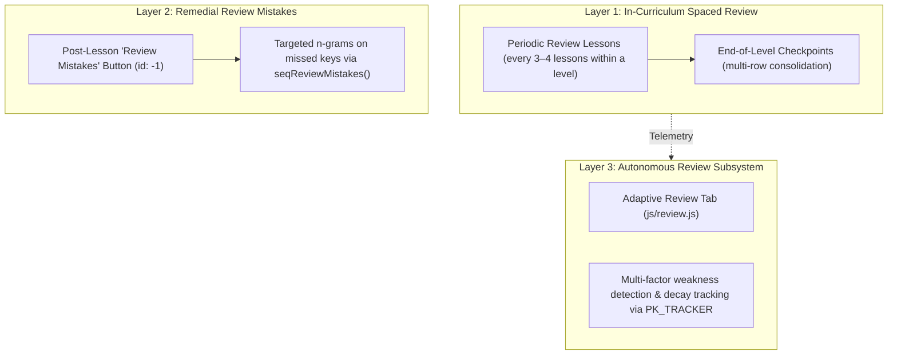

1. **In-Curriculum Spaced Review (Stage 8):**
   - At least **25% of all lessons** in each level are dedicated consolidation lessons.
   - Older characters are re-introduced in later levels (e.g., home row keys are continuously mixed into bottom-row and shift-layer exercises).
2. **Post-Lesson Remedial Drilling ("Review Mistakes"):**
   - Built directly into `js/lessons.js` (lines 2085–2110). If the user commits mistakes on specific characters during a lesson, clicking `Review Mistakes` launches an ad-hoc practice session (`id: -1`) targeting those exact characters and companion keys.
3. **External Adaptive Review (`js/review.js`):**
   - Monitors per-key accuracy and staleness across sessions.
   - Automatically surfaces keys falling below $85\%$ accuracy or unpracticed for $> 7$ days.

---

## 10. CHECKPOINTS & FINAL KEYBOARD MASTERY

### Mini Checkpoints:
- Placed at critical ergonomic boundaries (e.g., end of Home Row, end of Top Row, completion of Base Layer).
- Require $\ge 90\%$ accuracy to earn full star credit.
- Provide clear milestone feedback on typing rhythm, reach confidence, and accuracy.

### True Final Keyboard Mastery:
Mastery is **not** defined by simply clicking through every lesson. True Keyboard Mastery requires:
1. **100% Curriculum Completion:** Every lesson in the layout completed with recorded best scores.
2. **High Accuracy Standard:** Overall layout average accuracy $\ge 92\%$.
3. **Speed Competency:** Minimum sustained typing speed:
   - English: $\ge 40$ WPM on continuous paragraph challenges.
   - Khmer NiDA / Standard: $\ge 25$ WPM on continuous prose with Shift+Space word separation.
4. **Endurance Verification:** Passing the 3-minute continuous timed typing test without excessive backspacing ($< 5\%$ error rate).

---

## 11. AUTOMATED COVERAGE CHECKER & REGRESSION HARNESS

Completeness and correctness are enforced via machine-executable validation scripts:

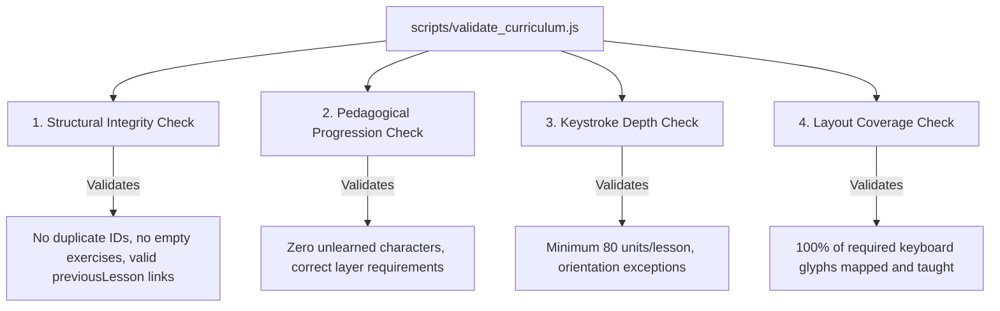

### What the Automated Harness Validates:
1. **Full Glyph Coverage:** Scans `data/keyboard.json` for every printable glyph across base, shift, and altgr layers, verifying that each glyph appears as an introduced character in at least one lesson.
2. **Zero Pre-Introduction Violations:** Replays the curriculum lesson-by-lesson and verifies that every character typed in an exercise was introduced in that lesson or an earlier one.
3. **Minimum Keystroke Depth:** Flags any lesson with fewer than 80 keystroke units (with an explicit threshold of 20 for orientation lessons).
4. **Duplication Detector:** Flags lessons that share identical introduced keys, exercise contents, and objectives.

---

## 12. PRESERVATION OF EXISTING SYSTEMS

The curriculum overhaul is strictly isolated to lesson content and curriculum loading. The following existing systems must remain untouched:

| System | File(s) | Preserved Functionality |
| :--- | :--- | :--- |
| **Adaptive Practice** | `js/adaptive.js`, `data/adaptive-vocab.js` | Letter progression sequence (`E N I A R L...`), 20-unit letter mastery engine, isolated `localStorage` key `pk_adaptive_state_v1`, granular letter mastery progress bars. |
| **Progress Persistence** | `js/progress.js` | Storage keys `khmerProgressData_v2` and `khmerLessonBest_<id>`, course records (`standard`, `nida`, `english`), `resetAll()` behavior. |
| **Keyboard Subsystem** | `js/keyboard.js`, `data/keyboard.json` | Virtual keyboard DOM generation, row/key styling, active layer transitions, kinematic hands overlay. |
| **Review Engine** | `js/review.js` | Adaptive review tab, weak-key cataloging, staleness decay equations. |
| **Keystroke Tracker** | `js/tracker.js` | Raw timing events, WPM calculation, latency measurement. |
| **UI Strip & Modals** | `index.html`, `js/lessons.js` | Level collapse/expansion, lesson cards, mastery stars, lock icons, shortcuts dialog, settings modal. |

---

## 13. MIGRATION & BACKWARD COMPATIBILITY STRATEGY

To ensure that existing users do not lose completed lesson progress or stars:
1. **Preserve Legacy Lesson IDs:**
   - English lessons retain IDs matching `en-Lxx-yy`.
   - NiDA lessons retain IDs matching `nida-Lxx-yy`.
   - Standard lessons use `standard-Lxx-yy` while supporting legacy numeric IDs (`1` through `58`) via `progress.js` migration mappings.
2. **Storage Key Continuity:**
   - Progress continues to read from and write to `khmerProgressData_v2` and legacy fallback `khmerLessonBest_<id>`.
3. **Graceful Upgrades:**
   - When new lessons or expanded exercises are introduced, existing completion records in `state.courses[layout].lessons[id]` remain valid. A completed lesson is never relocked because of an exercise expansion.

---

## 14. DATA ARCHITECTURE SPECIFICATION

Curriculum files are organized under `data/curriculum/`:

```
data/curriculum/
├── english/
│   ├── levels.json       # 14 levels with title, description, objective, lesson refs
│   ├── lessons.json      # 64 lessons with newKeys, requiredKeys, targets, exerciseRefs
│   └── exercises.json    # 204 exercises with type, content, description
├── nida/
│   ├── levels.json       # 13 levels with Khmer titles (titleKm)
│   ├── lessons.json      # 77 lessons with NiDA key mappings
│   └── exercises.json    # 230 exercises with authentic Khmer text
├── standard/
│   ├── levels.json       # 13 levels matching Standard keyboard mechanics
│   ├── lessons.json      # 77 lessons with Standard key mappings (Space Coeng)
│   └── exercises.json    # 230 exercises with Standard-specific text
└── ...
data/curriculum-data.js   # Single pre-bundled bundle file for offline zero-latency startup
```

### JSON Schema Definitions:

#### `levels.json` Schema:
```json
{
  "id": "en-L01",
  "levelNumber": 1,
  "title": "Core Home Row: D, K, S, L",
  "description": "Middle and ring finger home-row keys",
  "objective": "Master D, K, S, and L from anchor positions",
  "lessons": ["en-L01-01", "en-L01-02", "en-L01-03", "en-L01-04"],
  "unlockRequirements": { "previousLevel": "en-L00" },
  "completionRequirements": { "allLessonsCompleted": true, "minLevelAccuracy": 90 }
}
```

#### `lessons.json` Schema:
```json
{
  "id": "en-L01-01",
  "level": "en-L01",
  "order": 1,
  "title": "Middle Fingers: D and K",
  "description": "Middle Fingers: D and K",
  "objective": "Master Middle Fingers: D and K",
  "type": "single-char",
  "newKeys": [
    { "keyId": "d", "layer": "base", "char": "d", "finger": "lm" },
    { "keyId": "k", "layer": "base", "char": "k", "finger": "rm" }
  ],
  "requiredKeys": ["d", "k"],
  "fingerFocus": ["lm", "rm"],
  "difficulty": 1,
  "accuracyTarget": 90,
  "speedTarget": null,
  "mistakeTolerance": 5,
  "exerciseRefs": ["en-L01-01-E01", "en-L01-01-E02", "en-L01-01-E03", "en-L01-01-E04", "en-L01-01-E05"],
  "unlockRequirements": { "previousLesson": "en-L00-04" }
}
```

#### `exercises.json` Schema:
```json
{
  "en-L01-01-E01": {
    "type": "single-char",
    "content": "ddd kkk dkd kdk",
    "description": "Middle finger isolation"
  }
}
```

---

# Curriculum Architecture

This section documents how the new lesson curriculum will be generated, stored, validated, and consumed by the browser application.

## Core Design Principle
The pipeline strictly follows a simple, robust flow:  
**Generate → Validate → Store → Bundle → Use**

```
Generator (scripts/generate_curricula.js)
    ↓
Curriculum Source Files (data/curriculum/*)
    ↓
Curriculum Validator (scripts/validate_curriculum.js)
    ↓
Browser Bundle (data/curriculum-data.js)
    ↓
Browser App (js/lessons.js, js/progress.js, etc.)
```

## Architecture Diagram

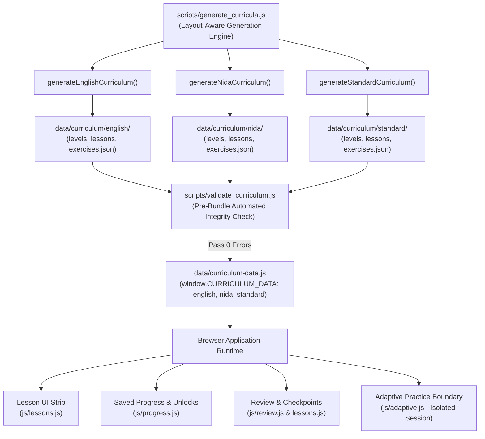

## What Each Part Means

### 1. `scripts/generate_curricula.js`
The curriculum generator is responsible for producing structured lesson data. It maintains separate generation logic for:
- **English US**
- **Khmer NiDA**
- **Khmer Standard**

The generator uses actual keyboard definitions (`data/keyboard.json` and `js/keyboard.js`) to resolve physical keys, finger assignments, and modifier layers rather than guessing or hardcoding characters.

---

### 2. `data/curriculum/`
This is the human-readable, maintainable curriculum source of truth. The three layouts are kept strictly separated:
```text
data/curriculum/
├── english/     # levels.json, lessons.json, exercises.json
├── nida/        # levels.json, lessons.json, exercises.json
└── standard/    # levels.json, lessons.json, exercises.json
```
Each layout folder contains structured modular files defining:
- Levels (objectives, sequencing, unlock rules)
- Lessons (new keys, required keys, finger assignments, target accuracy)
- Exercises (content text, drill types, descriptions)
- Metadata & layout progression information

NiDA and Standard remain separate curricula with layout-specific physical mechanics.

---

### 3. `data/curriculum-data.js`
This is the browser-consumable, zero-latency curriculum bundle. It exposes the compiled object:
```text
CURRICULUM_DATA
├── english
├── nida
└── standard
```
The browser consumes this structured bundle directly on load, eliminating multi-file fetch latency and allowing PK Khmer Type to run offline and via the `file:///` protocol without CORS restrictions.

---

### 4. Browser App
The client application consumes `CURRICULUM_DATA` to operate lessons dynamically:
- **Lesson UI Strip (`js/lessons.js`):** Materializes lesson models, renders level accordions, lesson cards, and mastery stars.
- **Lesson Progression & Unlocks (`js/progress.js`):** Evaluates lesson unlocks and persists attempt statistics.
- **Review & Checkpoints:** Feeds error telemetry into the post-lesson "Review Mistakes" modal and targeted practice.
- **Adaptive Practice Boundary (`js/adaptive.js`):** Runs independently with its own letter mastery engine, suspending curriculum lessons during practice sessions.

The curriculum data provides the lesson content; existing application subsystems handle execution, input processing, and state persistence.

---

### 5. Validation Step
Before bundling or release, the curriculum runs through the validation gate (`scripts/validate_curriculum.js`):
```text
Generator → Curriculum Data → Curriculum Validator → Browser Bundle
```
The validator automatically detects and prevents:
- Missing keys or characters on the layout
- Invalid lesson dependencies (broken `previousLesson` links)
- Future characters appearing before their introduction lesson
- Duplicate lesson or level IDs
- Broken progression or unmapped glyphs
- Sub-minimum keystroke depth ($<80$ units)
- Missing review or mastery coverage

---

# Lesson Generation Flow

This section explains how a single lesson is created from raw keyboard data through validation.

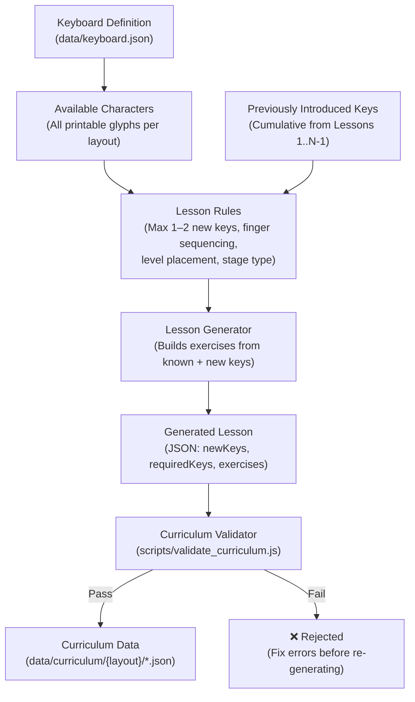

**How it works:**

1. **Keyboard definitions** (`data/keyboard.json`) provide the actual characters, physical key IDs, finger assignments, and modifier layers for each layout.
2. **The generator tracks what has already been introduced.** Before generating Lesson $N$, the cumulative set $\text{AvailableChars}(N-1)$ is computed from all preceding lessons.
3. **Lesson rules** determine what type of lesson to produce (introduce, combine, review, checkpoint) and enforce constraints: at most 1–2 new keys per introductory lesson, ergonomic finger ordering, proper stage placement.
4. **Generated lessons are validated** by `scripts/validate_curriculum.js` before becoming part of the curriculum. The validator checks for pre-introduction violations, missing keys, broken links, and insufficient depth.
5. **Invalid lessons are rejected** — they must never silently enter the curriculum. A validation failure is a blocking error that must be fixed before the lesson is accepted.

---

# Lesson Progression Flow

This section shows how the learner moves through the curriculum from introduction to mastery.

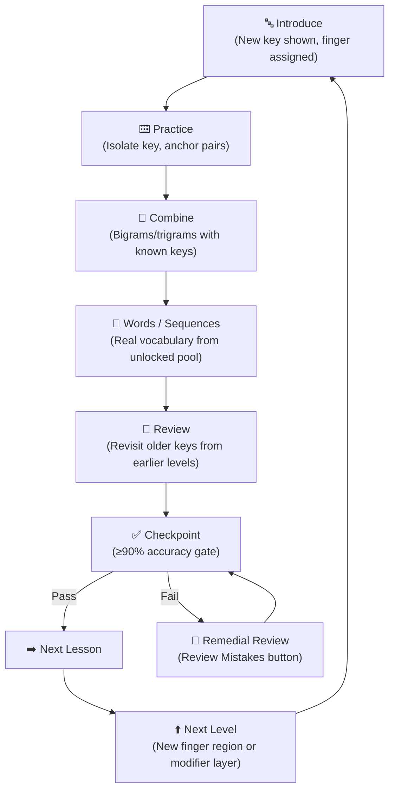

**Key principles:**

- Progression follows a strict pedagogical sequence. The learner does **not** randomly jump between unrelated skills.
- Each step builds on the one before it: new keys are isolated first, then combined with familiar keys, then used in real words.
- **Checkpoints act as gates** — the learner must demonstrate accuracy before advancing.
- Remedial review loops exist for learners who struggle — they re-enter through the "Review Mistakes" mechanism already built into `js/lessons.js`.
- Moving to the next **level** resets the cycle: a new finger region or modifier layer is introduced, and the progression repeats.

---

# Character Coverage System

This section shows how the system tracks whether a keyboard layout is fully covered by the curriculum.

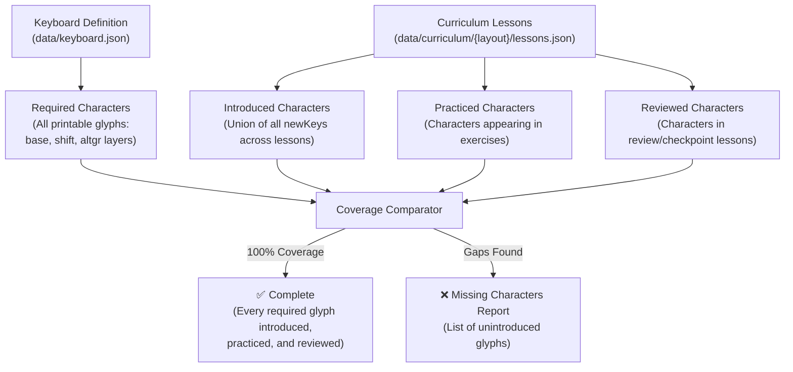

**What this means:**

- The keyboard definition is the **single source of truth** for what characters must be taught. Every printable glyph across base, shift, and altgr layers is a required character.
- The coverage system computes three sets per layout:
  - **Introduced:** Characters that appear in at least one lesson's `newKeys`.
  - **Practiced:** Characters that appear in exercise content.
  - **Reviewed:** Characters that appear in review or checkpoint lessons.
- A layout is **complete** only when every required character is introduced, practiced, and reviewed.
- `scripts/validate_curriculum.js` performs this coverage check automatically during validation. Missing characters produce blocking errors.

---

# Review and Weak-Key Flow

This section shows how normal review coexists with Adaptive Practice. They are **two separate systems** that must never interfere.

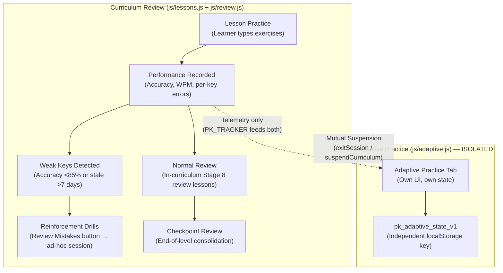

**Critical boundaries:**

- **Curriculum Review** is built into the lesson progression: review lessons (Stage 8), checkpoints (Stage 9), and the post-lesson "Review Mistakes" button.
- **Adaptive Practice** is a completely independent system with its own letter progression (`E N I A R L...`), its own mastery tracking (20 units per letter), and its own storage key (`pk_adaptive_state_v1`).
- They share keystroke telemetry through `PK_TRACKER` but **never share state or storage**.
- Mutual suspension ensures only one is active at a time: entering a curriculum lesson calls `PK_ADAPTIVE.exitSession(false)`; entering Adaptive Practice suspends the curriculum.

---

# Curriculum Validation Flow

This section details the automated validation pipeline that runs before any curriculum data is accepted.

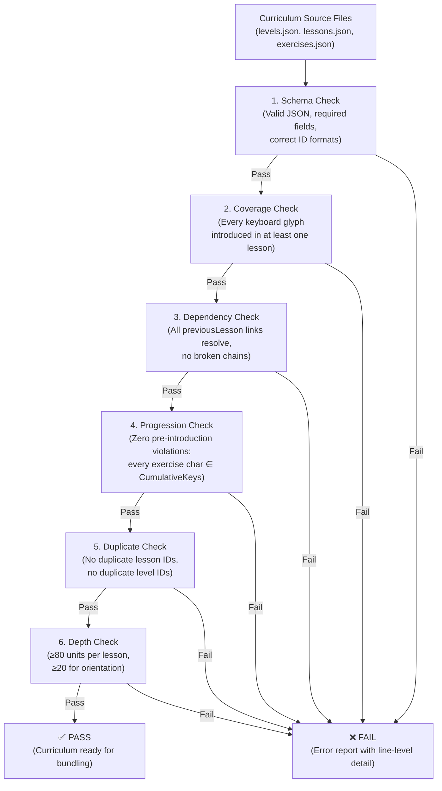

**Validation is a hard gate.** If any check fails, the entire curriculum is rejected. There is no "partial pass." This ensures that the browser application never receives corrupted or incomplete lesson data.

---

# Existing Progress Migration

This section shows how the new curriculum coexists with existing learner progress data.

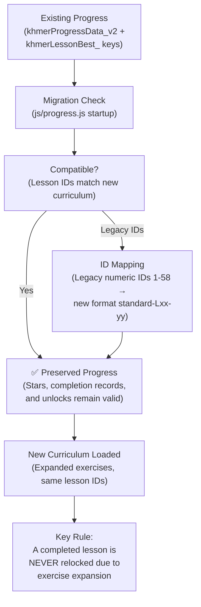

**Migration principles:**

- **Lesson IDs are stable.** English uses `en-Lxx-yy`, NiDA uses `nida-Lxx-yy`, Standard uses `standard-Lxx-yy`.
- **Legacy numeric IDs** (from the original Standard `buildCourse()` system) are mapped to new IDs by the migration logic in `js/progress.js` (lines 406–456).
- **Existing completion records remain valid.** If a learner completed a lesson before the expansion, that lesson stays completed even though it now has more/longer exercises.
- **No relocking.** Expanding exercise content within an existing lesson does not reset the learner's progress or re-lock previously unlocked lessons.

---

# Layout Separation

This section shows that English, NiDA, and Standard are fully independent curricula — each with its own lessons, progress, and progression.

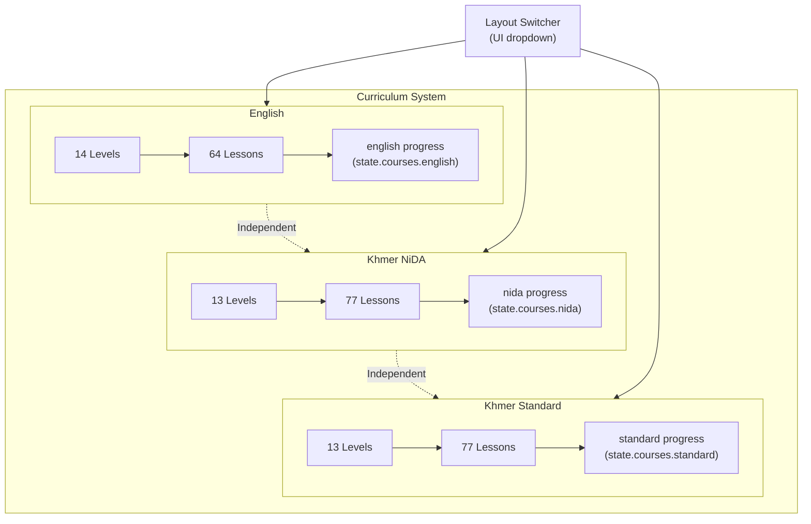

**Separation rules:**

- Each layout has its **own levels, lessons, exercises, and progression** — they never share lesson content or IDs.
- Progress is tracked **per layout** in `state.courses = { english, nida, standard }`.
- Completing English lessons has **zero effect** on NiDA or Standard progress, and vice versa.
- The UI layout switcher dynamically reloads the lesson strip for the selected layout without affecting other layouts' state.
- Keyboard physics differ between layouts (Coeng on `Shift+J` vs `Space`, different vowel placements), so lesson content cannot be cross-layout.

---

# Final Mastery Flow

This section shows the end-game progression where the learner has been introduced to all keys and works toward full keyboard mastery.

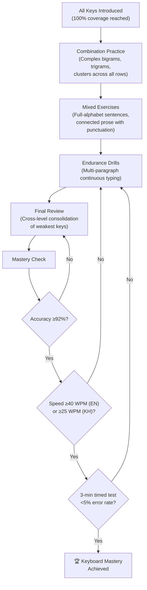

**Mastery is earned, not given.** Simply completing every lesson does not grant mastery. The learner must:

1. Complete 100% of the curriculum.
2. Maintain overall accuracy $\ge 92\%$.
3. Reach sustained speed: $\ge 40$ WPM (English) or $\ge 25$ WPM (Khmer).
4. Pass a 3-minute continuous timed test with $< 5\%$ error rate.

Failing any criterion sends the learner back into targeted practice at the appropriate stage.

---

# Overall System Diagram

This is the big-picture view connecting every part of the lesson overhaul system from source definitions through to learner mastery.

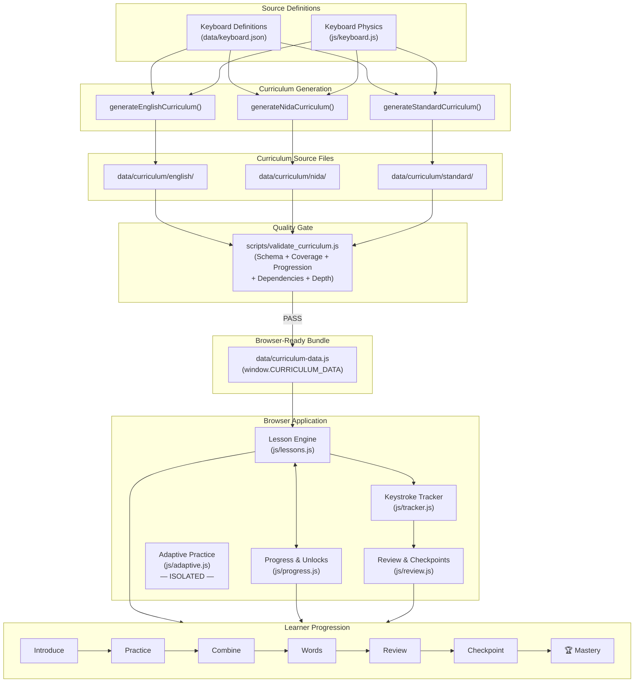

**This diagram answers: "How does everything connect?"**

1. **Keyboard definitions** are the root source of truth — they define what characters exist.
2. **Generators** produce structured JSON curricula from those definitions.
3. **Validation** ensures curriculum integrity before anything reaches the browser.
4. **Bundling** compiles validated JSON into a single zero-latency file.
5. **The browser app** consumes the bundle through its lesson engine, progress system, and review subsystems.
6. **Adaptive Practice** runs alongside but in strict isolation.
7. **The learner** progresses through the 10-stage pedagogical sequence from introduction to mastery.

---

# MASTER ARCHITECTURAL DEEP-DIVE MAPS (BIG & STRONG)

This section provides comprehensive, deep-dive architectural flowcharts mapping every subsystem of PK Khmer Type with maximum precision.

---

## MAP 1: THE UNIFIED KEYSTROKE LIFECYCLE & ENGINE DISPATCH PIPELINE

This map traces every single physical keypress from hardware actuation through IME interception, Unicode normalization, layout routing, active consumer dispatch, evaluation, telemetry tracking, and storage persistence:

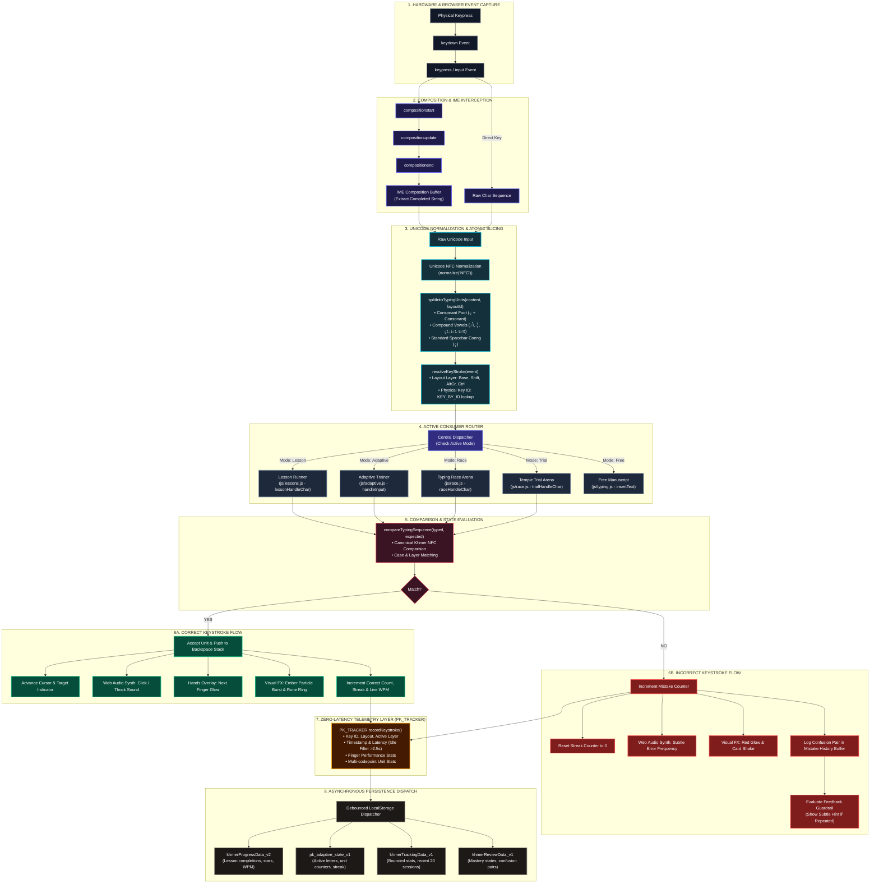

---

## MAP 2: THE COMPLETE KHMER GRAPHEME CLUSTER & ORTHOGRAPHY RESOLUTION MAP

This map shows how PK Khmer Type decomposes, verifies, and trains the full phonetic and structural complexity of the Khmer script, including the critical physical differences between Khmer NiDA and Khmer Standard:

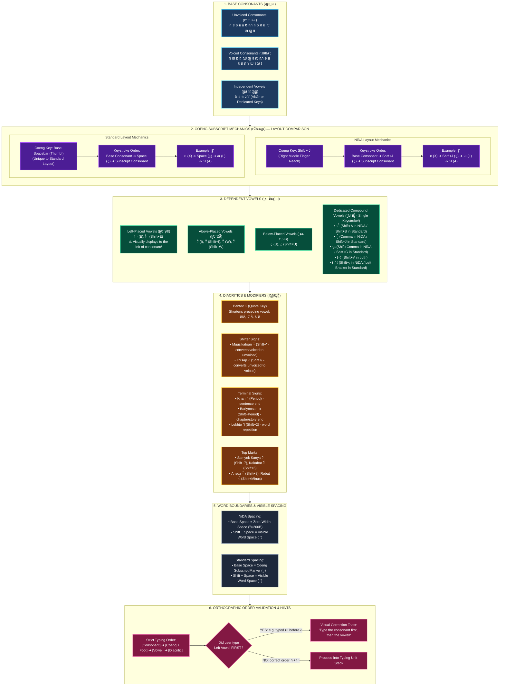

---

## MAP 3: THE MULTI-MODE TRAINING & PRACTICE ECOSYSTEM MAP

This map shows how the 6 distinct training modalities operate, maintain session isolation, and aggregate into the central learner profile:

```mermaid
flowchart TD
    classDef core fill:#0f172a,stroke:#38bdf8,stroke-width:2px,color:#fff;
    classDef mode fill:#1e1b4b,stroke:#818cf8,stroke-width:2px,color:#fff;
    classDef feature fill:#164e63,stroke:#06b6d4,stroke-width:2px,color:#fff;
    classDef profile fill:#451a03,stroke:#f59e0b,stroke-width:2px,color:#fff;
    classDef store fill:#14532d,stroke:#22c55e,stroke-width:2px,color:#fff;

    subgraph HUB ["APP RUNTIME & MODE CONTROLLER (js/app.js)"]
        ROUTER["Global Mode Router\n(Mutual Suspension Coordinator)"]:::core
        LAYOUT["Active Layout State\n• Khmer Standard | Khmer NiDA | English US"]:::core
        ROUTER <--> LAYOUT
    end

    subgraph MODE_LESSONS ["MODE 1: STRUCTURED CURRICULUM (js/lessons.js)"]
        L_DATA["218 Lessons / 40 Levels\nPre-bundled in curriculum-data.js"]:::mode
        L_HUD["Lesson Strip HUD\nLevel Accordion & Card Strip"]:::feature
        L_GATE["Checkpoint Gate (≥90% Acc)\nLocks next level until earned"]:::feature
        L_REV["Spaced Review Lessons\n(≥25% consolidation per level)"]:::feature
        L_TIME["Timed Speed Challenges\n(1-min & 3-min countdown timers)"]:::feature
        L_DATA --> L_HUD --> L_GATE --> L_REV --> L_TIME
    end

    subgraph MODE_ADAPTIVE ["MODE 2: ADAPTIVE PRACTICE (js/adaptive.js)"]
        A_STATE["Isolated State: pk_adaptive_state_v1\nZero leak to lesson records"]:::mode
        A_HUD["Keybr-Style Mastery HUD\nHorizontal Letter Progress Bars"]:::feature
        A_ALGO["Dynamic Percentage Engine\n+2%/+3% correct, -1%..-4% mistakes"]:::feature
        A_GEN["Zero-Leak Word Generator\n(65% weak target, 35% maintenance)"]:::feature
        A_DELTA["Before vs. After Delta HUD\n(Measure Δ% per round)"]:::feature
        A_STATE --> A_HUD --> A_ALGO --> A_GEN --> A_DELTA
    end

    subgraph MODE_TRIAL ["MODE 3: TEMPLE TRIAL (js/race.js)"]
        T_STATE["Streaks & High Scores\n(khmerTrialBest)"]:::mode
        T_WORDS["Dynamic Word Pool\n(Filtered by learner unlocked keys)"]:::feature
        T_AURA["Kinesthetic Heating Aura\nHeat 1 (x3) ➔ Heat 2 (x6) ➔ Heat 3 (x10)"]:::feature
        T_BURST["Rune Ring & Ember Celebrations"]:::feature
        T_STATE --> T_WORDS --> T_AURA --> T_BURST
    end

    subgraph MODE_RACE ["MODE 4: TYPING RACE (js/race.js)"]
        R_CONF["race-config.json Engine\nEasy, Medium, Hard, Expert"]:::mode
        R_LOBBY["Race Setup & Countdown (3-2-1)"]:::feature
        R_TRACK["Live Track & Ghost Racer Bots"]:::feature
        R_LB["Local Leaderboard Engine\nkhmerRaceLeaderboard<Diff><Len>"]:::feature
        R_CONF --> R_LOBBY --> R_TRACK --> R_LB
    end

    subgraph MODE_REVIEW ["MODE 5: TARGETED WEAK-KEY REVIEW (js/review.js)"]
        RV_STATE["PK_REVIEW Candidate Queue\nHigh priority low-acc, slow, stale"]:::mode
        RV_DRILL["Ad-Hoc Drill Generator\n(id: -1 targeted mini-session)"]:::feature
        RV_REMEDIAL["Post-Lesson 'Review Mistakes' Button"]:::feature
        RV_STATE --> RV_DRILL --> RV_REMEDIAL
    end

    subgraph MODE_FREE ["MODE 6: FREE MANUSCRIPT (js/typing.js)"]
        F_AREA["Open Writing Canvas\nFull IME & Layer Exploration"]:::mode
        F_CLIP["Clipboard Actions (Copy / Clear)"]:::feature
        F_AREA --> F_CLIP
    end

    ROUTER -->|Launch Lesson| MODE_LESSONS
    ROUTER -->|Launch Adaptive (Suspends Lesson)| MODE_ADAPTIVE
    ROUTER -->|Launch Trial| MODE_TRIAL
    ROUTER -->|Launch Race| MODE_RACE
    ROUTER -->|Launch Review| MODE_REVIEW
    ROUTER -->|Default View| MODE_FREE

    subgraph PROFILE_STATS ["UNIFIED LEARNER PROFILE & STATISTICS (js/statistics.js)"]
        PROF_HERO["Founder & Learner Profile Card\nXP Bar, Rank Titles, EST Seal"]:::profile
        STATS_MODAL["Statistics Dashboard Modal\nWPM Charts, Accuracy Histograms, Level Progress"]:::profile
        LEADERBOARD["Lessons & Race Local Leaderboards"]:::profile
        BACKUP["Backup System (JSON Export / Import)"]:::profile
    end

    MODE_LESSONS --> PROFILE_STATS
    MODE_ADAPTIVE --> PROFILE_STATS
    MODE_TRIAL --> PROFILE_STATS
    MODE_RACE --> PROFILE_STATS
    MODE_REVIEW --> PROFILE_STATS

    subgraph STORAGE_PERSIST ["LOCAL PERSISTENCE LAYER (localStorage)"]
        S1["khmerProgressData_v2"]:::store
        S2["pk_adaptive_state_v1"]:::store
        S3["khmerTrackingData_v1"]:::store
        S4["khmerReviewData_v1"]:::store
        S5["khmerProfile & khmerAccountData"]:::store
        S6["khmerRaceLeaderboard* & khmerTrialBest"]:::store
        S7["khmerSettings"]:::store
    end

    PROFILE_STATS --> STORAGE_PERSIST
```

---

## MAP 4: THE HOLISTIC DATA FLOW, TELEMETRY & PERSISTENCE MATRIX MAP

This map details every state object in memory, how telemetry flows into analytical engines, and how data is committed to LocalStorage without race conditions or storage pollution:

```mermaid
flowchart TD
    classDef mem fill:#172554,stroke:#3b82f6,stroke-width:2px,color:#fff;
    classDef proc fill:#312e81,stroke:#6366f1,stroke-width:2px,color:#fff;
    classDef store fill:#064e3b,stroke:#10b981,stroke-width:2px,color:#fff;
    classDef io fill:#451a03,stroke:#f59e0b,stroke-width:2px,color:#fff;

    subgraph IN_MEMORY ["1. IN-MEMORY ACTIVE STATE SUBSYSTEMS"]
        ST_LESSON["Lesson Engine Memory (js/lessons.js)\n• currentLesson, currentExerciseIdx\n• currentUnitIdx, acceptedUnitsStack\n• sessionMistakes, sessionCorrect"]:::mem
        ST_TRACKER["Keystroke Tracker State (PK_TRACKER)\n• keyStats[layout][keyId]\n• charStats[layout][char]\n• fingerStats[fingerId]\n• recentMistakes (Circular 100 Buffer)\n• sessions (Last 20 Runs)"]:::mem
        ST_REVIEW["Review Engine State (PK_REVIEW)\n• characterCatalog (96 Khmer, 95 English)\n• characterMastery: locked/learning/proficient/mastered\n• confusionPairs: Map<expected, Map<typed, count>>\n• responseTimes: Map<char, number[]>"]:::mem
        ST_ADAPTIVE["Adaptive Practice State (PK_ADAPTIVE)\n• activeStage, activeLetters[]\n• letterStats: { char: { units, accuracy, streak } }\n• wordPerformanceCounter (+10/-10)\n• focusLetter, targetBeforeAfter"]:::mem
        ST_PROGRESS["Progress Engine State (PK_PROGRESS)\n• courses: { standard, nida, english }\n• lessons: { [id]: { bestWpm, bestAcc, completed, stars } }"]:::mem
    end

    subgraph DATA_PIPELINE ["2. REAL-TIME DATA PROCESSING PIPELINE"]
        STROKE_IN["Raw Keystroke Event"]:::proc
        STROKE_IN --> ST_LESSON
        STROKE_IN --> ST_ADAPTIVE
        
        ST_LESSON -->|Real-time telemetry hook| ST_TRACKER
        ST_ADAPTIVE -->|Real-time telemetry hook| ST_TRACKER
        
        FEEDBACK_ANALYZER["Learner Feedback Layer (PK_FEEDBACK)\n• Analyzes mistake clusters & finger fatigue\n• Non-punitive guardrail: requires ≥2 repeated errors\n• Generates Post-Lesson Card & Paused Card"]:::proc
        ST_TRACKER --> FEEDBACK_ANALYZER
        
        MASTERY_EVAL["Mastery & Staleness Evaluator (PK_REVIEW)\n• Evaluates accuracy (<85% = low)\n• Evaluates latency (>2x avg = slow)\n• Evaluates staleness (>7 days or >10 lessons)\n• Builds Prioritized Review Candidate Queue"]:::proc
        ST_TRACKER --> MASTERY_EVAL
        MASTERY_EVAL --> ST_REVIEW
    end

    subgraph STORAGE_COMMIT ["3. PERSISTENCE STORAGE COMMIT (localStorage)"]
        direction TB
        K_PROG["Storage Key: khmerProgressData_v2\nIsolated courses: standard, nida, english\nLesson completions, best scores, star ratings"]:::store
        K_ADAPT["Storage Key: pk_adaptive_state_v1\nStrictly isolated adaptive letter progress\nUnit counters, mastery percentages, active stage"]:::store
        K_TRACK["Storage Key: khmerTrackingData_v1\nDebounced telemetry cache, recent sessions\nFinger latencies, error matrices"]:::store
        K_REV["Storage Key: khmerReviewData_v1\nPersistent character mastery states\nConfusion pairs, staleness timestamps"]:::store
        K_PROF["Storage Key: khmerProfile & khmerAccountData\nUser credentials hash, XP, level badge, avatar"]:::store
        K_RACE["Storage Key: khmerRaceLeaderboard* & khmerTrialBest\nTop 50 scores per difficulty/length combination"]:::store
        K_SET["Storage Key: khmerSettings\nTheme, accent color, sounds, guide toggles, wallpaper"]:::store
        
        ST_PROGRESS --> K_PROG
        ST_ADAPTIVE --> K_ADAPT
        ST_TRACKER --> K_TRACK
        ST_REVIEW --> K_REV
    end

    subgraph IO_RESILIENCE ["4. BACKUP, MIGRATION & RECOVERY SUBSYSTEM"]
        MIGRATION["Legacy Migration Engine (js/progress.js)\n• Maps numeric IDs (1..58) ➔ standard-Lxx-yy\n• Preserves legacy khmerLessonBest_<id> keys"]:::io
        EXPORT["JSON Backup Exporter\nSerializes all 7 keys into downloadable timestamped file"]:::io
        IMPORT["JSON Backup Importer & Validator\nValidates schema before overwriting state"]:::io
        RECOVERY["Self-Healing Corruption Guard\nCatches JSON.parse errors and restores fallback baseline"]:::io
        
        K_PROG <--> MIGRATION
        STORAGE_COMMIT --> EXPORT
        IMPORT --> STORAGE_COMMIT
        STORAGE_COMMIT --> RECOVERY
    end
```

---

## MAP 5: THE MASTER EXECUTION & TESTING QUALITY HIGHWAY MAP

This map outlines the complete testing battery, quality gates, and automated verification checkpoints that must be traversed from build time to final production sign-off:

```mermaid
flowchart TD
    classDef build fill:#14532d,stroke:#22c55e,stroke-width:2px,color:#fff;
    classDef unit fill:#1e3a8a,stroke:#3b82f6,stroke-width:2px,color:#fff;
    classDef live fill:#4c1d95,stroke:#a855f7,stroke-width:2px,color:#fff;
    classDef stress fill:#7c2d12,stroke:#f97316,stroke-width:2px,color:#fff;
    classDef gate fill:#831843,stroke:#ec4899,stroke-width:2px,color:#fff;
    classDef release fill:#1f2937,stroke:#10b981,stroke-width:3px,color:#fff;

    subgraph T_BUILD ["STAGE 1: COMPILE-TIME & DATA INTEGRITY GATES"]
        B1["scripts/validate_curriculum.js\n• 0 broken previousLesson links\n• 0 empty exercises or duplicate IDs\n• 0 pre-introduction character violations"]:::build
        B2["scripts/audit_curriculum_depth.js\n• 100% of lessons meet ≥80 keystroke units\n• Overall curriculum average ≥95 units"]:::build
        B3["scripts/bundle_curricula.js\n• Bundles all 3 layouts into curriculum-data.js\n• Verifies offline window.CURRICULUM_DATA"]:::build
        B1 --> B2 --> B3
    end

    subgraph T_UNIT ["STAGE 2: HEADLESS UNIT TEST BATTERY"]
        U1["Tracker Tests (test_tracker.js)\n37/37 Scenarios PASS (Latency, key stats, idle)"]:::unit
        U2["Progress Tests (test_progress.js)\n16/16 Scenarios PASS (Unlocks, stars, isolation)"]:::unit
        U3["Feedback Tests (test_feedback.js)\n11/11 Scenarios PASS (Guardrails, card generation)"]:::unit
        U4["Adaptive Unit Tests (test_adaptive_practice_complete.js)\n20/20 Scenarios PASS (Zero-leak vocab, weights)"]:::unit
        U1 --> U2 --> U3 --> U4
    end

    subgraph T_LIVE ["STAGE 3: REAL BROWSER INTEGRATION (CHROME CDP)"]
        L1["Hydration & Accordion Verification\n• Standard: 13 Levels, 77 Cards\n• NiDA: 13 Levels, 77 Cards\n• English: 14 Levels, 64 Cards"]:::live
        L2["Live Keystroke Simulation\nSimulate real physical key events across all 3 layouts"]:::live
        L3["Dynamic Percentage Assertions\nVerify visual letter progress bars update dynamically"]:::live
        L4["Layout Switching Without Reload\nVerify switching layout updates strip cleanly"]:::live
        L1 --> L2 --> L3 --> L4
    end

    subgraph T_STRESS ["STAGE 4: KHMER ORTHOGRAPHY & EDGE-CASE STRESS"]
        S1["Coeng Spacebar Test (Standard)\nVerify Space triggers Subscript Coeng on base layer"]:::stress
        S2["Complex Subscript Clusters\nTest triple clusters (ស្ទ្រី), Sanskrit loans (សង្ឃ, សម្បត្តិ)"]:::stress
        S3["Robat, Bantoc & Shifter Signs\nVerify ៌, ់, ៉, ៊ order and rendering"]:::stress
        S4["Storage Quota & Corrupted State Recovery\nSimulate local storage failure and verify self-healing"]:::stress
        S1 --> S2 --> S3 --> S4
    end

    subgraph T_GATE ["STAGE 5: PHASE VERIFICATION GATES (PHASES 10–14)"]
        G10["Gate 10: Checkpoints enforce ≥90% accuracy before level advance"]:::gate
        G11["Gate 11: Temple Trial 500+ words & Race multi-tier text bank verified"]:::gate
        G12["Gate 12: Khmer adaptive syllable generator produces 0 locked leaks"]:::gate
        G13["Gate 13: 100% translation coverage & Lighthouse A11y ≥95"]:::gate
        G14["Gate 14: 218-lesson automated playthrough suite completes 100%"]:::gate
        G10 --> G11 --> G12 --> G13 --> G14
    end

    subgraph T_RELEASE ["STAGE 6: PRODUCTION RELEASE SIGN-OFF (PHASE 15)"]
        R_OFFLINE["Offline PWA Verification (Service Worker Cache Audit)"]:::release
        R_CLEAN["Codebase Cleanup (Zero dangling scratch scripts)"]:::release
        R_DOCS["Documentation Sign-Off (README & Master Roadmap)"]:::release
        R_FINAL["🏆 FINAL ACCEPTANCE: DEFINITION OF DONE CERTIFIED"]:::release
        
        R_OFFLINE --> R_CLEAN --> R_DOCS --> R_FINAL
    end

    T_BUILD --> T_UNIT
    T_UNIT --> T_LIVE
    T_LIVE --> T_STRESS
    T_STRESS --> T_GATE
    T_GATE --> T_RELEASE
```

---

## 15. MASTER ROADMAP & ARCHITECTURAL MAP (PHASE 9 TO PRODUCTION COMPLETION)

### Status Key:
- `[COMPLETED]`: Fully implemented, verified with tests, and active in the repository.
- `[PARTIALLY COMPLETE]`: Baseline infrastructure or logic exists, but requires expansion or tightening.
- `[NEXT]`: The immediate upcoming phase to be implemented.
- `[PLANNED]`: Designed and scheduled in the master roadmap.
- `[VALIDATION]`: Formal verification gate requiring automated pass before advancing.
- `[BLOCKED]`: Waiting on a prerequisite phase.

### Subsystem Health & Status Summary:
| Subsystem | Status | Current Baseline | What Remains |
| :--- | :---: | :--- | :--- |
| **Curriculum Data** | `[COMPLETED]` | 40 levels, 218 lessons, 664 exercises, 20,798 units across English, NiDA, Standard. Zero lessons below 80 units. | Spaced-review distribution audit (≥25% review coverage per level). |
| **Curriculum Bundler & Validator** | `[COMPLETED]` | `validate_curriculum.js` & `bundle_curricula.js` enforce 0 progression violations and 0 broken links. | Continuous execution in CI/validation gates. |
| **Runtime Lesson Engine** | `[PARTIALLY COMPLETE]` | `js/lessons.js` hydrates all 3 layouts from `window.CURRICULUM_DATA`; level transitions now require a ≥90% pass on the preceding level's final lesson. | Timed challenge mechanics and spaced-review distribution audit. |
| **Typing Engine Core** | `[COMPLETED]` | Unicode NFC normalization, IME composition handling, multi-codepoint unit slicing, backspace stack. | Audio profile customization & sound latency tuning. |
| **Real-Time Keystroke Tracker** | `[COMPLETED]` | `js/tracker.js` (`PK_TRACKER`) zero-latency logging per key, finger, unit, layout, and active session. | Exporting aggregated telemetry for analytics dashboard. |
| **Review Engine Core** | `[COMPLETED]` | `js/review.js` (`PK_REVIEW`) character catalog, confusion matrix, staleness detection, candidate queue. | Connecting candidate queue to standalone targeted practice UI. |
| **Adaptive Practice (English)** | `[COMPLETED]` | Keybr-style letter progress bars, dynamic percentages (+2%/+3% correct, -1%..-4% wrong), 2,143 words. | Parity for Khmer NiDA & Standard. |
| **Adaptive Practice (Khmer)** | `[PARTIALLY COMPLETE]` | Basic syllable progression in `js/adaptive.js`, 384 Khmer words/syllables in `data/adaptive-vocab.js`. | Syllable-aware dynamic cluster generator, Coeng spacebar handling. |
| **Practice Modes (Trial & Race)** | `[PARTIALLY COMPLETE]` | `js/race.js` has live race track, local leaderboard, Temple Trial streak mechanics. | Word banks limited (9 Khmer, 20 English); race texts need multi-tier expansion. |
| **Progress & Account Persistence** | `[COMPLETED]` | `khmerProgressData_v2`, legacy migration, course isolation (`english`, `nida`, `standard`), backup export/import. | Granular historical attempt graphing. |
| **Localization & i18n** | `[PARTIALLY COMPLETE]` | `data/shared/i18n.json` exists; header and settings toggle English/Khmer. | 100% translation coverage for lesson cards, badges, and modals. |

---

### The Master Architecture & Development Map

```mermaid
flowchart TD
    classDef done fill:#1b3d2f,stroke:#2dd4a7,stroke-width:2px,color:#fff;
    classDef partial fill:#3d361b,stroke:#ffd166,stroke-width:2px,color:#fff;
    classDef next fill:#3d1b33,stroke:#ff5a70,stroke-width:3px,color:#fff;
    classDef planned fill:#1a2238,stroke:#4fe8ff,stroke-width:2px,color:#fff;
    classDef gate fill:#2c1b4d,stroke:#a06bff,stroke-width:2px,stroke-dasharray: 5 5,color:#fff;

    %% COMPLETED BASELINE
    subgraph BASELINE ["🏁 COMPLETED FOUNDATION (PHASES 1–9)"]
        P1_P2["Phase 1 & 2: Validator & Bundler Normalization"]:::done
        P3_P5["Phases 3–5: 218 Lessons Built (EN, NiDA, STD)"]:::done
        P6_P7["Phases 6 & 7: Runtime Hydration & Progress Isolation"]:::done
        P8_P9["Phases 8 & 9: Automated Coverage & Headless Browser Hydration"]:::done
        ENG_CORE["Typing Engine Core (NFC, IME, Backspace Stack)"]:::done
        TRACKER["Real-Time Keystroke Tracker (PK_TRACKER)"]:::done
        ADAPT_EN["Adaptive Practice for English (Keybr-style HUD)"]:::done
    end

    %% CRITICAL PATH & FUTURE PHASES
    P8_P9 --> PHASE10
    
    subgraph PHASE10_SUB ["PHASE 10: CHECKPOINTS, GATES & SPACED REVIEW"]
        PHASE10["Phase 10: Checkpoint Gate Complete; Timers & Review Audit Remain"]:::next
        CP_GATE["Checkpoint Enforcement (≥90% Acc Required to Advance)"]:::done
        SPACED_REV["Spaced Review Distribution Audit (≥25% Review/Level)"]:::planned
        TIMED_CHALLENGE["Timed Challenge Mechanics (1-min & 3-min Timers)"]:::planned
        PHASE10 --> CP_GATE
        PHASE10 --> SPACED_REV
        PHASE10 --> TIMED_CHALLENGE
    end

    subgraph PHASE11_SUB ["PHASE 11: PRACTICE SYSTEM EXPANSION"]
        PHASE11["Phase 11: Temple Trial & Typing Race Overhaul"]:::planned
        TRIAL_EXP["Temple Trial Expansion (Rich Word Bank from Vocab)"]:::planned
        RACE_EXP["Typing Race Text Engine (Multi-tier EN & Khmer Texts)"]:::planned
        REVIEW_UI["Targeted Weak-Key Drill Launcher (Connecting PK_REVIEW)"]:::planned
        PHASE11 --> TRIAL_EXP
        PHASE11 --> RACE_EXP
        PHASE11 --> REVIEW_UI
    end

    subgraph PHASE12_SUB ["PHASE 12: KHMER ADAPTIVE SYLLABLE ENGINE"]
        PHASE12["Phase 12: Khmer Adaptive Engine & Syllable Generator"]:::planned
        KM_SYLLABLE["Grapheme Cluster Syllable Generator (Zero-Leak)"]:::planned
        STD_SPACE["Standard Layout Coeng (Spacebar) Adaptive Support"]:::planned
        NIDA_COENG["NiDA Shift+J Subscript Adaptive Sequences"]:::planned
        PHASE12 --> KM_SYLLABLE
        PHASE12 --> STD_SPACE
        PHASE12 --> NIDA_COENG
    end

    subgraph PHASE13_SUB ["PHASE 13: LOCALIZATION & UX POLISH"]
        PHASE13["Phase 13: Complete i18n & Sensory/A11y Refinement"]:::planned
        I18N_FULL["Full Dual-Language Coverage (All 218 Lessons & Modals)"]:::planned
        AUDIO_PROFILE["Sound Engine Customization (Mechanical, Thock, Typewriter)"]:::planned
        A11Y_FOCUS["Accessibility, High-Contrast & Focus Mode Hardening"]:::planned
        PHASE13 --> I18N_FULL
        PHASE13 --> AUDIO_PROFILE
        PHASE13 --> A11Y_FOCUS
    end

    subgraph PHASE14_SUB ["PHASE 14: FULL-SYSTEM TEST SUITE"]
        PHASE14["Phase 14: Comprehensive Verification & Regression"]:::planned
        E2E_ALL["Automated E2E Suite (218 Lessons Load & Complete)"]:::planned
        KM_ORTHO["Khmer Orthography Stress Tests (Complex Clusters & Signs)"]:::planned
        ISOLATION_TEST["Cross-Layout Progress & Storage Resilience Tests"]:::planned
        PHASE14 --> E2E_ALL
        PHASE14 --> KM_ORTHO
        PHASE14 --> ISOLATION_TEST
    end

    subgraph PHASE15_SUB ["PHASE 15: RELEASE CANDIDATE & SIGN-OFF"]
        PHASE15["Phase 15: Final Release Audit & Delivery"]:::planned
        RELEASE_GATE["Quality Gate Verification (0 Errors, 100% Pass)"]:::gate
        DOCS["Final User & Developer Documentation"]:::planned
        SIGN_OFF["🏆 PK Khmer Type Production Ready"]:::done
        PHASE15 --> RELEASE_GATE
        RELEASE_GATE --> DOCS
        DOCS --> SIGN_OFF
    end

    %% INTER-PHASE DEPENDENCIES
    PHASE10_SUB --> PHASE11_SUB
    PHASE10_SUB --> PHASE12_SUB
    PHASE11_SUB --> PHASE13_SUB
    PHASE12_SUB --> PHASE13_SUB
    PHASE13_SUB --> PHASE14_SUB
    PHASE14_SUB --> PHASE15_SUB
```

---

### Detailed Specification of Future Phases (Phases 10–15)

```text
================================================================================
PHASE 10: CHECKPOINTS, GATEKEEPING & SPACED REVIEW AUDIT
================================================================================
Status:       [PARTIALLY COMPLETE]
Dependencies: Phase 9 (Completed)
Files:        js/lessons.js, data/curriculum/*

Goal:
Enforce true pedagogical gatekeeping across the 218 lessons and verify spaced
review distribution so learners do not advance without demonstrating accuracy.

Why It Exists:
Currently, lesson unlocking relies on a simple completion flag. Checkpoints and
timed challenges must act as genuine milestones requiring ≥90% accuracy.

Main Work:
1. Checkpoint Gatekeeping — COMPLETE:
     - The final ordered lesson in each level is its checkpoint; all 40 levels
         already define a 90% accuracy target for that lesson.
     - Level transitions now remain locked until the checkpoint's saved best
         accuracy reaches at least 90%. Existing within-level unlocks are unchanged.
2. Timed Challenge Mechanics — REMAINING:
   - Wire 1-minute and 3-minute countdown timers into Level 12/13 speed lessons.
   - Calculate live net WPM and display celebratory pass criteria.
3. Spaced Review Audit — REMAINING:
   - Run audit verifying that ≥25% of exercises in every level systematically
     re-introduce characters from preceding levels.

Expected Result:
Learners cannot breeze through lessons with poor accuracy; checkpoints enforce
mastery, and timed drills function with active countdown timers.

Validation:
Focused runtime checks verify that a sub-90% checkpoint stays locked, a 90%+
checkpoint unlocks the next level, and within-level progression is unchanged.
Timed challenges and the 40-level review-distribution audit remain unverified.
```

```text
================================================================================
PHASE 11: PRACTICE SYSTEM EXPANSION (TEMPLE TRIAL & TYPING RACE)
================================================================================
Status:       [PLANNED]
Dependencies: Phase 10
Files:        js/race.js, data/typing-content.json, data/shared/race-config.json

Goal:
Transform Temple Trial and Typing Race from basic stubs into rich, layout-aware
practice modes with extensive vocabularies and authentic texts.

Why It Exists:
Temple Trial currently has only 9 Khmer words and 20 English words. Typing Race
lacks multi-tier literary content and layout-aware difficulty scaling.

Main Work:
1. Temple Trial Vocabulary Expansion:
   - Expand word pools to 500+ authentic Khmer words and 1,000+ English words
     drawn from adaptive vocabulary banks.
   - Filter words based on the learner's unlocked keys in the active layout.
2. Typing Race Text Engine:
   - Populate Easy, Medium, Hard, and Expert categories with authentic Khmer
     literature, proverbs, historical narratives, and English classic prose.
   - Integrate scoring formula from data/shared/race-config.json (netWPM * acc^2.2).
3. Targeted Review Drill Launcher:
   - Connect js/review.js candidate queue to a 1-click "Targeted Drill" button.

Expected Result:
Temple Trial provides endless varied practice; Typing Race features authentic,
challenging texts across 4 difficulties; targeted review is instantly accessible.

Validation:
Unit tests confirming zero locked-letter leakage in Temple Trial; live Chrome
test completing a 30s race and saving scores to local leaderboard.
```

```text
================================================================================
PHASE 12: KHMER ADAPTIVE SYLLABLE ENGINE & LAYOUT ISOLATION
================================================================================
Status:       [PLANNED]
Dependencies: Phase 10, Phase 11
Files:        js/adaptive.js, data/adaptive-vocab.js

Goal:
Bring full Khmer adaptive learning parity to match the English Keybr-style
trainer, supporting Khmer orthography and layout-specific mechanics.

Why It Exists:
English Adaptive Practice is fully mature, but Khmer requires syllable-aware
grapheme generation rather than arbitrary letter shuffling to form valid words.

Main Work:
1. Grapheme Cluster Syllable Generator:
   - Build dynamic Khmer syllable assembler respecting consonant-subscript-vowel
     phonotactics using strictly unlocked keys.
2. Standard Layout Spacebar Coeng Adaptation:
   - Ensure target word generation on Standard layout guides the user to use
     the thumb Spacebar for subscripts (`ក` + `Space` + `ក` = `ក្ក`).
3. NiDA Layout Shift+J Adaptation:
   - Ensure NiDA adaptive practice trains `Shift+J` for subscripts.
4. Granular Letter Progress UI for Khmer:
   - Render the horizontal progress strip for Khmer consonants and vowels.

Expected Result:
Learners can launch Adaptive Practice in Khmer NiDA and Khmer Standard, drilling
valid syllables with real-time weakness detection and Keybr-style progress.

Validation:
Automated test verifying 0 syntax errors in generated Khmer syllables, correct
subscript mapping per layout, and dynamic percentage updates.
```

```text
================================================================================
PHASE 13: FULL i18n LOCALIZATION & SENSORY/A11Y POLISH
================================================================================
Status:       [PLANNED]
Dependencies: Phase 11, Phase 12
Files:        data/shared/i18n.json, js/app.js, css/*.css, index.html

Goal:
Deliver complete dual-language (Khmer / English) localization and refine sensory
and accessibility features for all user tiers.

Why It Exists:
The app is founded in Cambodia for Khmer and international learners. Every UI
element, lesson card, and feedback message must be fluently available in both languages.

Main Work:
1. 100% i18n Translation Coverage:
   - Localize all 218 lesson titles, level titles, objectives, and exercise
     descriptions into both Khmer and English.
   - Ensure dynamic string replacement when toggling language (Alt+L).
2. Audio Profile Engine:
   - Implement audio synthesizers/samples for distinct key profiles: Mechanical
     Clicky (Blue), Smooth Linear (Red), Deep Thock, and Antique Typewriter.
3. Accessibility & Focus Mode:
   - Implement ARIA live regions announcing typing errors for screen readers.
   - Enforce modal focus traps and Esc-key dismissals.
   - Refine Focus Mode (Alt+F) to dim distractions with smooth transitions.

Expected Result:
Instantaneous, flawless switching between Khmer and English UI; satisfying,
customizable tactile audio; full accessibility compliance.

Validation:
Lighthouse accessibility score ≥95; automated check confirming 0 missing
translation keys in data/shared/i18n.json.
```

```text
================================================================================
PHASE 14: COMPREHENSIVE VERIFICATION & CROSS-BROWSER REGRESSION
================================================================================
Status:       [PLANNED]
Dependencies: Phases 10–13
Files:        scripts/validate_curriculum.js, scratch/test_*.js

Goal:
Execute an exhaustive automated test battery covering every lesson, subsystem,
and edge case across major browser runtimes.

Why It Exists:
Before declaring the system ready for production, machine-verifiable proof must
guarantee zero regressions, zero progression bugs, and rock-solid persistence.

Main Work:
1. 218-Lesson Automated Playthrough Suite:
   - Headless script that programmatically inputs correct keystrokes for all
     218 lessons across English, NiDA, and Standard.
   - Verify completion triggers, star assignments, and unlock cascades.
2. Khmer Orthography Stress Testing:
   - Verify complex clusters (e.g. `ស្ដេច`, `កញ្ជ្រោង`, `សម្បត្តិ`, `កិត្តិយស`).
   - Test Robat (`៌`), Bantoc (`់`), Coeng spacebar, and ZWSP handling.
3. Storage & State Resilience Tests:
   - Simulate storage quota limits, corrupted JSON recovery, and export/import.
4. Cross-Browser Verification:
   - Verify rendering and key capture across Chromium, Firefox, and WebKit.

Expected Result:
All test suites pass 100% with zero failures, confirming rock-solid stability.

Validation:
Master test script outputs: "ALL SUITES PASSED (218/218 Lessons, 0 Regressions)".
```

```text
================================================================================
PHASE 15: RELEASE CANDIDATE AUDIT & FINAL DELIVERY
================================================================================
Status:       [PLANNED]
Dependencies: Phase 14
Files:        README.md, manifest.json, service-worker.js

Goal:
Package the completed PK Khmer Type learning system for production release,
verifying offline PWA readiness and documenting the codebase.

Why It Exists:
Provides final validation against the Definition of Done, cleans up scratch
development artifacts, and guarantees flawless zero-latency offline operation.

Main Work:
1. PWA & Offline Packaging:
   - Audit service worker cache to ensure all assets (audio, fonts, curricula)
     cache for 100% offline functionality.
2. Code Cleanup:
   - Remove temporary scratch scripts and diagnostic logs.
3. Documentation Finalization:
   - Update README.md with complete curriculum details, shortcut reference,
     and technical architecture notes.
4. Final Sign-off Report:
   - Deliver comprehensive sign-off audit verifying all acceptance criteria.

Expected Result:
PK Khmer Type is completely packaged, documented, verified, and ready for release.

Validation:
Clean git working tree, verified offline PWA audit, 100% passing test matrix.
```

---

### Critical Path & Execution Sequencing

$$\mathbf{Phase\ 9\ [Done]} \longrightarrow \mathbf{Phase\ 10\ [Next]} \longrightarrow \mathbf{Phase\ 12} \longrightarrow \mathbf{Phase\ 13} \longrightarrow \mathbf{Phase\ 14} \longrightarrow \mathbf{Phase\ 15\ [Release]}$$

*Parallel Opportunity:* **Phase 11 (Practice Expansion)** can execute concurrently with **Phase 12 (Khmer Adaptive Engine)** since practice word banks and race texts are decoupled from the adaptive algorithm.

---

### Connections to Existing Planning Documents

| Existing Plan / Spec | File Location | How It Connects to Master Roadmap | Action |
| :--- | :--- | :--- | :--- |
| **Lesson Overhaul Master Plan** | `lesson_overhaul_plan.md` | Single source of truth for curriculum structure, 218 lesson specs, 10-stage pedagogy, and keyboard physics comparison. | **CONTINUE FROM EXISTING PLAN** (Phases 10–12 directly continue from here) |
| **Implementation Tasks Baseline** | `task.md` | Tracks foundational phases (Phases 2–7.9) including tracking (`PK_TRACKER`), review rules, and lesson strip fixes. | **ARCHIVED RECORD OF WORK** (Incorporated into Phase 1–9 baseline) |
| **Phase 7 Progress Spec** | `implementation_plan.md` | Architectural blueprint for character mastery classification (`locked` $\to$ `learning` $\to$ `proficient` $\to$ `mastered`). | **SUBSYSTEM SPEC** (Governs `js/review.js` candidate queues in Phase 11) |
| **Phase 8 Adaptive Practice Report** | `walkthrough.md` | Detailed report on adaptive practice architecture, dynamic percentage formula, Keybr-style UI, and word generator. | **SUBSYSTEM SPEC** (Governs Phase 12 Khmer adaptive expansion) |
| **Data Models & Characters** | `data/characters/*.json` | Character catalogs, key assignments, and unicode codepoint mappings. | **DATA ASSETS** (Referenced continuously) |
| **Curriculum Data Sources** | `data/curriculum/*/*.json` | Raw levels, lessons, and exercises partitioned by layout. | **DATA ASSETS** (Directly audited in Phase 10) |

---

### Unknowns & Open Questions

1. **Typing Race Community Leaderboard:** Should an optional cloud leaderboard (e.g. Firebase Firestore) be implemented, or should PK Khmer Type remain strictly 100% local storage? *(Recommendation: Local storage by default; keep external cloud integration purely optional).*
2. **Sound Synthesis vs Audio Samples:** Should custom click sounds (Thock, Typewriter) be synthesized dynamically via the Web Audio API or loaded from small audio sprites? *(Recommendation: Web Audio API synthesis to maintain zero external network dependencies).*
3. **Khmer Adaptive Word Simplification:** In the earliest adaptive stages (e.g., first 5 consonants unlocked), should the generator emit isolated pronounceable syllables or strictly full dictionary words? *(Recommendation: Use authentic syllables from `data/adaptive-vocab.js` to ensure phonotactically valid Khmer combinations).*

---

## 16. COMPREHENSIVE TESTING MATRIX

| Test Domain | Target System | Tool / Method | Success Criteria |
| :--- | :--- | :--- | :--- |
| **Content Progression** | All Curricula | `scripts/validate_curriculum.js` | 0 unintroduced characters, 0 missing exercises, 0 broken lesson links across 218 lessons. |
| **Keystroke Depth** | All Curricula | `scripts/audit_curriculum_depth.js` | 0 lessons below 80 units (except Level 0 orientation). Layout average $\ge 90$ units. |
| **Keyboard Physics** | Standard vs. NiDA | Compile-time key lookup | Standard Coeng resolved to `space` base layer; NiDA Coeng resolved to `Shift+J`. |
| **Offline Startup** | Pre-bundled cache | `scripts/bundle_curricula.js` | `window.CURRICULUM_DATA` contains `standard`, `nida`, `english` with zero-latency load. |
| **Runtime Rendering** | UI Lesson Strip | Headless Chrome (CDP) | DOM contains correct card count on load; switching layout updates cards without reload. |
| **Persistence** | Progress Store | `js/progress.js` mock | Lesson completions save to `khmerProgressData_v2`; lesson $N$ completion unlocks $N+1$. |
| **Adaptive Decoupling** | Adaptive Engine | Storage key inspection | `pk_adaptive_state_v1` untouched by lesson sessions; mutual suspension works cleanly. |
| **Checkpoint Gating** | Progress / Lessons | Unit test (`test_checkpoints.js`) | Level $L+1$ unlocks only when Level $L$ checkpoint achieves $\ge 90\%$ accuracy. |
| **Khmer Syllable Engine**| Adaptive Engine | Automated test | Generates 100% grammatically valid syllables with 0 locked letters. |
| **Full E2E Playthrough** | Complete Engine | Headless Chrome automated run | All 218 lessons simulate typing, reach completion, and assign stars without crash. |

---

## 17. FINAL CURRICULUM AUDIT & ACCEPTANCE CRITERIA

Before final sign-off, the curriculum and application must satisfy the following checklist across all three layouts:

### English US Checklist:
- [x] Complete home-row anchor foundation (`f`, `j`, `space`).
- [x] Progressive reaches to top and bottom rows.
- [x] All 26 letters of the English alphabet systematically introduced.
- [x] Opposite-hand Shift coordination for capital letters.
- [x] Number row reaches (1–0) with structured finger assignments.
- [x] Punctuation, quotation marks, parentheses, and arithmetic symbols.
- [x] Authentic English word banks at every stage (zero nonsense words).
- [x] End-of-level checkpoints and 3-minute timed speed challenges.

### Khmer NiDA Checklist:
- [x] Index anchor keys `ថ` (F) and `ក` (K) with tactile rest rhythm.
- [x] Correct sequential introduction of home row consonants and vowel `ា`.
- [x] Coeng subscript mechanism explicitly taught at `Shift + J`.
- [x] Dedicated compound vowels (`ាំ`, `ុំ`, `ុះ`, `េះ`, `ោះ`) taught as single strokes.
- [x] Logical typing order enforced: Consonant $\rightarrow$ Subscript $\rightarrow$ Vowel.
- [x] Word separation with `Shift + Space`.
- [x] Comprehensive coverage of aspirated Shift consonants and dependent Shift vowels.
- [x] Diacritics (`៉`, `៊`, `៍`, `៏`, `័`, `៌`), Riel sign (`៛`), and repetition mark (`ៗ`).
- [x] AltGr independent vowels (`ឪ`, `ឧ`, `ឲ`, `ឯ`, `ឱ`).

### Khmer Standard Checklist:
- [x] Standard-specific keyboard physics strictly mapped and verified.
- [x] Coeng subscript marker explicitly taught on the **Spacebar base layer**.
- [x] Visible word separation taught on **`Shift + Space`**.
- [x] Unique Standard vowel placements: `ះ` on Semicolon, `ើ` and `ោះ` on brackets.
- [x] Unique Standard shift locations: `ៃ` (Shift+A), `ាំ` (Shift+S), `ុះ` (Shift+G), `៏` (Shift+H), `ុំ` (Shift+J).
- [x] Consonant `អ` correctly located and taught on Comma key.
- [x] Subscript cluster drills utilizing the thumb Spacebar Coeng sequence.
- [x] Independent vowels and speed mastery challenges matching Standard layout physics.

---

## 18. DEFINITION OF DONE

The learning system of PK Khmer Type is 100% complete and ready for release when:

1. **Parity Across All Layouts:** English (14 levels, 64 lessons), Khmer NiDA (13 levels, 77 lessons), and Khmer Standard (13 levels, 77 lessons) are fully specified and bundled in `data/curriculum-data.js`.
2. **Substantial Practice Depth:** Zero non-orientation lessons under 80 keystroke units; overall curriculum average exceeds 95 keystroke units per lesson.
3. **Machine-Verified Progression:** `scripts/validate_curriculum.js` outputs **`OVERALL RESULT: PASS`** with 0 errors, 0 warnings, and 0 out-of-order key violations across all 218 lessons.
4. **Browser Runtime Parity:** Switching between layouts dynamically updates the lesson strip with matching card counts in real browser testing.
5. **Progress & Adaptive Integrity:** User completion records persist safely without collisions, and Adaptive Practice functions in complete isolation.
6. **Milestone Gatekeeping:** Checkpoint lessons enforce $\ge 90\%$ accuracy before unlocking subsequent levels.
7. **Complete Practice Modes:** Temple Trial and Typing Race are populated with multi-tier authentic vocabularies and literary passages.
8. **Khmer Adaptive Parity:** Adaptive practice supports syllable-aware cluster generation for Khmer NiDA and Standard.
9. **Localization & Accessibility:** 100% translation coverage in English and Khmer, keyboard-accessible navigation, and WCAG high-contrast compliance.
10. **Full Regression Clearance:** Headless test battery confirms 218/218 lessons complete cleanly with zero errors.

---

## 19. FRONTEND TECHNOLOGY STACK

The lesson overhaul frontend must use **React + Vite + Tailwind CSS only**:

- **React** is the sole UI framework. Build lesson views and interactions as React components; do not add a parallel vanilla-DOM UI framework.
- **Vite** is the sole frontend development server and build tool.
- **Tailwind CSS** is the sole styling framework. Do not add another CSS framework or component library.
- Keep the existing curriculum JSON and domain data as application inputs; this stack decision does not authorize changes to curriculum content or unrelated subsystems.

Do not introduce alternative frontend frameworks, build tools, or styling frameworks for this work.

---

## 20. REACT MIGRATION VERIFICATION & LEGACY PURGE

**Status: COMPLETED**

The application has successfully completed the React migration and all legacy frontend code has been permanently removed. 

### Final Verification Actions
- **Legacy Purge:** The old HTML/vanilla JS architecture (`js/`, `css/`, `public/js/`, `public/css/`, `public/legacy.html`, etc.) has been completely deleted.
- **Single Source of Truth:** Only the React + Vite + Tailwind implementation remains. `index.html` serves exclusively as the Vite entry point.
- **Domain Logic Preserved:** The critical Khmer typing engine functions (`splitIntoTypingUnits`, `normalizeInput`, `KHMER_COMPOUND_VOWELS`) have been carefully migrated to `src/logic/typing/units.js` and successfully integrated with the React components and Node.js validation scripts.
- **Automated Validation:** `npm run validate` successfully executes against the new domain logic structure, resulting in **0 violations across all 218 lessons**.
- **Build Step:** `vite build` executes cleanly.

The architecture mapped out in Section 19 is fully realized and operational.
